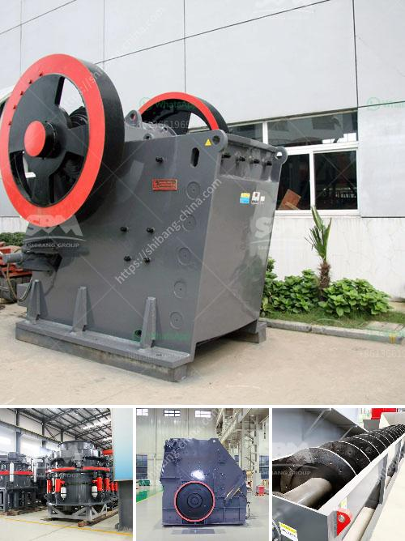

<h3>لمطحنة الكرة الميكرو</h3>
تُعد لمطحنة الكرة الميكرو أحدث التقنيات المستخدمة في عملية طحن المواد الصلبة. تستخدم هذه المطاحن كرات صلبة صغيرة لطحن المواد إلى حجم جسيمات صغير جدا ، وعادة ما تستخدم في صناعة الألوان والأصباغ والدهانات والطلاء.

تعتمد مبدأ عمل اللمطاحن الكرة على وجود اثنين من الرافعات الموجودة داخل الاسطوانة المدمجة. تحتوي الأسطوانة على عجلة سفلية وعجلة علوية مرتبطة بثنائيات الفولتية وتعمل بتقنية الرافعات الهيدروليكية. تقوم هذه الرافعات بتحريك الكرات الصلبة لأعلى ولأسفل داخل الأسطوانة. يصطدم الجسيمات المتناثرة معًا بفعل حركة الكرات الصلبة الدورانية في الأسطوانة. يتم طحن المواد بسبب تآكل الكرات الصلبة في بعضها البعض أو تآكلها مع الأسطوانة.

تتميز لمطاحن الكرة الميكرو بعدة مزايا. أولاً ، فإن حجم الجسيمات الناتجة يمكن أن يكون موحدًا بسبب تساوي حجم الكرات الصلبة المستخدمة. ثانيًا ، فإن هذه المطاحن قادرة على طحن المواد الصلبة الأكثر صعوبة مثل المواد الكيميائية والأدوية. ثالثًا ، تعتمد لمطاحن الكرة الميكرو على الحركة الدائرية المستمرة للكرات الصلبة ، وعلى تقنية الرافعات الهيدروليكية ، مما يقلل من الاحتكاك ويزيد من كفاءة الطحن.

يتم استخدام لمطاحن الكرة الميكرو في العديد من الصناعات. على سبيل المثال ، يتم استخدامها في صناعة الطلاء لطحن الصباغ والمواد الأساسية معًا للحصول على اللون المطلوب. كما يتم استخدامها أيضًا في صناعة الزجاج والسيراميك والمبيدات الحشرية ومواد التشحيم أيضًا.

تعتبر لمطاحن الكرة الميكرو تكنولوجيا مهمة في عملية طحن المواد الصلبة. تعمل هذه المطاحن على تحقيق توزيع موحد للحجم وتحسين كفاءة الطحن. بالإضافة إلى ذلك ، فهي توفر أداءً استثنائيًا لطحن المواد الكيميائية والمعادن ، مما يجعلها مثالية للاستخدام في العديد من الصناعات.
<h3>Contact us</h3><ul><li><strong>Whatsapp:&nbsp;<a href="https://wa.me/8613661969651">+8613661969651</a></strong></li><li><a href="https://swt.shibang-china.com/?git&amp;zhl&amp;لمطحنة الكرة الميكرو"><strong>Online Service(chat now)</strong></a></li></ul><h3>Related</h3><ul><li><a href='مطاحن الكرة المستخدمة في بيرو.md'>مطاحن الكرة المستخدمة في بيرو</a></li><li><a href='شركات المحاجر في بوكواس وأماسامان.md'>شركات المحاجر في بوكواس وأماسامان</a></li><li><a href='كسارات صخور cec للبيع.md'>كسارات صخور cec للبيع</a></li><li><a href='عمليات سحق الركام.md'>عمليات سحق الركام</a></li><li><a href='إعلانات الصحف لمصنع كسارة.md'>إعلانات الصحف لمصنع كسارة</a></li></ul>