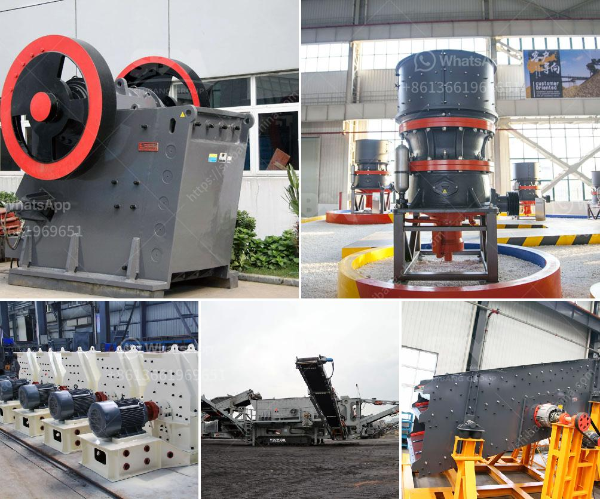

<h3>ما هو مطحنة الكرة</h3>
تعتبر مطحنة الكرة واحدة من أهم الأدوات المستخدمة في مجال صناعة الألغام والبناء ومعالجة المواد المعدنية. تستخدم لسحق المواد الخام وتصغير حجمها إلى حبيبات صغيرة جدًا. تعمل المطحنة عن طريق تدوير جهاز التشغيل الذي يحتوي على كتل من الصلب المعروفة باسم "الكرات"، وهذه الكرات تسحق المادة الخام عند تعرضها للاصطدام أثناء دوران الجهاز.

تتألف المطحنة من جزأين رئيسيين، وهما الجسم الدوار وجسم التحميل. يتم تحميل المادة الخام في جسم التحميل، وبمجرد دخولها هناك، يتم سحقها وتفتيتها بواسطة الكرات التي تتحرك في الجسم الدوار. يتم تعديل حجم الكرات وكمية الكرات المستخدمة وفقًا لنوع المادة الخام وحجمها.

تُستخدم مطاحن الكرة في صناعة الألغام لطحن المواد الخام مثل الذهب والفضة والنحاس والحديد. تستخدم أيضًا في صناعة الأسمنت، حيث تستخدم لطحن الكلنكر وإضافة المكونات الأخرى للحصول على مادة الأسمنت النهائية. بالإضافة إلى ذلك، تستخدم في مجالات أخرى مثل صناعة السيراميك والطلاء والتصنيع الكيميائي.

تتميز مطاحن الكرة بسهولة الاستخدام وكفاءتها العالية في سحق المواد الخام. كما توفر هذه الآلة توازنًا جيدًا بين قوة الضغط والاحتكاك لطحن المواد بشكل متساوٍ ومتجانس. تستخدم مطاحن الكرة أيضًا لتجفيف المواد بعد سحقها بواسطة إضافة هواء ساخن أثناء عملية الطحن.

بشكل عام، تعتبر مطاحن الكرة أداة أساسية في صناعة الألغام والبناء. إنها تساهم في تحسين عملية التصنيع وتقليل تكاليف الإنتاج. كما تساعد على زيادة كفاءة استخدام الموارد وتحسين جودة المنتج النهائي. من المتوقع أن تستمر مطاحن الكرة في التطور والتحسين مع مرور الوقت، وذلك لتلبية احتياجات الصناعة المتزايدة والمتغيرة.
<h3>Contact us</h3><ul><li><strong>Whatsapp:&nbsp;<a href="https://wa.me/8613661969651">+8613661969651</a></strong></li><li><a href="https://swt.shibang-china.com/?git&amp;zhl&amp;ما هو مطحنة الكرة"><strong>Online Service(chat now)</strong></a></li></ul><h3>Related</h3><ul><li><a href='كسارة معدنية للإيجار.md'>كسارة معدنية للإيجار</a></li><li><a href='مطحنة عمودية للبيع في الولايات المتحدة.md'>مطحنة عمودية للبيع في الولايات المتحدة</a></li><li><a href='كسارة مخروطية.md'>كسارة مخروطية</a></li><li><a href='آلة تسخين حجر الكوارتز للبيع.md'>آلة تسخين حجر الكوارتز للبيع</a></li><li><a href='مكاتب CAD لمعدات التعدين.md'>مكاتب CAD لمعدات التعدين</a></li></ul>