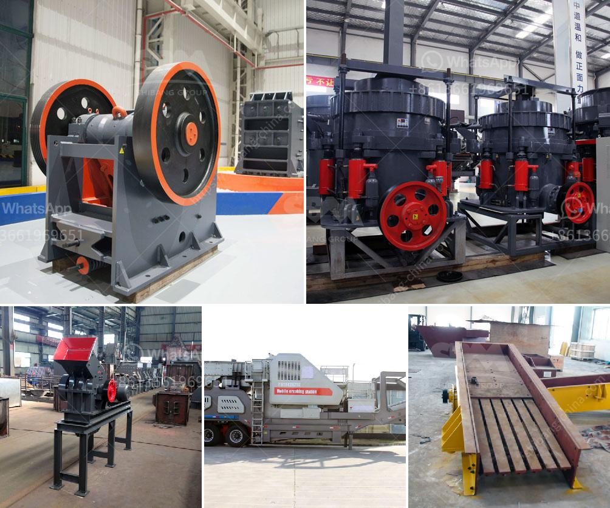

<h3>مبدأ عمل حزام النقل</h3>
يعتبر حزام النقل أحد الأدوات الهامة في العديد من الصناعات والمجالات التجارية. يستخدم حزام النقل لنقل المواد والسلع من مكان إلى آخر بكفاءة وسهولة. مبدأ عمل حزام النقل يعتمد على استخدام قوة الاحتكاك والجاذبية لتحريك المواد عبر الحزام.

يتكون حزام النقل من حزام مستمر مصنوع من مواد مرنة مثل المطاط أو البوليمرات. يتم تثبيت هذا الحزام على بكرات دوّارة في النقاط البداية والنهاية من الخط النقل. عند تشغيل الحزام، تدور البكرات وينتقل المنتج عبر الخط النقل. تستخدم البكرات المدفوعة لتحريك الحزام بواسطة محرك يتم توصيله بأحد البكرات، بينما تستخدم البكرات الساكنة لتثبيت الحزام والحفاظ على استقامته.

أحد الاعتبارات الرئيسية في تصميم حزام النقل هو ضمان عدم انزلاق المواد أثناء التنقل. لذلك، يتم تجهيز الحزام بنظام تخاطب أو وسادات بارزة للحفاظ على الاحتكاك بين المواد والحزام. يتم ضبط قوة الاحتكاك هذه بناءً على خصائص المادة التي ستنقل، حيث تحتاج بعض المواد إلى قوة احتكاك أعلى لتجنب الانزلاق وضمان الاستقرار.

يمكننا تحديد استخدام حزام النقل في عدة قطاعات مثل الصناعات التعدينية والزراعية والصناعات الغذائية واللوجستية. يساهم حزام النقل في زيادة الإنتاجية وتحسين كفاءة العمل بشكل عام. فهو يتيح نقل السلع والمواد بكميات كبيرة دون الحاجة للعمل اليدوي الشاق. يعزز حزام النقل كفاءة العمل، حيث يمكن أن يعمل بشكل مستمر لساعات طويلة دون التأثير السلبي على أداء الجهاز أو العامل.

بشكل عام، مبدأ عمل حزام النقل يسهم في جعل عملية التنقل للمواد أسرع وأسهل في الصناعات المختلفة. يعتبر حزام النقل أداة فعالة وفعالة تساعد على توفير الوقت والجهد وتعزيز الإنتاجية. بفضل مبدأ عمله البسيط والموثوق، استطاع حزام النقل أن يثبت نفسه كأداة مهمة في العديد من المجالات والصناعات المختلفة.
<h3>Contact us</h3><ul><li><strong>Whatsapp:&nbsp;<a href="https://wa.me/8613661969651">+8613661969651</a></strong></li><li><a href="https://swt.shibang-china.com/?git&amp;zhl&amp;مبدأ عمل حزام النقل"><strong>Online Service(chat now)</strong></a></li></ul><h3>Related</h3><ul><li><a href='تصميم مصنع تكسير وتخطيطه.md'>تصميم مصنع تكسير وتخطيطه</a></li><li><a href='كسارة متنقلة صغيرة الخرسانة.md'>كسارة متنقلة صغيرة الخرسانة</a></li><li><a href='عملية كولمان للطحن.md'>عملية كولمان للطحن</a></li><li><a href='مصنع فصل وتركيز المعادن في نيجيريا.md'>مصنع فصل وتركيز المعادن في نيجيريا</a></li><li><a href='كسارة الحجر الجيري المصنعة في باكستان.md'>كسارة الحجر الجيري المصنعة في باكستان</a></li></ul>