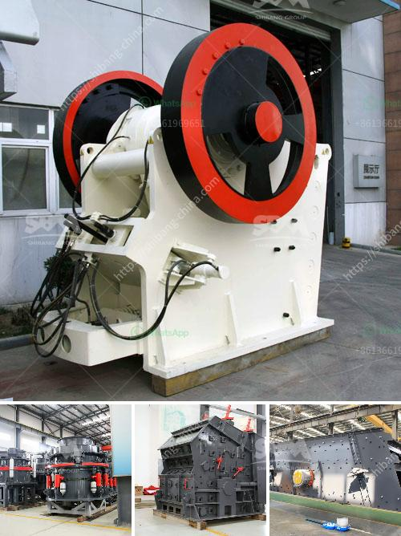

<h3>مبدأ عمل مطحنة الهامر</h3>
تعتبر مطحنة الهامر واحدة من أهم الأجهزة الهندسية المستخدمة في صناعة التكسير والطحن. تعتمد مبدأ عملها على تطبيق القوة الميكانيكية على المواد المراد تكسيرها أو طحنها بواسطة حركة الدوران والصدمة. تستخدم المطاحن الهامر المنشورة لطحن المواد إلى حجم جسيمات أصغر قبل استخدامها في الصناعات المختلفة مثل صناعة الأسمدة والأغذية والمواد الكيميائية والتعدين وغيرها.

تتألف مطاحن الهامر من جسم عمودي يحوي روتورًا مركبًا من مجموعة من الشفرات الصدمية المحملة على المحور الأفقي، وتعمل بواسطة محرك كهربائي. تدخل المواد المراد تكسيرها إلى مطحنة الهامر من الجانب العلوي عن طريق فتحة الإلقاء، ثم يتم دفعها إلى داخل الروتور وتبدأ عملية الطحن.

عند تشغيل المطحنة، تدور شفرات الروتور بسرعة عالية. وعندما تصطدم المواد بالشفرات، تتحطم وتتفتت إلى جسيمات أصغر. يتم تسريع الشفرات وتوجيه الجزيئات المكسرة إلى الشبكة الفاصلة الموجودة في الأسفل. تزيل الشبكة الجسيمات التي لا تزال كبيرة من الجسيمات المكسرة، في حين يتم تفريق الغبار والجسيمات الدقيقة عن طريق الهواء المنتج بواسطة المروحة.

تتضمن بعض المطاحن الهامر أيضًا نظام به ناقل يقوم بنقل المواد بعد التكسير إلى أماكن تجميع أو تخزين أو عملية ما. بالإضافة إلى ذلك، يمكن ضبط فتحة الخروج في مطاحن الهامر، مما يسمح بالتحكم في حجم الجسيمات النهائي.

يتميز مبدأ عمل مطحنة الهامر بالسرعة والكفاءة في عملية التكسير والطحن، وهي قادرة على معالجة مجموعة واسعة من المواد بدقة وفعالية. لا يقتصر استخدام هذا الجهاز على صناعة معينة، بل يمكن استخدامه في العديد من الصناعات الأخرى التي تتطلب طحن المواد أو تفتيتها.

وفي الختام، يعتبر مبدأ عمل مطحنة الهامر أمرًا حيويًا في صناعة التكسير والطحن، حيث يضمن كفاءة عالية وجودة جيدة للمنتج النهائي. تطورت تكنولوجيا مطاحن الهامر على مر السنين، مما أدى إلى تحسين أدائها وقدرتها على التعامل مع مجموعة واسعة من المواد وتلبية الاحتياجات المتنوعة للصناعة.
<h3>Contact us</h3><ul><li><strong>Whatsapp:&nbsp;<a href="https://wa.me/8613661969651">+8613661969651</a></strong></li><li><a href="https://swt.shibang-china.com/?git&amp;zhl&amp;مبدأ عمل مطحنة الهامر"><strong>Online Service(chat now)</strong></a></li></ul><h3>Related</h3><ul><li><a href='مطاحن تلك جنوب أفريقيا.md'>مطاحن تلك جنوب أفريقيا</a></li><li><a href='آلة مسحوق الحجر الجيري.md'>آلة مسحوق الحجر الجيري</a></li><li><a href='مصنع معدات التعدين للذهب.md'>مصنع معدات التعدين للذهب</a></li><li><a href='اليابان لمصنع تكسير متنقل.md'>اليابان لمصنع تكسير متنقل</a></li><li><a href='كسارة على أساس الإيجار في نيجيريا.md'>كسارة على أساس الإيجار في نيجيريا</a></li></ul>