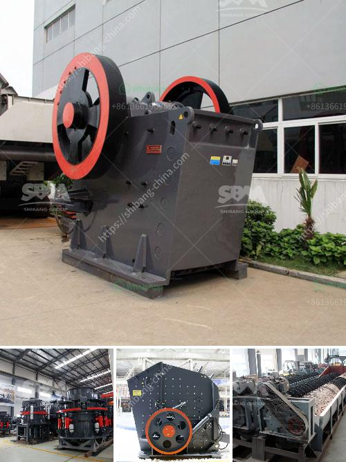

<h3>مبيعات آلة التكسير المحمولة في جنوب أفريقيا</h3>
تعتبر آلة التكسير المحمولة أحدث تقنية تستخدم في صناعة التكسير والغربلة. هذه الآلة تمتاز بقدرتها على تحويل المواد الخام إلى منتجات نهائية عالية الجودة، سواء كانت حصى أو رمال أو أحجار طبيعية. وتعد جنوب أفريقيا واحدة من الأسواق الرئيسية لمبيعات آلة التكسير المحمولة.

تعد البنية التحتية والتعدين قطاعًا حيويًا في جنوب أفريقيا، إذ تمتلك البلاد ثروات طبيعية هائلة من الذهب والماس والفحم والبلاتين والنحاس، وغيرها. ومن هنا، فإن الحاجة إلى آلات تكسير قوية وفعالة تعد عاملًا أساسيًا لتعزيز الإنتاج وزيادة الربحية.

تتميز آلة التكسير المحمولة بعدة مزايا تجعلها اختيارًا مثاليًا لمشغلي المناجم وشركات التعدين في جنوب أفريقيا. أهم هذه المزايا هي:

1. القدرة على العمل في مواقع متنوعة: يمكن نقل هذه الآلة بسهولة إلى أي موقع وبسرعة، سواء كان ذلك داخل المنجم أو في مناطق أخرى للتعدين. وهذا يساعد على زيادة الكفاءة وتقليل التكاليف المرتبطة بالنقل والتشغيل.

2. القدرة على تكسير المواد الخام المتنوعة: تتوفر الآلات المحمولة بعدة أحجام وأنواع مختلفة، مما يتيح للمشغلين تحقيق أقصى قدر من المرونة في تكسير مختلف أنواع المواد الخام. وبالتالي، فإن المشغلين لديهم القدرة على تلبية متطلبات السوق واحتياجات العملاء بكفاءة.

3. الابتكار التقني: تتميز آلات التكسير المحمولة بالابتكار التقني المستمر، حيث يتم تطويرها باستمرار لتلبية تحديات السوق المتغيرة. وتتضمن هذه التحسينات زيادة القدرة التدميرية وتحسين الكفاءة العامة للآلة.

تشهد جنوب أفريقيا نموًا اقتصاديًا وفيرًا، وهذا يعني أن هناك طلبًا مستمرًا على آلة التكسير المحمولة في البلاد. ولذلك، يجب على الشركات المصنعة والموزعين العاملين في هذا القطاع أن يستفيدوا من هذه الفرصة عن طريق تقديم منتجات ذات جودة عالية وخدمة متميزة لعملائهم في جنوب أفريقيا.

في الختام، يمكن القول إن مبيعات آلة التكسير المحمولة في جنوب أفريقيا تشهد ازديادًا ملحوظًا نظرًا للحاجة المتزايدة إلى تكنولوجيا التكسير الحديثة والمرنة. ومع استمرار النمو الاقتصادي في البلاد، يمكن توقع مزيد من التوسع في هذا القطاع في المستقبل.
<h3>Contact us</h3><ul><li><strong>Whatsapp:&nbsp;<a href="https://wa.me/8613661969651">+8613661969651</a></strong></li><li><a href="https://swt.shibang-china.com/?git&amp;zhl&amp;مبيعات آلة التكسير المحمولة في جنوب أفريقيا"><strong>Online Service(chat now)</strong></a></li></ul><h3>Related</h3><ul><li><a href='مصنع طحن الذهب في زيمبابوي.md'>مصنع طحن الذهب في زيمبابوي</a></li><li><a href='مصنع دوامة للبيع لخام الكروم.md'>مصنع دوامة للبيع لخام الكروم</a></li><li><a href='رمل وحجر الكسارة في كينيا.md'>رمل وحجر الكسارة في كينيا</a></li><li><a href='مصنعين لشاشات الاهتزاز في جنوب أفريقيا.md'>مصنعين لشاشات الاهتزاز في جنوب أفريقيا</a></li><li><a href='كسارات الثانية الفلبين.md'>كسارات الثانية الفلبين</a></li></ul>