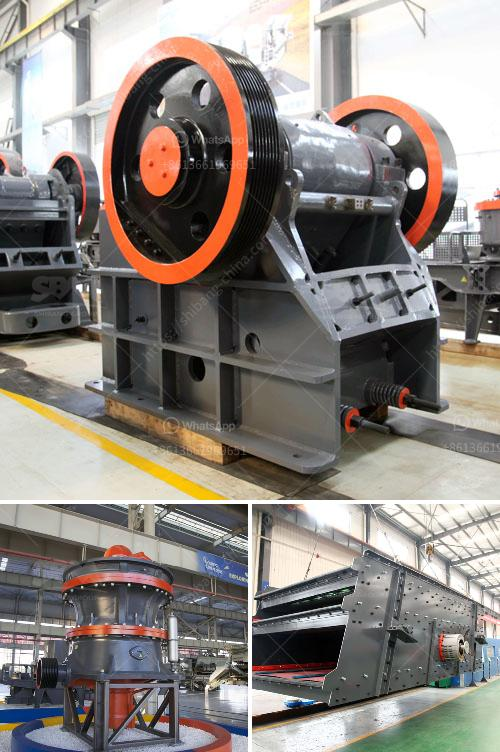

<h3>مبيعات أحزمة الناقلات</h3>
تعد أحزمة الناقلات أداة أساسية في صناعات النقل والتصنيع التي تعتمد على حركة المواد والمنتجات. تتميز هذه الأحزمة بقدرتها على نقل جميع أنواع المواد بكفاءة وسهولة، سواء كانت خفيفة أو ثقيلة الوزن، وتستخدم في العديد من المجالات مثل التعدين والزراعة والصناعات الغذائية والمستودعات.

تعتبر مبيعات أحزمة الناقلات من أكثر الأصناف المطلوبة في سوق النقل والتصنيع. فلعبور المواد من مرحلة إلى أخرى داخل المصانع والمستودعات يتطلب نقل مستمر يؤمن سلاسة العملية. لذلك، يعتبر اختيار الحزام الناقل المناسب والمناسب للاستخدام المحدد أمرًا حاسمًا.

تنوعت أحزمة الناقلات على مر السنين لتلبية احتياجات العملاء المتنوعة. تتوفر أحزمة مصنوعة من النايلون والبوليستر والبلاستيك والمطاط والجلود والستيل، ويعتمد اختيار المادة على استخدامها وبيئة العمل. على سبيل المثال، تعتبر أحزمة النايلون الخفيفة والفعالة في نقل المواد الثقيلة، في حين تعتبر أحزمة الستيل مثالية للتعامل مع الأحمال الثقيلة والتطبيقات القاسية.

تقدم الشركات المصنعة لأحزمة الناقلات منتجات متقدمة تتميز بالمتانة والقوة والمرونة، إلى جانب قدراتها على التحمل والتحميل الثقيل. تتوفر الأحزمة بأطوال وعرض مختلفة، مما يمنح العملاء خيارات متعددة لتلبية احتياجاتهم. كما تتميز بسهولة التركيب والصيانة، مما يوفر الوقت والجهد للعملاء.

تؤمن أحزمة الناقلات بأمان العملية وتقليل فقدان المواد والتلف، مما يحسن كفاءة العمل ويرفع من إنتاجية الشركات. تستخدم الأحزمة الناقلات أيضًا في تحميل وتفريغ الشاحنات والوثب والتصنيع الأوتوماتيكي، مما يؤدي إلى زيادة الكفاءة وتقليل تكاليف العمل.

باختصار، تلعب أحزمة الناقلات دورًا حاسمًا في صناعات النقل والتصنيع، حيث تزود العملاء بأدوات فعالة ومتينة لنقل المواد والمنتجات. توفر الشركات المصنعة العديد من الخيارات لتلبية احتياجات العملاء المختلفة، سواء كانت صناعية أو تجارية، مما يساهم في تطور القطاع وتحقيق النمو الاقتصادي.
<h3>Contact us</h3><ul><li><strong>Whatsapp:&nbsp;<a href="https://wa.me/8613661969651">+8613661969651</a></strong></li><li><a href="https://swt.shibang-china.com/?git&amp;zhl&amp;مبيعات أحزمة الناقلات"><strong>Online Service(chat now)</strong></a></li></ul><h3>Related</h3><ul><li><a href='تكلفة كسارة النحاس.md'>تكلفة كسارة النحاس</a></li><li><a href='مصنعون لكسارات الصدم.md'>مصنعون لكسارات الصدم</a></li><li><a href='تكلفة آلة طحن الرمال السيليكا.md'>تكلفة آلة طحن الرمال السيليكا</a></li><li><a href='آلة عملية مطحنة الأسطوانة.md'>آلة عملية مطحنة الأسطوانة</a></li><li><a href='آلة مسحوق الدولوميت.md'>آلة مسحوق الدولوميت</a></li></ul>