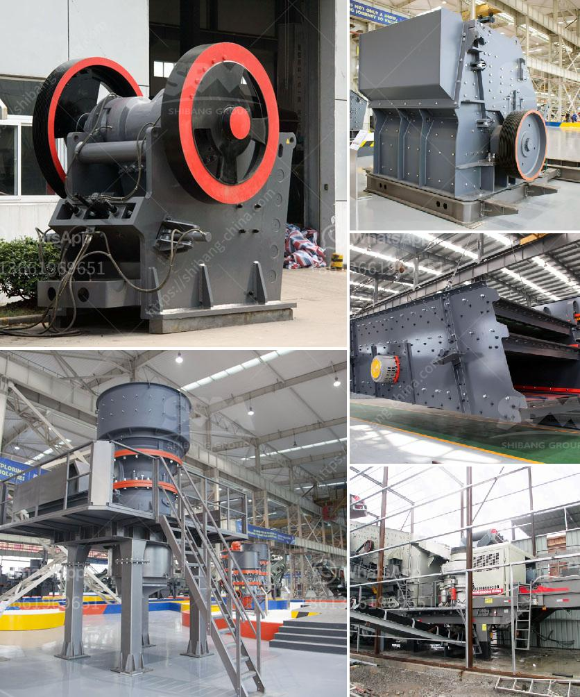

<h3>متطلبات أعمال مصنع الكسارة في باكستان</h3>
تعتبر صناعة الكسارات من الصناعات الحيوية في باكستان، حيث يتزايد الطلب على الرمال والزُلط والحصى للاستخدام في مجالات مختلفة مثل البناء والبناء التحتي والطرق والجسور وغيرها. ومع هذا الطلب المتزايد تزايدت أيضًا حاجة الشركات والمقاولين إلى مصانع الكسارات لتلبية احتياجاتهم.

تتطلب مصانع الكسارات في باكستان تحقيق عدد من المتطلبات الأساسية لكي تكون قادرة على العمل بكفاءة وتلبية الطلب المتزايد. أحد المتطلبات الأساسية هي الوجود المكان المناسب لتأسيس المصنع. يجب أن يكون الموقع قريبًا من مصادر المواد الخام مثل المحاجر والمناجم وكذلك قريبًا من السوق المستهدفة لبيع المنتجات المصنعة.

علاوة على ذلك، يجب أن تتوافر الموارد المالية الكافية لشراء المعدات والآلات اللازمة في المصنع مثل الكسارات والغرابيل والناقلات والملقمات وغيرها. هذه المعدات ليست رخيصة، ولذلك يجب أن يتوفر رأس المال اللازم للاستثمار فيها.

علاوة على ذلك، يجب أن يكون هناك فريق من ذوي الخبرة والكفاءة لإدارة وتشغيل المصنع. يجب أن يكون لديهم المعرفة الفنية والمهارات اللازمة للتعامل مع المعدات وضمان سلامة وفعالية العملية.

بالإضافة إلى ذلك، يجب أن يكون هناك نظام جيد لإدارة المخلفات المنتجة في المصنع. فعملية الكسر والغربلة قد تنتج كميات كبيرة من المخلفات المادية مثل الأتربة والحجارة الصغيرة. يجب أن يتم التخلص من هذه المخلفات بشكل صحيح وفقًا للقوانين واللوائح المحلية.

أخيراً، يجب أن تتوافر التراخيص والتصاريح اللازمة لتشغيل المصنع بشكل قانوني. يجب تلبية جميع متطلبات السلامة والبيئة والصحة المهنية.

باختصار، تتطلب مصانع الكسارات في باكستان العديد من المتطلبات بما في ذلك الموقع المناسب، الموارد المالية، الفريق المؤهل، نظام إدارة المخلفات، والتراخيص والتصاريح. يجب توفير هذه المتطلبات للنجاح والاستدامة في هذه الصناعة الحيوية.
<h3>Contact us</h3><ul><li><strong>Whatsapp:&nbsp;<a href="https://wa.me/8613661969651">+8613661969651</a></strong></li><li><a href="https://swt.shibang-china.com/?git&amp;zhl&amp;متطلبات أعمال مصنع الكسارة في باكستان"><strong>Online Service(chat now)</strong></a></li></ul><h3>Related</h3><ul><li><a href='مصنع تكسير الحجر في نيجيريا.md'>مصنع تكسير الحجر في نيجيريا</a></li><li><a href='كسارة الفك تركيا.md'>كسارة الفك تركيا</a></li><li><a href='خطة عمل للمحجر.md'>خطة عمل للمحجر</a></li><li><a href='تعدين الجبس والكروم والحجر الجيري.md'>تعدين الجبس والكروم والحجر الجيري</a></li><li><a href='سعر مصنع كربونات الكالسيوم.md'>سعر مصنع كربونات الكالسيوم</a></li></ul>