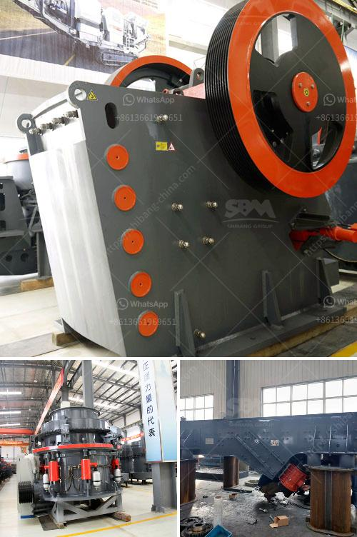

<h3>مجفف رمل مستعمل للبيع</h3>
يعتبر مجفف الرمل المستعمل من المعدات الهامة والضرورية في صناعة البناء والتشييد. يقوم هذا الجهاز بفصل الماء عن الرمل وجفافه بشكل فعال وسريع، مما يسهم في تقليل الزمن المستغرق للمواد الخام ليصبح جاهزًا للاستخدام في عملية البناء.

يتكون مجفف الرمل من جسم رئيسي ومروحة ونظام تهوية وأنابيب. يعمل عن طريق استخدام حركة الهواء الساخن وتعويم الجسيمات الرملية في الهواء، مما يمكنها من أن تتجفف بأكملها. يتم تسخين الهواء باستخدام مصادر حرارة مختلفة مثل حرق العوائق أو استخدام الغاز الطبيعي أو الزيت أو الكهرباء.

توجد عدة أنواع من مجففات الرمل المستعملة، منها المجففات الدوارة ومجففات التيار المستمر. يتم اختيار النوع المناسب بناءً على احتياجات العمل وتوافر الموارد المختلفة.

إن استخدام مجفف الرمل المستعمل يوفر الكثير من المزايا للمستخدمين. فعلى سبيل المثال، يساعد في تقليل التكاليف العامة للمشروعات، حيث أن الإصدارات المستعملة تكون أرخص من الجديدة. بالإضافة إلى ذلك، يوفر زمنًا أقل في عملية التجفيف، مما يعزز إنتاجية المشروع ويقلل من وقت الانتظار للمواد الجاهزة للاستخدام.

من الجدير بالذكر أنه عند شراء مجفف رمل مستعمل، يجب اختياره بعناية والتحقق من جودته وأدائه قبل القيام بالشراء. من الأمور المهمة النظر في تاريخ استخدام المجفف والفحص الدقيق لأجزاء الجهاز للتأكد من سلامتها وجاهزيتها للاستخدام. قد يكون من الأفضل التعاون مع شركات موثوقة أو منشئات بناء معروفة لضمان شراء مجفف الرمل المستعمل بجودة عالية.

بشكل عام، مجفف الرمل المستعمل هو خيار مناسب واقتصادي للعديد من المقاولين وأصحاب المشاريع الصغيرة والكبيرة. إنه يساعد في تحسين كفاءة عملية البناء ويوفر الوقت والموارد. على الرغم من أنه من المهم الحصول على مجفف رمل مستعمل بجودة عالية وفحصه جيدًا قبل الشراء، فإن استخدامه سيثبت أنه استثمار لا يمكن الاستغناء عنه للمقاولين والمهندسين المعماريين على حد سواء.
<h3>Contact us</h3><ul><li><strong>Whatsapp:&nbsp;<a href="https://wa.me/8613661969651">+8613661969651</a></strong></li><li><a href="https://swt.shibang-china.com/?git&amp;zhl&amp;مجفف رمل مستعمل للبيع"><strong>Online Service(chat now)</strong></a></li></ul><h3>Related</h3><ul><li><a href='مطحنة ريموند للبنتونيت.md'>مطحنة ريموند للبنتونيت</a></li><li><a href='تقرير مشروع مصنع الكرة الصغيرة بتنسيق PDF.md'>تقرير مشروع مصنع الكرة الصغيرة بتنسيق PDF</a></li><li><a href='كم تكلفة آلة المحجر.md'>كم تكلفة آلة المحجر</a></li><li><a href='سعر مصنع كسارة الفك.md'>سعر مصنع كسارة الفك</a></li><li><a href='سعر آلة الكسارة في سريلانكا.md'>سعر آلة الكسارة في سريلانكا</a></li></ul>