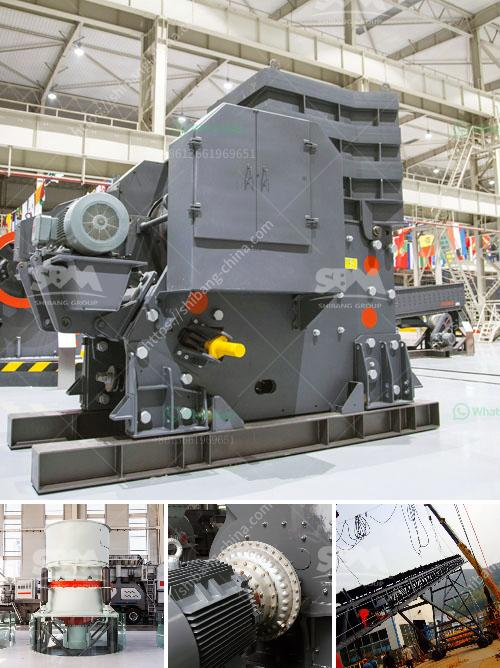

<h3>محجر مستعمل بشكل معقول في نيجيريا</h3>
تلعب صناعة المحاجر دورًا حيويًا في الاقتصاد النيجيري، حيث تلبي الحاجة المتزايدة للمواد الأساسية في قطاع البناء والبنية التحتية. ومع ذلك ، فإن استخدام المحجر العشوائي وغير المنظم له تأثير بيئي واقتصادي سلبي. لذلك ، يجب أن يتم تشغيل المحاجر بشكل معقول في نيجيريا.

تعتبر نيجيريا موطنًا للعديد من الموارد الطبيعية المهمة ، بما في ذلك الحجر الجيري والرخام والغرانيت والفحم والبترول. تلعب المحاجر دورًا حيويًا في استخراج وتجهيز هذه الموارد الطبيعية للأغراض البنائية والتجارية. ومع ذلك ، فإن استخدام المحاجر بشكل غير معقول يؤدي إلى تدهور البيئة والتربة والمياه ، وتلوث الهواء ، وتأثيرات سلبية على الحياة البرية.

لتشغيل المحاجر بشكل معقول ، يجب أن تتبع الصناعة مبادئ الاستدامة البيئية والاجتماعية. يجب أن يتم وضع قوانين ولوائح صارمة للمحاجر للحد من التأثيرات البيئية السلبية. يجب أن تستخدم تقنيات استخراج يدوية أو آلية لتجنب الأضرار غير الضرورية للبيئة. علاوة على ذلك ، يجب أن يتم تنظيف الموقع بعد الانتهاء من عمليات استخراج الموارد لاستعادة البيئة الطبيعية قدر الإمكان.

بالإضافة إلى الاهتمام بالبيئة ، يجب أيضًا مراعاة الجوانب الاجتماعية لاستثمار المحاجر. ينبغي أن تعمل شركات المحاجر على توفير فرص عمل للمجتمعات المحلية وتعزيز الاقتصاد المحلي. يمكن أيضًا توجيه مساهمات من صناعة المحاجر لتطوير البنية التحتية في المنطقة ودعم البرامج التعليمية والصحية.

العمل بشكل معقول في صناعة المحاجر في نيجيريا سيساهم في تعزيز الاقتصاد وتحسين جودة الحياة للمجتمعات المحلية. ستعمل المحاجر بأرباح أعلى وستخلق فرص عمل تساهم في خفض معدل البطالة. كما ستتحسن جودة الهواء والمياه والتربة ، مما يعزز الصحة العامة ويحمي الحياة البرية المحلية.

باختصار ، يجب أن يتم تشغيل المحاجر بشكل معقول في نيجيريا من أجل الحفاظ على الموارد الطبيعية والبيئة ، وتحقيق التنمية المستدامة وتعزيز الاقتصاد المحلي. يجب أن يلتزم صناع المحاجر بمعايير الاستدامة البيئية والاجتماعية ، وتحقيق التوازن بين الربحية والمسؤولية البيئية. إذا تم ذلك بنجاح ، فسوف يستفيد الجميع من إدارة المحاجر بشكل معقول في نيجيريا.
<h3>Contact us</h3><ul><li><strong>Whatsapp:&nbsp;<a href="https://wa.me/8613661969651">+8613661969651</a></strong></li><li><a href="https://swt.shibang-china.com/?git&amp;zhl&amp;محجر مستعمل بشكل معقول في نيجيريا"><strong>Online Service(chat now)</strong></a></li></ul><h3>Related</h3><ul><li><a href='مصانع الإسمنت للبيع في باكستان.md'>مصانع الإسمنت للبيع في باكستان</a></li><li><a href='معدات تكسير الكالسايت.md'>معدات تكسير الكالسايت</a></li><li><a href='آلة كسارة الفلدسبار.md'>آلة كسارة الفلدسبار</a></li><li><a href='مصنعي كسارات التعدين.md'>مصنعي كسارات التعدين</a></li><li><a href='قائمة مصنعي آلات سحق اليابان.md'>قائمة مصنعي آلات سحق اليابان</a></li></ul>