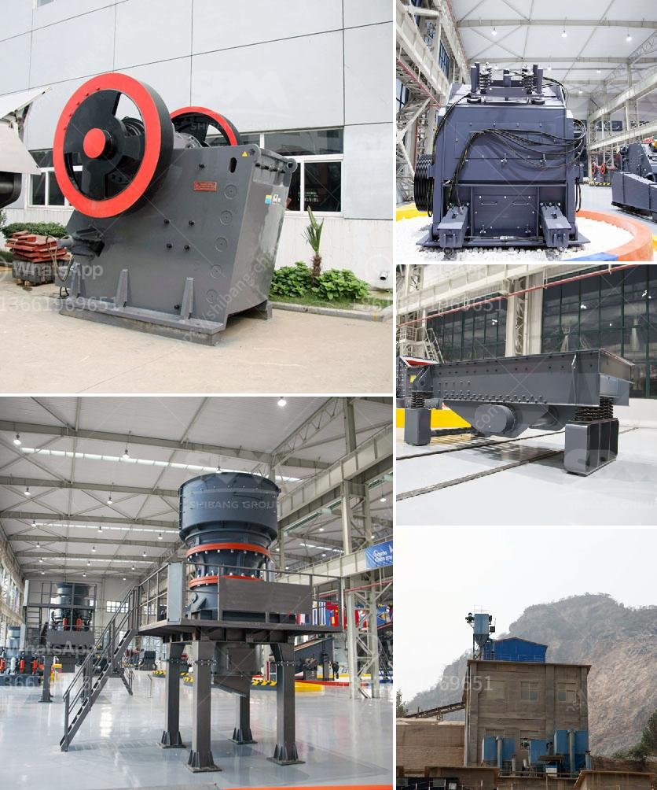

<h3>محجر مصنع كسارة في الفلبين</h3>
تعد الفلبين أحد البلدان التي تعتمد بشكل كبير على صناعة التعدين ومنتجاتها. ومن بين المنتجات الناتجة عن هذه الصناعة هي المحاجر والكسارات، التي تلعب دورًا حاسمًا في تزويد قطاع البناء بالمواد اللازمة للإنشاءات.

يتم تشغيل العديد من المحاجر والكسارات في الفلبين، وتعتبر أحد هذه المصانع الموجودة في البلاد واحدة من أبرز أمثلة النجاح في هذا القطاع. يقع المحجر في منطقة ناغا، وهو واحد من أكبر المحاجر والكسارات في البلاد، حيث يمتلك قدرات إنتاجية هائلة.

تعمل الكسارة في هذا المحجر على تكسير الصخور الكبيرة وتحويلها إلى قطع صغيرة تستخدم في البناء والإنشاءات. تتمتع هذه المصنع بالعديد من المزايا التنافسية التي جعلتها واحدة من الخيارات الرئيسية للعملاء في السوق المحلية.

تعتمد نجاح هذا المصنع على عدة عوامل. أحدها هو جودة المنتجات المصنعة، حيث يتم الاهتمام بإنتاج مواد دقيقة وعالية الجودة تلبي معايير الصناعة ومتطلبات العملاء. كما يتم توفيرها بأسعار تنافسية تجذب العملاء.

بالإضافة إلى ذلك، يضمن هذا المصنع مراقبة صارمة للجودة حتى يتمكن من تقديم المنتجات المطلوبة بدقة وفقًا للمواصفات المحددة. تعتبر اتخاذ تدابير السلامة والأمان مهمة أيضًا، حيث يتم ضمان بيئة عمل آمنة وملائمة للموظفين.

بالإضافة إلى المزايا المادية والعملية لهذا المحجر والكسارة، يساهم أيضًا في دعم الاقتصاد المحلي وتوفير فرص العمل للسكان المحليين. يعمل في هذا المصنع عدد كبير من العمال والفنيين، وبالتالي يعزز النمو الاقتصادي ويحسن معيشة السكان.

ومن الجدير بالذكر أن هذا المحجر والكسارة لا يعد فقط موردًا محليًا، ولكنها أيضًا تصدر منتجاتها للأسواق الخارجية. يعكس هذا الاستدامة والنجاح الذي يحققه المصنع في التوسع والنمو المستدام للفلبين في هذا القطاع الحيوي.

بالاستناد إلى ما تم ذكره، يُعد هذا المحجر والكسارة في الفلبين ملهمًا للعديد من الشركات الأخرى في الصناعة لتحقيق النجاح والاستدامة، فضلاً عن دوره الحيوي في دعم البنية التحتية للبلاد وتوفير فرص العمل لسكانها.
<h3>Contact us</h3><ul><li><strong>Whatsapp:&nbsp;<a href="https://wa.me/8613661969651">+8613661969651</a></strong></li><li><a href="https://swt.shibang-china.com/?git&amp;zhl&amp;محجر مصنع كسارة في الفلبين"><strong>Online Service(chat now)</strong></a></li></ul><h3>Related</h3><ul><li><a href='كسارة آلية.md'>كسارة آلية</a></li><li><a href='شراء كسارة حجرية صغيرة في الفلبين.md'>شراء كسارة حجرية صغيرة في الفلبين</a></li><li><a href='كسارة الحجر في الكاميرون.md'>كسارة الحجر في الكاميرون</a></li><li><a href='سعر مصنع معالجة الحجر الجيري.md'>سعر مصنع معالجة الحجر الجيري</a></li><li><a href='آلات تكسير الحصى.md'>آلات تكسير الحصى</a></li></ul>