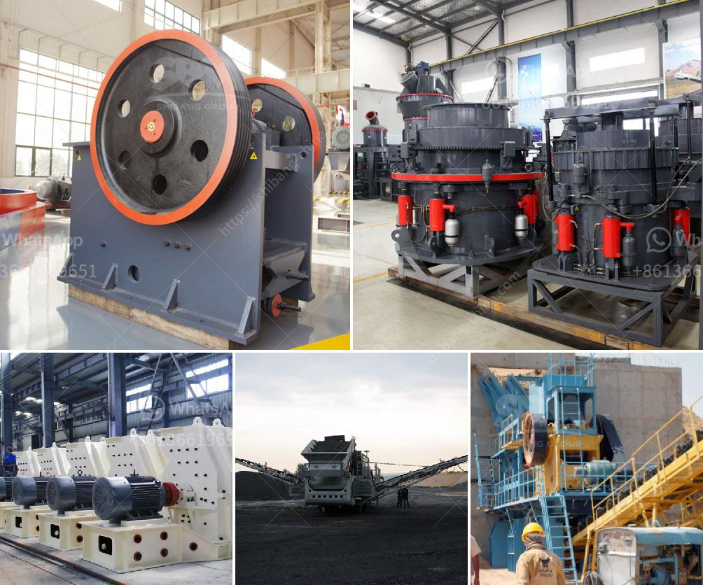

<h3>محرك مطحنة الإسمنت للبيع في المملكة المتحدة</h3>
يعتبر محرك مطحنة الإسمنت أحد العناصر الأساسية في صناعة الإسمنت، فهو يستخدم لطحن الكلنكر والمواد الأخرى المستخدمة في تصنيع الإسمنت. وفي المملكة المتحدة، هناك مجموعة متنوعة من محركات مطحنة الإسمنت المتاحة للبيع.

تتميز محركات المطاحن المتاحة في المملكة المتحدة بالجودة العالية والكفاءة العالية. فهي تعمل على تحويل الطاقة الكهربائية إلى طاقة ميكانيكية، مما يساعد في تشغيل عملية طحن الكلنكر بشكل فعال. بالإضافة إلى ذلك، تمتاز هذه المحركات بالمتانة والموثوقية، مما يجعلها قادرة على العمل بشكل مستمر دون أي انقطاع.

واحدة من المزايا الأخرى لمحركات مطحنة الإسمنت في المملكة المتحدة هي أنها تتميز بالتكنولوجيا المتقدمة والابتكارات الحديثة. فهي تستخدم أحدث التقنيات في مجال الطاقة والأتمتة، مما يساعد في تحسين الأداء العام للمطحنة وزيادة الإنتاجية.

بالإضافة إلى ذلك، تتوفر محركات مطحنة الإسمنت في المملكة المتحدة بمجموعة واسعة من القدرات، تناسب احتياجات العملاء المختلفة. فبدءًا من المحركات الصغيرة التي تصل قدرتها إلى 200 كيلوواط، وصولاً إلى المحركات الكبيرة بقدرة تصل إلى 4000 كيلوواط، يمكن للعملاء اختيار المحرك الذي يناسب حجم منشأتهم واحتياجاتهم الإنتاجية.

أخيرًا، يعتبر سوق بيع محرك مطحنة الإسمنت في المملكة المتحدة سوقًا تنافسيًا. يمكن للعملاء الاختيار بين العديد من البائعين والموردين الموثوقين الذين يقدمون مجموعة متنوعة من المحركات بأسعار تناسب ميزانيتهم.

لذا، فإن شراء محرك مطحنة الإسمنت في المملكة المتحدة يوفر مجموعة من الفوائد مثل الجودة العالية، والكفاءة، والتكنولوجيا المتقدمة، والاختيار الواسع، والتنافسية في السوق. عند اختيار المحرك المناسب، يمكن للعملاء الاستمتاع بعملية طحن الكلنكر بكفاءة واحترافية عالية، مما يساهم في تحسين إنتاجية مصنع الإسمنت وتقديم منتج نهائي عالي الجودة.
<h3>Contact us</h3><ul><li><strong>Whatsapp:&nbsp;<a href="https://wa.me/8613661969651">+8613661969651</a></strong></li><li><a href="https://swt.shibang-china.com/?git&amp;zhl&amp;محرك مطحنة الإسمنت للبيع في المملكة المتحدة"><strong>Online Service(chat now)</strong></a></li></ul><h3>Related</h3><ul><li><a href='كسارة الخرسانة للبيع في نيو جيرسي.md'>كسارة الخرسانة للبيع في نيو جيرسي</a></li><li><a href='مصنع كسارة الحجر 100 tph.md'>مصنع كسارة الحجر 100 tph</a></li><li><a href='شركة تصنيع مطحنة ريموند.md'>شركة تصنيع مطحنة ريموند</a></li><li><a href='مصانع التعدين.md'>مصانع التعدين</a></li><li><a href='كيفية بدء منجم المحاجر.md'>كيفية بدء منجم المحاجر</a></li></ul>