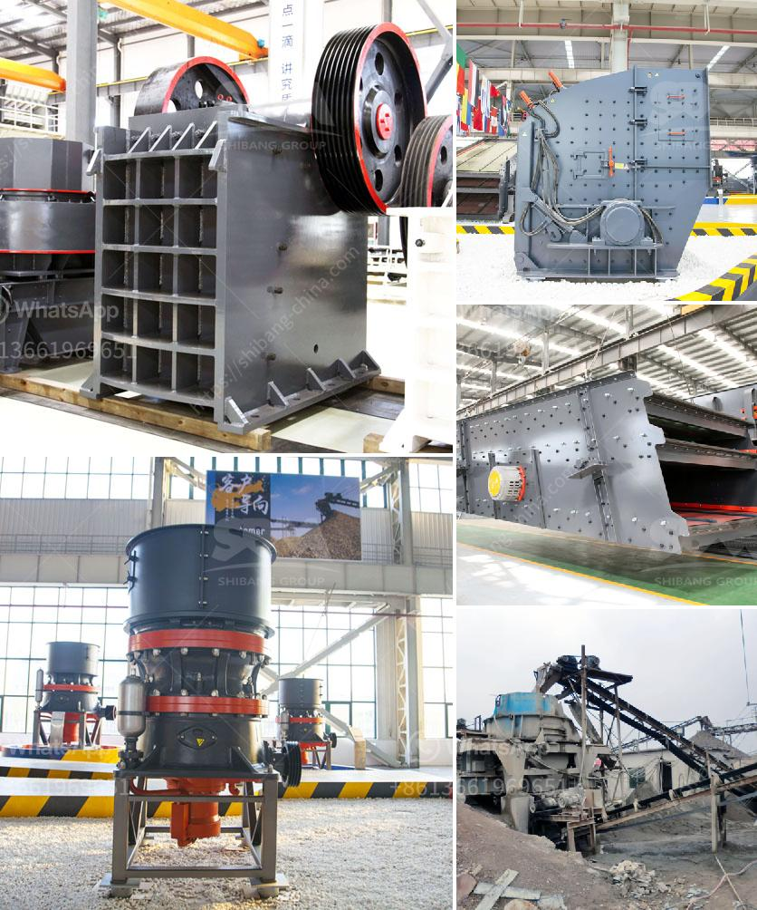

<h3>محطات الكسارات في الكويت</h3>
تعتبر محطات الكسارات من المرافق الحيوية في الكويت، حيث تلعب دورًا هامًا في عملية تطوير البنية التحتية وبناء المشاريع الضخمة في البلاد. تعتبر الكويت من الدول التي تتميز بنفاذها الوفير للصخور والحصى والرمال، مما يجعلها تمتلك إمكانيات ضخمة لاستخدام الكسارات في تغذية مشاريع البناء.

توجد العديد من محطات الكسارات في الكويت، تُستخدم لاستخراج المواد الجيولوجية الضرورية في مشاريع البنية التحتية والمشاريع العامة. تستخدم هذه المحطات لإنتاج الرمل والحصى والصخور المكسرة، والتي تستخدم في بناء الطرق والأبنية والمشاريع العامة الأخرى.

تعمل محطات الكسارات في الكويت بواسطة آلات ومعدات حديثة، مثل الكسارات الفكية والكسارات المخروطية وغيرها من الآلات المتخصصة. تتميز هذه المحطات بكفاءتها العالية في تكسير المواد الصخرية وفصلها عن بعضها البعض لتحقيق المنتجات المطلوبة.

يتم استخدام المنتجات التي تنتجها محطات الكسارات في العديد من المشاريع، مثل بناء الطرق والجسور والمباني التجارية والسكنية وغيرها. كما تستخدم في تنفيذ المشاريع الرئيسية والمشروعات الصناعية.

تحظى محطات الكسارات في الكويت برقابة صارمة من قبل الجهات المعنية، لضمان تنفيذها للمعايير البيئية والصحية. تهدف هذه الرقابة إلى الحفاظ على البيئة وصحة المواطنين وضوابط السلامة في مواقع العمل.

ومع زيادة الطلب على المواد البناء في الكويت، يتم تطوير وتحديث محطات الكسارات باستمرار، لتلبية الطلب المتزايد. تهدف هذه التحديثات إلى زيادة الإنتاجية وتحسين الجودة والكفاءة في العمل.

بالنظر إلى الأهمية الحيوية لمحطات الكسارات في الكويت، فإنها تعتبر جزءًا أساسيًا من عملية التنمية البنية التحتية للبلاد. تسهم هذه المحطات في بناء البنية التحتية القوية وتوفير الموارد الطبيعية الضرورية لدعم الاقتصاد الكويتي.
<h3>Contact us</h3><ul><li><strong>Whatsapp:&nbsp;<a href="https://wa.me/8613661969651">+8613661969651</a></strong></li><li><a href="https://swt.shibang-china.com/?git&amp;zhl&amp;محطات الكسارات في الكويت"><strong>Online Service(chat now)</strong></a></li></ul><h3>Related</h3><ul><li><a href='مشاكل طحن السخام.md'>مشاكل طحن السخام</a></li><li><a href='معدات استخراج الذهب من الصخور.md'>معدات استخراج الذهب من الصخور</a></li><li><a href='آلة تكسير الصخور في الفلبين.md'>آلة تكسير الصخور في الفلبين</a></li><li><a href='كسارة مخروطية بسعة 100 طن في الساعة.md'>كسارة مخروطية بسعة 100 طن في الساعة</a></li><li><a href='شركات تصنيع آلات الكسارة في شنغهاي.md'>شركات تصنيع آلات الكسارة في شنغهاي</a></li></ul>