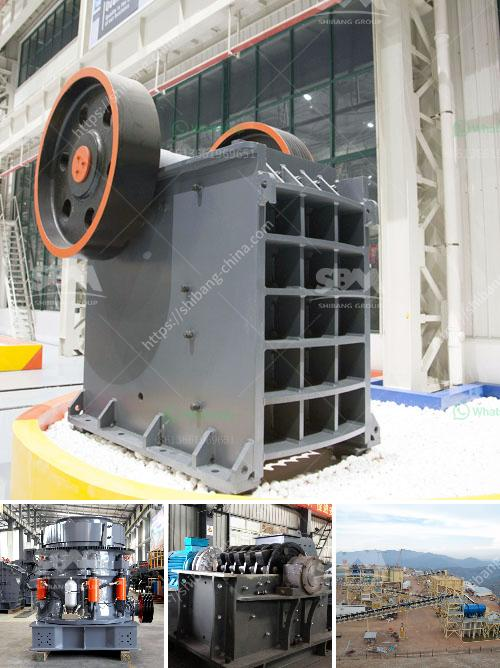

<h3>محطات الكسارات للبيع في باكستان</h3>
تعتبر محطات الكسارات من المعدات الأساسية والضرورية في عمليات التعدين والبناء. وتعد باكستان واحدة من الدول التي تشهد طلبًا متزايدًا على هذه المحطات وبالتالي، هناك العديد من المحطات المتاحة للبيع في البلاد.

تتكون محطات الكسارات من مجموعة من المعدات والأجزاء التي تتعاون معًا لتقوم بعملية تكسير الصخور والأحجار الكبيرة وتحويلها إلى أحجار صغيرة قابلة للاستخدام في مجموعة متنوعة من التطبيقات. تشتمل هذه المحطات عادة على مزيج من الكسارات الفكية، والكسارات المخروطية، وشاشات التحجيم، والناقلات، والفرز، والغرابيل والمجمعات الغبارية.

تعتبر محطات الكسارات في باكستان من العوامل الأساسية التي تدعم صناعة البناء في البلاد. فهي تلعب دورًا حاسمًا في إعداد المواد الأولية التي يتم استخدامها في بناء الطرق والجسور والمباني. كما أنها تستخدم أيضًا في تغذية الأفران ومحطات الخلاطات الرملية.

تتوفر محطات الكسارات للبيع في باكستان بمجموعة متنوعة من الأحجام والقدرات لتلبية احتياجات العملاء المختلفة. يتم تحديد السعة القصوى لمحطة الكسارات بناءً على الكمية المطلوب تكسيرها في الوقت المحدد. وعلاوة على ذلك، فإن الأداء والجودة هما العوامل الأساسية التي يجب مراعاتها عند شراء محطة الكسارات.

عند البحث عن محطات الكسارات للبيع في باكستان، ينصح بالتعاون مع الموردين الموثوق بهم والذين لديهم سمعة جيدة بتوفير محطات ذات جودة عالية وموثوقة. يمكن العثور على هذه الموردين من خلال البحث عبر الإنترنت، أو من خلال الاتصال بالمهندسين المحليين في صناعة التعدين والبناء للحصول على توصياتهم.

باختيار محطات الكسارات المناسبة، يمكن للشركات والمقاولين في باكستان تحسين كفاءة وإنتاجية أعمالهم وخفض تكاليف الإنتاج. بالإضافة إلى ذلك، تتيح محطات الكسارات للبلاد الاعتماد على الإمكانات المحلية لتطوير وبناء مشاريعها الكبرى، مما يساهم في تعزيز الاقتصاد المحلي وخلق فرص عمل جديدة.
<h3>Contact us</h3><ul><li><strong>Whatsapp:&nbsp;<a href="https://wa.me/8613661969651">+8613661969651</a></strong></li><li><a href="https://swt.shibang-china.com/?git&amp;zhl&amp;محطات الكسارات للبيع في باكستان"><strong>Online Service(chat now)</strong></a></li></ul><h3>Related</h3><ul><li><a href='آلة سحق مكعب الخرسانة.md'>آلة سحق مكعب الخرسانة</a></li><li><a href='آلة كسارة في الفلبين.md'>آلة كسارة في الفلبين</a></li><li><a href='كسارة محمولة كليمان.md'>كسارة محمولة كليمان.</a></li><li><a href='سعر كسارة الحصى في رانشي.md'>سعر كسارة الحصى في رانشي</a></li><li><a href='آلات مصنع تكسير وفرز الحجر المحمولة.md'>آلات مصنع تكسير وفرز الحجر المحمولة</a></li></ul>