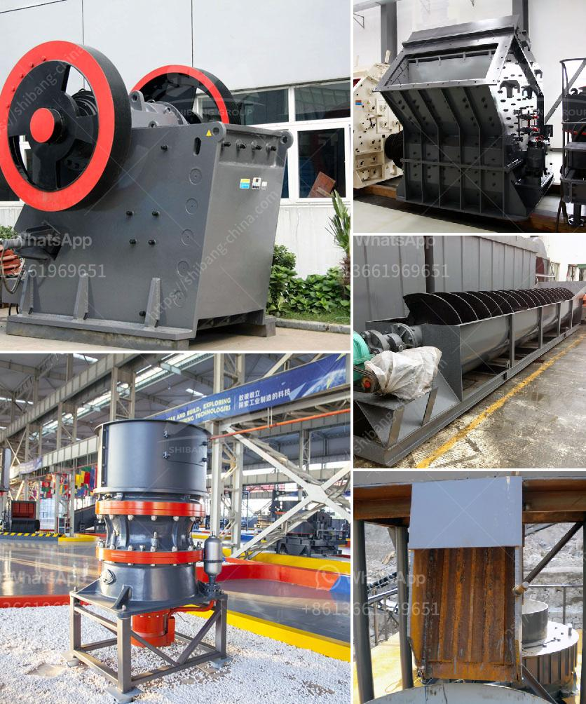

<h3>محطات تكسير الطاقة</h3>
تعتبر محطات تكسير الطاقة من أهم الأماكن التي تقوم بتحويل الوقود الاحفوري إلى طاقة قابلة للاستخدام. تلعب هذه المحطات دورًا حيويًا في تلبية احتياجات الكهرباء والوقود في معظم الدول حول العالم.

تستخدم محطات تكسير الطاقة عدة تقنيات مختلفة لتحويل الوقود الاحفوري، وخاصة النفط والغاز الطبيعي، إلى طاقة. تُعد عملية التكسير خطوة رئيسية في هذا السياق، حيث يتم تحويل الوقود إلى بخار قابل للاشتعال. يتمكن البخار الناتج من توليد ضغط ميكانيكي يستخدم لتحريك محرك الناقل الذي يقوم بتوليد الطاقة الكهربائية.

تتميز محطات تكسير الطاقة بالكفاءة العالية في تحويل الوقود إلى طاقة. تستخدم هذه المحطات التكنولوجيا المتقدمة لتحسين عملية التكسير وزيادة كفاءتها. يتم توجيه الوقود إلى مرجلات عالية الضغط حيث يتم تكسيره بواسطة الحرارة والضغط. تتحلل الكائنات الكيميائية في الوقود إلى تركيبات أكثر بساطة، مما يتيح استخلاص الكفاءة القصوى منها.

بالإضافة إلى تحسين الكفاءة، تعتبر محطات تكسير الطاقة أيضًا وسيلة للتخلص من الملوثات الناتجة عن احتراق الوقود الاحفوري. تقوم المحطات بالتعامل مع مجموعة متنوعة من الملوثات، مثل الغازات السامة والجسيمات الدقيقة. تستخدم التقنيات الحديثة للتحكم في انبعاثات هذه المحطات ومراقبة النفايات الناتجة عنها قبل أن تلوث البيئة.

ومع ازدياد الاهتمام بالطاقة المتجددة، يتم التحول أيضًا نحو استخدام محطات تكسير الطاقة لتحويل الوقود البيولوجي إلى طاقة. يمكن أن يكون الوقود البيولوجي مثل الحيوانات الميتة ومخلفات النباتات والزيوت النباتية. يعتبر الوقود البيولوجي خيارًا مستدامًا وصديقًا للبيئة، حيث يحتوي على نسبة أقل من الكربون المخرجة إلى الجو.

على الرغم من أهمية محطات تكسير الطاقة في توليد الكهرباء والوقود، فإنها تتضمن بعض القضايا البيئية والاقتصادية. يجب علينا تعزيز استخدام الطاقة المتجددة والبحث عن تقنيات أكثر فعالية في إنتاج الطاقة. بالإضافة إلى ذلك، يجب علينا توعية الجمهور حول أهمية الحفاظ على الطاقة والبدء بتبني أساليب حياة مستدامة للحد من انبعاثات الكربون وتغير المناخ.

بإجمالها، تعتبر محطات تكسير الطاقة نقطة رئيسية في دورة الطاقة من أجل تلبية احتياجاتنا في الكهرباء والوقود. تحتاج هذه المحطات إلى تقنيات تكسير محسّنة وتحكم في الانبعاثات من أجل الاستدامة البيئية وصحة البشر والكوكب.
<h3>Contact us</h3><ul><li><strong>Whatsapp:&nbsp;<a href="https://wa.me/8613661969651">+8613661969651</a></strong></li><li><a href="https://swt.shibang-china.com/?git&amp;zhl&amp;محطات تكسير الطاقة"><strong>Online Service(chat now)</strong></a></li></ul><h3>Related</h3><ul><li><a href='آلة تسخين حجر الكوارتز للبيع.md'>آلة تسخين حجر الكوارتز للبيع</a></li><li><a href='آلة كسارة الذهب للبيع في جنوب أفريقيا.md'>آلة كسارة الذهب للبيع في جنوب أفريقيا</a></li><li><a href='كسارات الحجر الرخيصة.md'>كسارات الحجر الرخيصة</a></li><li><a href='بيع محطة تكسير الحجارة.md'>بيع محطة تكسير الحجارة</a></li><li><a href='قائمة أسعار كسارات الفك.md'>قائمة أسعار كسارات الفك</a></li></ul>