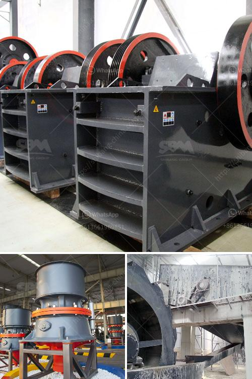

<h3>محطات تكسير للبيع</h3>
تعتبر محطات التكسير من الأنواع الشائعة للصناعات المختلفة، حيث تستخدم لتحويل المواد الخام إلى منتجات نهائية قابلة للاستخدام. وبالتالي، فإن وجود محطة تكسير فعالة وفعالة يعتبر أمرًا ضروريًا لنجاح الصناعات المرتبطة بها. تحظى محطات التكسير بشهرة واسعة في الصناعات البترولية، وصناعة الأسمنت، وصناعة الصلب، وغيرها من الصناعات ذات الصلة.

تهدف محطات التكسير إلى تحطيم المواد الخام إلى قطع صغيرة بحجم محدد، مما يتيح معالجتها وإعادة استخدامها في إنتاج منتجات جديدة. تمتاز محطات التكسير الحديثة بتقنياتها المتطورة والقادرة على معالجة مختلف الأنواع المختلفة من المواد الخام. تشمل بعض المواد الخام الشائعة المعالجة في محطات التكسير الحجارة، والخامات المعدنية، والفحم، والخرسانة، وغيرها.

عند البحث عن محطات التكسير للبيع، يجب أن ينظر المشتري في عدة عوامل مهمة. أولاً، يجب النظر في القدرة الإنتاجية المطلوبة. فمثلاً، إذا كانت المحطة مستخدمة لصناعة الأسمنت، فإن القدرة الإنتاجية المطلوبة من المحطة قد تكون عالية، حيث يتطلب إنتاج الأسمنت كميات كبيرة من المواد الخام. ثانيًا، يجب أن ينظر المشتري في تكنولوجيا المحطة، والتي يجب أن تكون متطورة بما يكفي لتلبية المتطلبات الحالية والمستقبلية.

كما يجب أن يلتفت المشتري إلى نقاط أخرى في تعامله مع بائعي محطات التكسير. ينبغي التأكد من جودة المحطة ومدى ملاءمتها للغرض المقصود. يجب أيضًا التأكد من توفر خدمة ما بعد البيع المناسبة، بما في ذلك الصيانة والتدريب وقطع الغيار. علاوة على ذلك، ينبغي اتخاذ القرار المبني على السعر المناسب والتوفر العام للمحطة.

بالإجمال، محطات التكسير تلعب دورًا حاسمًا في الصناعات المختلفة، والعثور على محطة تكسير مناسبة لاحتياجات المشتري يتطلب النظر في العديد من العوامل. إن توظيف محطة تكسير فعالة وفعالة يمكن أن يعزز الإنتاجية ويحسّن جودة المنتجات في هذه الصناعات. لذلك، يجب أن تتم دراسة كافة العوامل المتعلقة بعملية الشراء قبل اتخاذ القرار النهائي بشأن الشراء.
<h3>Contact us</h3><ul><li><strong>Whatsapp:&nbsp;<a href="https://wa.me/8613661969651">+8613661969651</a></strong></li><li><a href="https://swt.shibang-china.com/?git&amp;zhl&amp;محطات تكسير للبيع"><strong>Online Service(chat now)</strong></a></li></ul><h3>Related</h3><ul><li><a href='آلة طحن الكوارتز المستعملة للبيع.md'>آلة طحن الكوارتز المستعملة للبيع</a></li><li><a href='استخدام مسحوق الجبس في البناء.md'>استخدام مسحوق الجبس في البناء</a></li><li><a href='مصانع تجفيف رمل الفراك للبيع.md'>مصانع تجفيف رمل الفراك للبيع</a></li><li><a href='مصانع الكرات الصناعية.md'>مصانع الكرات الصناعية</a></li><li><a href='كسارة الحجر بوزولانا 100 طن في الساعة.md'>كسارة الحجر بوزولانا 100 طن في الساعة</a></li></ul>