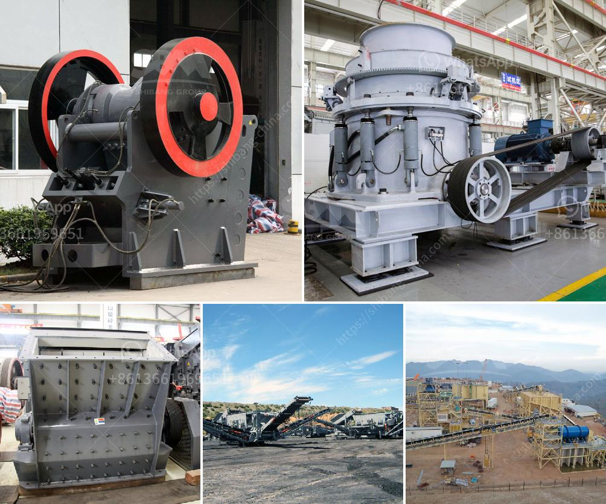

<h3>محطات تكسير محمولة</h3>
محطات التكسير المحمولة: التقنية الحديثة لمعالجة المواد الصلبة

تعد محطات التكسير المحمولة تقنية حديثة تستخدم في معالجة المواد الصلبة باستخدام الكسارات والغرابيل المحمولة. تتميز هذه المحطات بقدرتها على العمل في أماكن متعددة وتوفير الوقت والجهد في نقل المواد الصلبة من مكان إلى آخر.

تعتبر محطات التكسير المحمولة هي الحل الأمثل للمقاولين والشركات التي تحتاج إلى معالجة المواد الصلبة في مواقع مختلفة. تأتي هذه المحطات عادة في هياكل متحركة وقابلة للفك والتجميع، مما يجعلها سهلة التنقل والتركيب في أي مكان. بفضل هذه القابلية للحركة والتشغيل المستقل، يمكن للمحطات العمل في الطرق السريعة والمشاريع الكبرى دون الحاجة إلى إعداد محطات تكسير ثابتة.

تعتمد محطات التكسير المحمولة على استخدام الكسارات والغرابيل المحمولة لتفتيت وفصل المواد الصلبة. تأتي هذه المحطات مع مجموعة متنوعة من الكسارات والغرابيل المتنقلة، مما يتيح للمستخدمين تحقيق التكسير المثلى والفصل الدقيق للمواد الصلبة.

تتيح محطات التكسير المحمولة للشركات تقليل تكاليف النقل والتشغيل، حيث يمكنها استخدام المواد القريبة لإنتاج المواد الصلبة المطلوبة. بدلاً من نقل المواد الصلبة على مسافات طويلة إلى محطات التكسير الثابتة، يمكن للمحطات المحمولة الوصول بسهولة إلى مواقع مختلفة والبدء في تكسير المواد الصلبة على الفور.

تتميز محطات التكسير المحمولة أيضًا بكفاءتها العالية وقدرتها على معالجة كمية كبيرة من المواد الصلبة بشكل مستمر. توفر هذه المحطات نتائج سريعة وفعالة في تكسير المواد الكبيرة والتحكم في حجم الجسيمات المطلوبة.

بفضل التكنولوجيا الحديثة والتطور المستمر في مجال معدات التكسير المحمولة، يتم تطوير محطات أكثر كفاءة وسهولة في التشغيل. تأتي بعض المحطات بميزات إضافية مثل الشاشات الذكية وأنظمة التحكم عن بُعد، مما يسهل على المستخدمين مراقبة العملية وتعديلها بناءً على الاحتياجات.

في الختام، تُعَد محطات التكسير المحمولة تكنولوجيا حديثة وفعالة لمعالجة المواد الصلبة. توفر هذه المحطات سهولة التنقل والتشغيل المستقل والكفاءة العالية في معالجة المواد الكبيرة. تعتبر هذه التكنولوجيا البديل الأمثل للمحطات الثابتة، حيث توفر الوقت والجهد وتقلل التكاليف، وهي قادرة على تحقيق الأداء المطلوب في أي موقع وفي أي وقت.
<h3>Contact us</h3><ul><li><strong>Whatsapp:&nbsp;<a href="https://wa.me/8613661969651">+8613661969651</a></strong></li><li><a href="https://swt.shibang-china.com/?git&amp;zhl&amp;محطات تكسير محمولة"><strong>Online Service(chat now)</strong></a></li></ul><h3>Related</h3><ul><li><a href='مصنع كسارة الكاولين في أوزبكستان.md'>مصنع كسارة الكاولين في أوزبكستان</a></li><li><a href='تكلفة مجفف الرمال في ولاية كيرالا.md'>تكلفة مجفف الرمال في ولاية كيرالا</a></li><li><a href='آلة قطع الحجر المستخدمة من اليابان.md'>آلة قطع الحجر المستخدمة من اليابان</a></li><li><a href='مكاتب CAD لمعدات التعدين.md'>مكاتب CAD لمعدات التعدين</a></li><li><a href='كسارة مخروطية في الشرق الأوسط.md'>كسارة مخروطية في الشرق الأوسط</a></li></ul>