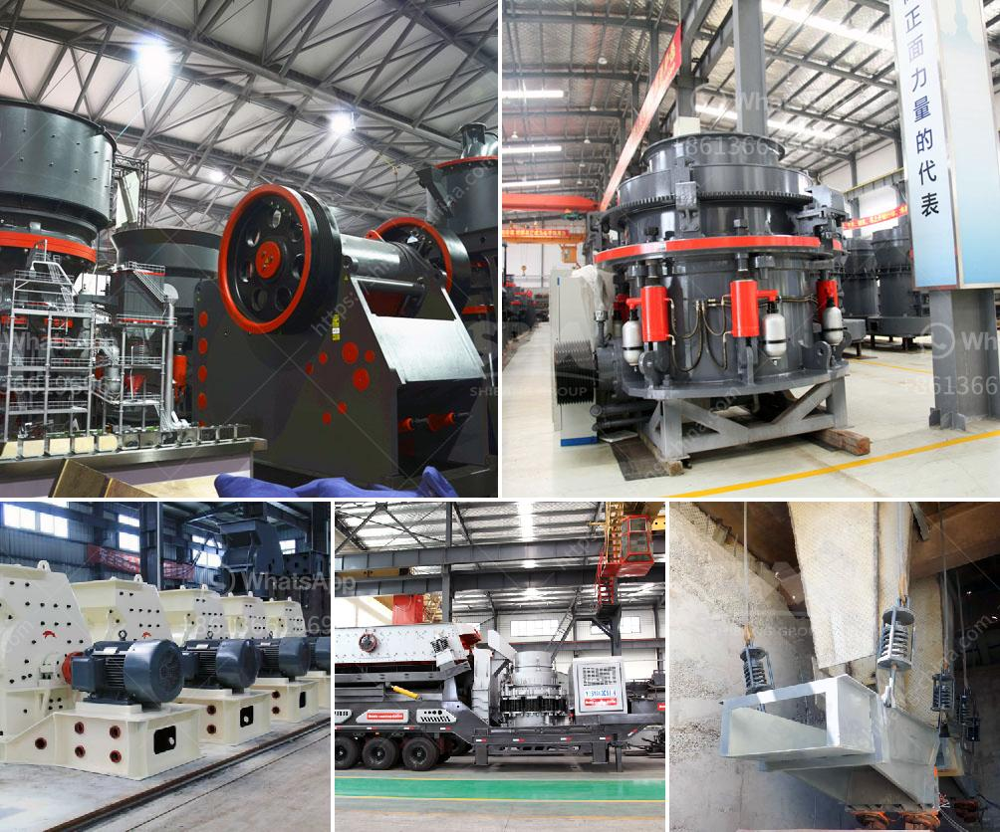

<h3>محطة تكسير الصخور</h3>
تعتبر محطة تكسير الصخور من أهم المحطات في صناعة التعدين والبناء، حيث تستخدم لتكسير الصخور الكبيرة وتقسيمها إلى قطع صغيرة مناسبة للاستخدام في العديد من التطبيقات. تعد هذه المحطة من الآلات الهندسية المعقدة التي تعمل بطرق متقدمة وقادرة على معالجة كميات كبيرة من الصخور.

تتكون محطة تكسير الصخور من عدة أجزاء أساسية، بدءًا من المغذي الاهتزازي الذي يقوم بنقل الصخور الكبيرة إلى الكسارة الفكية. يتم استخدام الكسارة الفكية لتكسير الصخور بطريقة أولية، حيث يتم تقليل حجمها بواسطة ضغط الفكين المتحركين والثابتين. بعد تكسير الصخور بواسطة الكسارة الفكية، يتم نقلها عبر الأحزمة الناقلة إلى الكسارات الثانوية والتي تقوم بتكسير الصخور إلى قطع أصغر حجماً.

تتميز محطة تكسير الصخور بقدرتها على تكسير العديد من أنواع الصخور المختلفة بشكل فعال، بما في ذلك الحجر الجيري والجرانيت والديوريت والبازلت وغيرها. تتوفر الكسارات بتصاميم وحجوم مختلفة لتتناسب مع احتياجات المشروع المحدد. علاوة على ذلك، يوجد العديد من أجهزة الفحص والفرز المتقدمة التي تساعد على فصل الصخور المكسورة إلى مقاسات مختلفة وفقًا لاستخداماتها.

محطة تكسير الصخور تستخدم في العديد من الصناعات مثل صناعة البناء، حيث تستخدم الصخور المكسورة لصنع الخرسانة والأسفلت والحصى. كما تستخدم في صناعة التعدين، حيث تساعد في استخراج المعادن من الصخور الخام. تستخدم أيضًا في صناعة الطاقة حيث يتم استخدام الفحم المكسور لتوليد الطاقة الكهربائية.

باختصار، محطة تكسير الصخور هي محطة هندسية تستخدم في تكسير الصخور الكبيرة وتقسيمها إلى قطع صغيرة. تعتبر هذه المحطة جزءًا أساسيًا في صناعة التعدين والبناء، حيث تلعب دورًا هامًا في تحويل الصخور الخام إلى منتجات نهائية قابلة للاستخدام. تتوفر محطات تكسير الصخور بتصاميم متعددة وقدرات مختلفة لتتناسب مع متطلبات المشروع المحدد وتلبي احتياجات العملاء.
<h3>Contact us</h3><ul><li><strong>Whatsapp:&nbsp;<a href="https://wa.me/8613661969651">+8613661969651</a></strong></li><li><a href="https://swt.shibang-china.com/?git&amp;zhl&amp;محطة تكسير الصخور"><strong>Online Service(chat now)</strong></a></li></ul><h3>Related</h3><ul><li><a href='عمليات محجر الحجر الجيري.md'>عمليات محجر الحجر الجيري</a></li><li><a href='آلة عملية مطحنة الأسطوانة.md'>آلة عملية مطحنة الأسطوانة</a></li><li><a href='كسارة حجرية بمحرك ديزل قائمة أسعار في الهند.md'>كسارة حجرية بمحرك ديزل قائمة أسعار في الهند</a></li><li><a href='أفضل آلة سحق الكوارتز في الهند.md'>أفضل آلة سحق الكوارتز في الهند</a></li><li><a href='الفرق بين مطاحن الكرة وكسارة الفك.md'>الفرق بين مطاحن الكرة وكسارة الفك</a></li></ul>