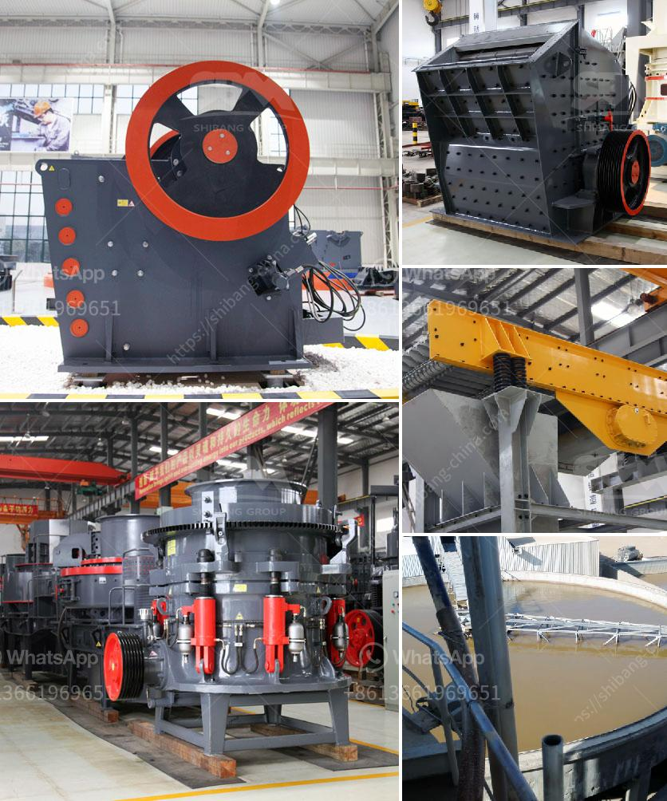

<h3>محطة تكسير وفرز مستعملة للبيع</h3>
تُعد محطة تكسير وفرز المستعملة إحدى الآلات المهمة في صناعة التعدين والبناء. فهي تستخدم لتحويل مواد البناء والديموليشن إلى مواد ذات قيمة جديدة، حيث يتم تفكيك المواد القديمة وتحويلها إلى مواد قابلة لإعادة الاستخدام.

تحظى محطات التكسير والفرز المستعملة بشعبية كبيرة في صناعة البناء والهدم. فهي تساهم في التخلص المستدام من المخلفات وتقليل الضرر البيئي الناجم عن التخلص من هذه المواد في المكبات الكبرى. بدلاً من ذلك، تقوم هذه المحطات بتكسير وفرز المواد المعاد تدويرها مثل الخرسانة والأسفلت والزجاج والخشب، وتحويلها إلى ركام يمكن إعادة استخدامه في مشاريع البناء والهدم القادمة.

تتميز محطات التكسير والفرز المستعملة بالمرونة والكفاءة في الأداء. فهي تتكون عادةً من كسارة أولية لتكسير المواد إلى حجم أصغر، ثم يتم نقلها إلى آلة الفرز التي تقوم بفصل المواد حسب حجمها وجودتها. كما يتم استخدام المعدات المساعدة مثل الناقلات والمغناطيس لتسهيل عملية الفرز.

واحدة من أهم المزايا لشراء محطة تكسير وفرز مستعملة هو التكلفة المنخفضة. فبدلاً من شراء معدات جديدة، يمكن توفير الكثير من المال عند شراء معدات مستعملة والتي لا تزال تعمل بكفاءة. بالإضافة إلى ذلك، تسمح هذه المحطات بزيادة إنتاجية موقع البناء وتقليل التأثير البيئي السلبي.

عند شراء محطة تكسير وفرز مستعملة، يجب أن يتم النظر في عدة عوامل. من بين هذه العوامل، ينبغي التحقق من حالة المعدات ومدى عمرها المفترض. ينصح أيضًا بالاستعانة بخبراء التعدين والبناء لتقديم النصح والاستشارات المهنية.

في النهاية، تعتبر محطة تكسير وفرز المستعملة فرصة رائعة للشركات والمقاولين لتحويل المخلفات إلى ثروة. تساهم هذه المحطات في الاستدامة البيئية وتوفير التكاليف في صناعة البناء والهدم. لذا، يجب النظر بجدية في شراء محطة تكسير وفرز مستعملة للبيع للاستفادة من فوائدها المتعددة.
<h3>Contact us</h3><ul><li><strong>Whatsapp:&nbsp;<a href="https://wa.me/8613661969651">+8613661969651</a></strong></li><li><a href="https://swt.shibang-china.com/?git&amp;zhl&amp;محطة تكسير وفرز مستعملة للبيع"><strong>Online Service(chat now)</strong></a></li></ul><h3>Related</h3><ul><li><a href='مصنع كسارة 150 طن في الساعة.md'>مصنع كسارة 150 طن في الساعة</a></li><li><a href='كسارة مخروطية في المملكة العربية السعودية.md'>كسارة مخروطية في المملكة العربية السعودية</a></li><li><a href='إنتاج مصنع الإسمنت في الجزائر.md'>إنتاج مصنع الإسمنت في الجزائر</a></li><li><a href='معدات طحن لمسحوق التلك.md'>معدات طحن لمسحوق التلك</a></li><li><a href='حفارات مستعملة للبيع في نيجيريا.md'>حفارات مستعملة للبيع في نيجيريا</a></li></ul>