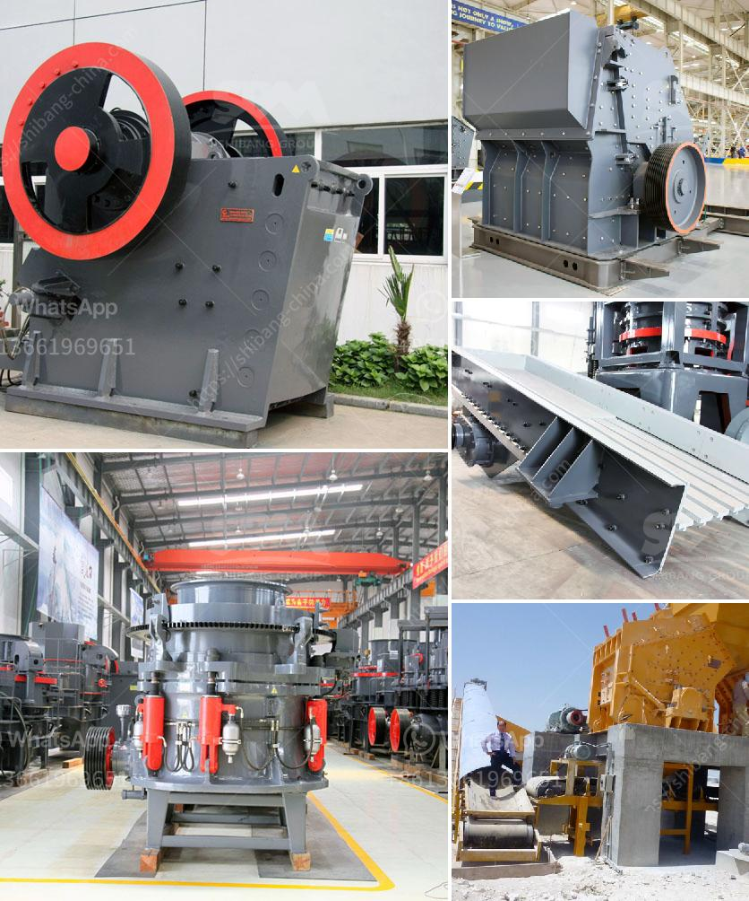

<h3>محطة سحق تينوفا</h3>
تعد محطة سحق تينوفا واحدة من أهم المحطات الصناعية في قطاع التعدين، وتقع في منطقة تينوفا بجمهورية كازاخستان. تأسست المحطة في عام 1970، وقد تم تطويرها وتحديثها على مر السنين لتكون واحدة من أكبر وأكثر المحطات تقدمًا في العالم.

تقوم محطة سحق تينوفا بتحويل خامات المنجم إلى منتجات نهائية قابلة للتسويق عن طريق عملية السحق والغربلة. تتميز المحطة بتجهيز العديد من أنواع الخامات مثل الحديد والنحاس والذهب والفضة والزنك، وتقدم منتجات عالية الجودة للشركات المصنعة وصناعة المعادن في جميع أنحاء العالم.

تعتبر محطة سحق تينوفا ضرورية لعملية التعدين الحديثة، حيث تقوم بعملية سحق الصخور وتجهيزها بطرق فعالة ومحسنة. تمتلك المحطة تجهيزات ومعدات حديثة تتيح لها معالجة الكميات الكبيرة من الخامات في وقت قصير، مما يزيد من كفاءة العملية الإنتاجية ويخفض تكاليف التشغيل.

بالإضافة إلى ذلك، تعتبر محطة سحق تينوفا ملتزمة بالأمان والصحة العامة. توفر خطط وإجراءات وقائية صارمة لضمان سلامة العمال والموظفين والحفاظ على البيئة المحيطة. تستخدم المحطة تقنيات حديثة في مجال إدارة النفايات واستخدام المواد الكيميائية، مما يضمن التشغيل السلس والمستدام.

تلعب محطة سحق تينوفا دورًا هامًا في تطوير الاقتصاد المحلي وتوفير فرص عمل للمجتمع المحيط. توظف المحطة عددًا كبيرًا من العاملين المحليين وتعمل على تطوير المهارات الفنية والتقنية لديهم. بالإضافة إلى ذلك، تقوم المحطة بإجراءات رياضية وثقافية في المنطقة وتساهم في تطوير المجتمع المحلي.

باختصار، تُعد محطة سحق تينوفا مثالًا رائعًا على المحطات الصناعية المتقدمة والملتزمة بالجودة والسلامة والاستدامة. تلبي متطلبات صناعة التعدين الحديثة وتساهم في تطوير الاقتصاد والمجتمع المحلي. بفضل تطورها المستمر ورؤيتها الاستراتيجية، من المتوقع أن تستمر محطة سحق تينوفا في النمو والتطور في المستقبل.
<h3>Contact us</h3><ul><li><strong>Whatsapp:&nbsp;<a href="https://wa.me/8613661969651">+8613661969651</a></strong></li><li><a href="https://swt.shibang-china.com/?git&amp;zhl&amp;محطة سحق تينوفا"><strong>Online Service(chat now)</strong></a></li></ul><h3>Related</h3><ul><li><a href='محطات الكسارات في الكويت.md'>محطات الكسارات في الكويت</a></li><li><a href='حساب قطر كرة الطحن لمطحنة الكرة.md'>حساب قطر كرة الطحن لمطحنة الكرة</a></li><li><a href='مطاحن الكرة حديد الصهر الهند.md'>مطاحن الكرة حديد الصهر الهند</a></li><li><a href='قائمة مصانع حبيبات خام الحديد في الهند.md'>قائمة مصانع حبيبات خام الحديد في الهند</a></li><li><a href='إنشاء محجر في نيجيريا.md'>إنشاء محجر في نيجيريا</a></li></ul>