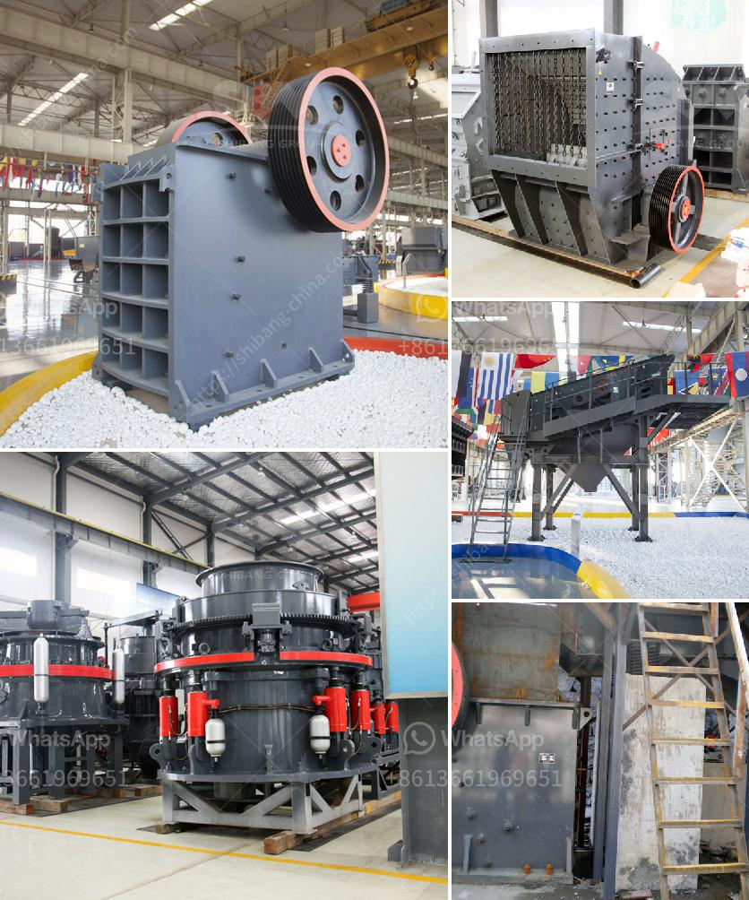

<h3>محطة سحق ثابتة بسعة 200 طن في الساعة</h3>
تعتبر محطة سحق الثابتة بسعة 200 طن في الساعة أحد أهم المرافق في قطاع البناء والتشييد. تتميز هذه المحطة بأنها تستخدم لسحق الصخور والأحجار الكبيرة إلى أحجام أصغر وذلك للاستخدام في مشاريع البناء المختلفة.

تتألف محطة السحق الثابتة من عدة أجزاء رئيسية، بما في ذلك جهاز التغذية وكسارة الفك والكسارة المخروطية والشاشة الاهتزازية وناقل الحركة. يتم استخدام هذه الأجزاء لتحويل الصخور الكبيرة إلى صخور صغيرة أو حصى قابلة للاستخدام في مشاريع البناء المختلفة.

بالنسبة لسعة المحطة، فإن قدرتها على سحق 200 طن في الساعة تعني أنها قادرة على معالجة كمية كبيرة من الصخور في وقت قصير. هذا يعني أنها تزيد من كفاءة عملية السحق وتقلل من الوقت والجهد المبذولين في هذه العملية.

بفضل القدرة العالية والكفاءة، يمكن استخدام محطة السحق الثابتة بسعة 200 طن في الساعة في مجموعة واسعة من مشاريع البناء. من بين هذه المشاريع، يمكن استخدامها في بناء الطرق والجسور والأبنية والأعمال الإنشائية الأخرى التي تتطلب استخدام الصخور المكسرة.

إضافة إلى ذلك، يتميز هذا النوع من المحطات بثباتها وموثوقيتها. فهي تعمل بشكل مستمر ومنتظم دون أي توقف غير مبرر. كما أنها تحتوي على تصميم متقدم وتكنولوجيا عالية الجودة لضمان أداء ممتاز وتحقيق النتائج المرجوة.

أخيراً، يجب أن نذكر أهمية محطات السحق الثابتة في صناعة البناء والتشييد. فهي تعتبر الأساس في إعداد المواد اللازمة للمشاريع وتساهم بشكل كبير في تطوير البنية التحتية وتحسين جودة البناء. وبفضل القدرة العالية والكفاءة المحسنة لهذه المحطات، يمكن للشركات والمقاولين تحقيق توفير في الوقت والجهد والتكاليف، مما يسهم في نجاح المشاريع وزيادة الربحية.

للخلاصة، تتمثل أهمية محطة السحق الثابتة بسعة 200 طن في الساعة في قدرتها على تحويل الصخور الكبيرة إلى أحجام صغيرة وإعداد المواد اللازمة لمشاريع البناء. بفضل استخدام تكنولوجيا عالية الجودة والقدرة العالية والكفاءة المحسنة، تعد هذه المحطة اختيارًا مثاليًا للشركات والمقاولين الذين يسعون إلى زيادة إنتاجيتهم وتحسين جودة الأعمال التي يقدمونها.
<h3>Contact us</h3><ul><li><strong>Whatsapp:&nbsp;<a href="https://wa.me/8613661969651">+8613661969651</a></strong></li><li><a href="https://swt.shibang-china.com/?git&amp;zhl&amp;محطة سحق ثابتة بسعة 200 طن في الساعة"><strong>Online Service(chat now)</strong></a></li></ul><h3>Related</h3><ul><li><a href='سعر مصنع التكسير والفرز في جنوب أفريقيا.md'>سعر مصنع التكسير والفرز في جنوب أفريقيا</a></li><li><a href='عملية كربونات الكالسيوم المترسبة.md'>عملية كربونات الكالسيوم المترسبة</a></li><li><a href='كسارة الأسطوانة PG 610 x 400.md'>كسارة الأسطوانة PG 610 x 400</a></li><li><a href='أنا أبحث عن كسارة في ماليزيا.md'>أنا أبحث عن كسارة في ماليزيا</a></li><li><a href='إعداد وحدة طحن الأسمنت بسعة 100 طن يوميًا.md'>إعداد وحدة طحن الأسمنت بسعة 100 طن يوميًا</a></li></ul>