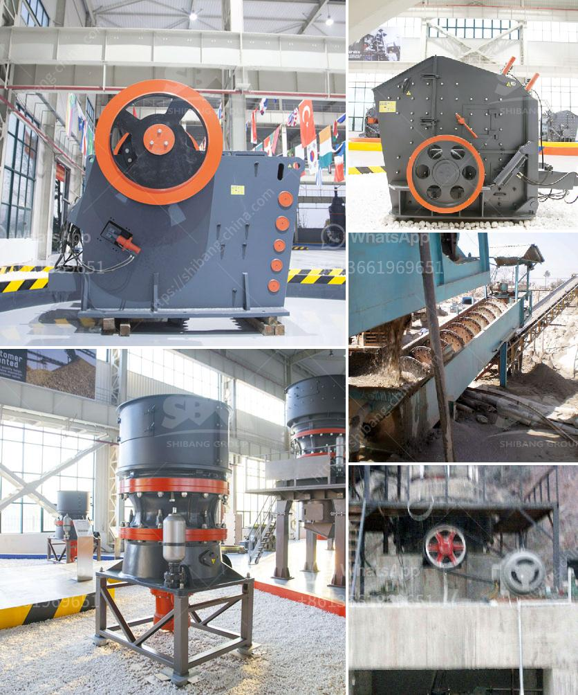

<h3>محطة كسارة تلقائية من اليد الثانية</h3>
تعتبر محطة كسارة تلقائية من اليد الثانية أحد الحلول المستدامة والاقتصادية لتكسير الصخور والمواد الصلبة المختلفة في صناعات متعددة. تُستخدم هذه المحطة في عمليات تجهيز المواد الخام للبناء، والتعدين، وإعادة التدوير، مما يساهم في تحسين كفاءة العمل وتقليل التكاليف التشغيلية.

تعتبر المحطة الكسارة اليدوية من اليد الثانية بديلاً اقتصادياً مقارنةً بالمحطات الكسارة الجديدة، حيث أنها تستخدم بعد تجديدها وتعديلها بحيث تكون قادرة على العمل بنفس الكفاءة والجودة التي تقدمها المحطات الجديدة. يتم اختيار المحطة الكسارة بعناية من مصدر موثوق به ويتم فحصها واختبارها قبل بيعها للتأكد من جاهزيتها للعمل.

تتكون محطة الكسارة التلقائية من اليد الثانية من عدة أجزاء رئيسية تعمل بشكل متناسق لتنفيذ العملية بكفاءة. تشمل هذه الأجزاء المكونات الهيدروليكية واللوحة الكهربائية والسيور الناقلة والمجمع الهيكلي وكسارة الصخرة نفسها. يتم التحكم في العملية بواسطة نظام التحكم الآلي الذي يعمل على تنظيم تغذية المواد وضبط حجم الإخراج حسب الحاجة.

محطة كسارة تلقائية من اليد الثانية توفر العديد من المزايا للمستخدمين. فبدلاً من شراء محطة كسارة جديدة بتكلفة عالية، يمكن للشركات أو الأفراد الحصول على محطة كسارة يدوية بسعر أقل وبنفس الجودة والأداء. بالإضافة إلى ذلك، يتم تقليل النفايات والتلوث الناجم عن إعادة تدوير المحطة الكسارة وتجديدها بدلاً من التخلص منها، مما يساهم في الحفاظ على البيئة.

بالنسبة للشركات المصنعة لمحطات الكسارة، فإن بيع وشراء المحطات الكسارة التلقائية من اليد الثانية يسمح لها بتوسيع أعمالها وزيادة دخلها. كما أن تلك المحطات تساهم في تلبية الطلب المتزايد من قبل العملاء الذين يبحثون عن حلول مستدامة واقتصادية في عمليات التكسير.

باختصار، تعتبر محطة الكسارة التلقائية من اليد الثانية خيارًا مستدامًا واقتصاديًا في صناعة التكسير. تساهم هذه المحطة في توفير التكاليف وتحسين كفاءة العمل، بالإضافة إلى دورها في الحفاظ على البيئة من خلال إعادة تدوير وتجديد المعدات القديمة. يوفر بيع وشراء المحطات الكسارة اليدوية من اليد الثانية فرصة للشركات لتوسيع أعمالها وزيادة دخلها في هذه الصناعة المتنامية.
<h3>Contact us</h3><ul><li><strong>Whatsapp:&nbsp;<a href="https://wa.me/8613661969651">+8613661969651</a></strong></li><li><a href="https://swt.shibang-china.com/?git&amp;zhl&amp;محطة كسارة تلقائية من اليد الثانية"><strong>Online Service(chat now)</strong></a></li></ul><h3>Related</h3><ul><li><a href='خط إنتاج الكوارتز.md'>خط إنتاج الكوارتز</a></li><li><a href='سعر مطحنة ريموند الفائقة الدقة.md'>سعر مطحنة ريموند الفائقة الدقة</a></li><li><a href='سعر آلة طحن المطحنة.md'>سعر آلة طحن المطحنة</a></li><li><a href='المواصفات الفنية لمطحنة الكرة.md'>المواصفات الفنية لمطحنة الكرة</a></li><li><a href='دراسة الجدوى لإنتاج مسحوق الجبس.md'>دراسة الجدوى لإنتاج مسحوق الجبس</a></li></ul>