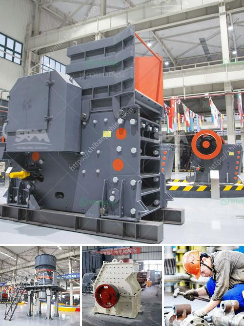

<h3>محطة كسارة في الفلبين</h3>
تقع محطة الكسارة في جزيرة الفلبين في منطقة جزاتانجاس على بعد حوالي 85 كيلومترًا جنوب العاصمة مانيلا. تُعتبر هذه المحطة واحدة من أهم وأكبر المحطات في البلاد وتعمل على توليد الطاقة الكهربائية من خلال الطاقة الحرارية المشتقة من الفحم.

تتميز محطة الكسارة بأنها قادرة على توليد طاقة تصل إلى 1000 ميجاواط، وهو ما يشكل نحو 16٪ من إجمالي توليد الكهرباء في الفلبين. تعتمد المحطة على استخدام فحم الكوك الذي يشترى من الشركات المحلية والدولية. يتم تحويل هذا الفحم إلى حرارة من خلال عملية الاحتراق، ثم يتم تحويل الحرارة المولدة إلى طاقة كهربائية عبر التوربينات.

يوفر تشغيل محطة الكسارة الكهرباء للملايين من الأسر والمؤسسات في الفلبين. يتم توزيع هذه الكهرباء عبر الشبكة الكهربائية لتشمل جميع مناطق البلاد، بما في ذلك المناطق النائية والمحافظات البعيدة.

تعد محطة الكسارة مهمة من حيث المساهمة في تلبية الطلب المتزايد على الكهرباء في الفلبين، حيث تعاني البلاد في بعض الأحيان من نقص في توفير الطاقة في الفترات الذروية. بالإضافة إلى ذلك، تعد محطة الكسارة من بين المحطات النظيفة نسبياً في البلاد، حيث تستخدم تكنولوجيا حديثة للتحكم في انبعاثات الغازات السامة.

ومع ذلك، تمر محطة الكسارة ببعض التحديات والانتقادات. يُعتبر احتراق الفحم مصدرًا للتلوث البيئي والانبعاثات الضارة التي يمكن أن تؤثر على صحة السكان المحليين والبيئة المحيطة. قد تغرق المحطة في بعض الأحيان في الضباب السام نتيجة انبعاث غاز ثاني أكسيد الكبريت وجزيئات صلبة معلقة في الهواء.

علاوة على ذلك، تمثل مجموعات حقوق الإنسان ومنظمات البيئة استنكارًا واعتراضًا على استمرار استخدام الفحم كمصدر للطاقة، وتدعو إلى الاستثمار في مصادر الطاقة المتجددة بدلاً من ذلك. تهدف هذه المنظمات إلى تشجيع الحكومة الفلبينية والشركات الكهربائية على الانتقال إلى استخدام الطاقة الشمسية والرياح وغيرها من المصادر النظيفة كبديل عن الفحم.

وفي النهاية، تبقى محطة الكسارة إحدى أهم المحطات الكهربائية في الفلبين ومساهمة حاسمة في تلبية احتياجات الكهرباء الوطنية. ومع ذلك، فإن السلوك البيئي والاستدامة هما من بين التحديات التي يجب على الحكومة والشركات معالجتها من أجل ضمان التنمية المستدامة في المستقبل.
<h3>Contact us</h3><ul><li><strong>Whatsapp:&nbsp;<a href="https://wa.me/8613661969651">+8613661969651</a></strong></li><li><a href="https://swt.shibang-china.com/?git&amp;zhl&amp;محطة كسارة في الفلبين"><strong>Online Service(chat now)</strong></a></li></ul><h3>Related</h3><ul><li><a href='معدات معالجة الجبس والكالسينيشن.md'>معدات معالجة الجبس والكالسينيشن</a></li><li><a href='آلة معالجة الذهب في الصين.md'>آلة معالجة الذهب في الصين</a></li><li><a href='مصنعين محطم في جنوب أفريقيا.md'>مصنعين محطم في جنوب أفريقيا</a></li><li><a href='كسارات متنقلة أمريكية.md'>كسارات متنقلة أمريكية</a></li><li><a href='مكونات مصنع الحجر الجيري الأولي.md'>مكونات مصنع الحجر الجيري الأولي</a></li></ul>