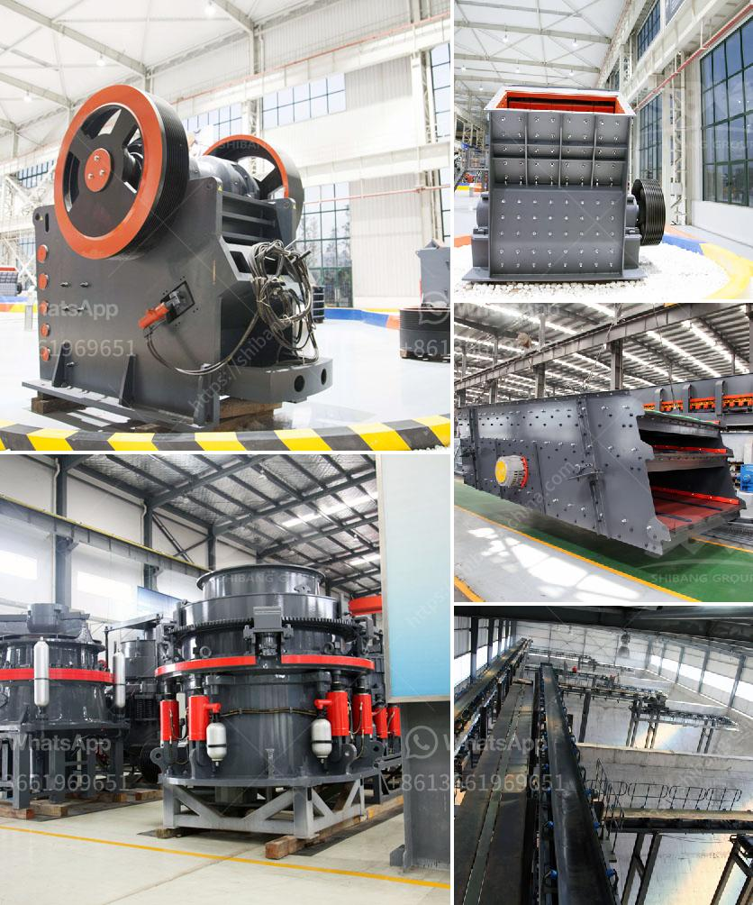

<h3>محطة كسارة محمولة من الهند</h3>
تعتبر محطات الكسارة المحمولة من الهند حلاً مبتكرًا لصناعة التعدين والبناء. تتميز هذه الآلات بالقدرة على سحق الصخور والحصى والمواد الأخرى بسهولة وفعالية ونقلها من موقع إلى آخر بسهولة ومرونة. تتميز هذه المحطات بأنها قادرة على التعامل مع مختلف أنواع المواد الخام بسهولة وتوفير الوقت والجهد المطلوبين لنقلها إلى موقع المعالجة الرئيسي.

تتألف محطات الكسارة المحمولة من الهند من وحدات متكاملة تتضمن كسارة الفك أو الصدم، وناقل الحزام، والمغذي الاهتزازي، والشاشة الاهتزازية، إلخ. تتميز هذه الوحدات بالتصميم المدمج والمحمولية العالية، مما يسمح بتثبيتها واستخدامها بسهولة في مواقع العمل المختلفة.

بفضل تصميمها المبتكر والموفر للمساحة، تعد محطات الكسارة المحمولة من الهند مثالية للاستخدام في مناطق العمل الضيقة مثل مواقع البناء الحضرية والمناطق الصناعية. بالإضافة إلى ذلك، يمكن استخدام هذه المحطات في المواقع النائية والمناطق الجبلية حيث لا تتوفر البنية التحتية الكافية لتثبيت محطات الكسارة التقليدية.

تقدم محطات الكسارة المحمولة من الهند العديد من المزايا. فهي توفر حلاً فعالًا ومرنًا لتلبية احتياجات صناعة التعدين والبناء. تقلل هذه الآلات من تكاليف النقل والتشغيل المرتبطة بنقل المواد لمواقع المعالجة التقليدية. بالإضافة إلى ذلك، تتميز هذه المحطات بأداء عالٍ وإنتاجية ممتازة، مما يساهم في تحسين كفاءة عمليات التعدين والبناء.

وتتميز محطات الكسارة المحمولة من الهند أيضًا بالسهولة في الصيانة والاستخدام. فهي تتميز بتقنيات متقدمة ونظام تحكم فعال يسهل التحكم في عمليات الكسارة وتشغيلها بكفاءة. بالإضافة إلى ذلك، فإن الشاشة الاهتزازية المدمجة تساهم في تحسين كفاءة الفصل وتصنيف المواد المسحوقة.

باختصار، تعد محطات الكسارة المحمولة من الهند حلاً مثاليًا لصناعة التعدين والبناء. تقدم هذه الآلات الكفاءة والمرونة والاقتصادية في عمليات سحق ونقل المواد. تمثل هذه المحطات طفرة في صناعة التعدين والبناء، وتسهم في تحقيق أقصى استفادة من الموارد الطبيعية بطريقة فعالة ومستدامة.
<h3>Contact us</h3><ul><li><strong>Whatsapp:&nbsp;<a href="https://wa.me/8613661969651">+8613661969651</a></strong></li><li><a href="https://swt.shibang-china.com/?git&amp;zhl&amp;محطة كسارة محمولة من الهند"><strong>Online Service(chat now)</strong></a></li></ul><h3>Related</h3><ul><li><a href='كسارة حصى ورمل في نيبال.md'>كسارة حصى ورمل في نيبال</a></li><li><a href='كيفية حساب كفاءة الكسارة.md'>كيفية حساب كفاءة الكسارة</a></li><li><a href='مطاحن الكرة في إندونيسيا.md'>مطاحن الكرة في إندونيسيا</a></li><li><a href='كسارات مستعملة للبيع في الولايات المتحدة.md'>كسارات مستعملة للبيع في الولايات المتحدة</a></li><li><a href='طحن مطحنة الاسمنت.md'>طحن مطحنة الاسمنت</a></li></ul>