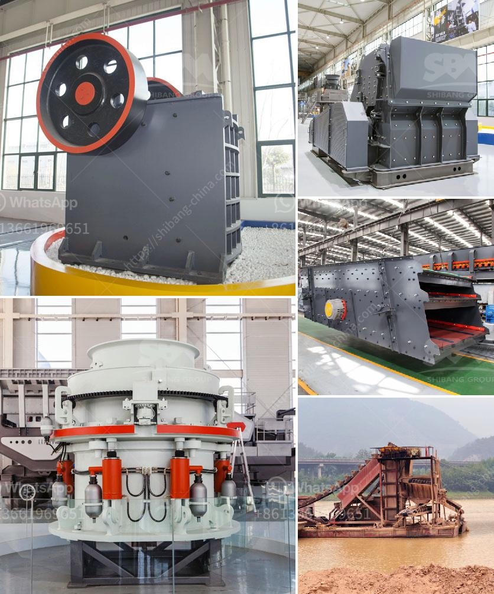

<h3>محطة كسارة نيجيريا</h3>
تعتبر محطة كسارة نيجيريا واحدة من أهم المحطات الحرارية في نيجيريا. تقع هذه المحطة في ولاية بلاشيو في شمال نيجيريا وتمكنت من تلبية احتياجات الطاقة الكهربائية في المنطقة بشكل كبير.

تم إنشاء محطة كسارة نيجيريا بداية العمل في العام 1982 وهي تعتبر واحدة من أكبر محطات توليد الكهرباء في البلاد. تغطي المحطة مساحة واسعة وتحتوي على العديد من الوحدات الحرارية التي تستخدم الفحم كوقود لتوليد الكهرباء.

تم تصميم محطة كسارة نيجيريا لتكون مستدامة وفعالة من حيث استخدام الموارد وتلبية احتياجات الطاقة في البلاد. تم تجهيزها بأحدث التقنيات والمعدات لضمان أقصى كفاءة وأداء.

تعتبر محطة كسارة نيجيريا مصدرًا رئيسيًا لتوليد الكهرباء في المنطقة. توفر المحطة الكهرباء للمنازل والمؤسسات والصناعات الكبرى في المنطقة. تعتبر الكهرباء مصدرًا حيويًا لتشغيل الصناعات وتعزيز التطور الاقتصادي في المنطقة.

علاوة على ذلك ، فإن محطة كسارة نيجيريا تعتبر نموذجًا رائدًا في استخدام الفحم كوقود. تسعى البلاد إلى توسيع استخدام الفحم في توليد الكهرباء بسبب توفرها الوفير وتكلفتها المنخفضة. وبفضل المحطة ، تم تحقيق ذلك بشكل ناجح وتم توفير الكهرباء بأسعار معقولة للمستهلكين.

يجب أن نذكر أيضًا أن محطة كسارة نيجيريا تلتزم بالمسؤولية البيئية. تعمل المحطة بطرق تكنولوجية تضمن تقليل انبعاثات الغازات الضارة وتلوث الهواء. تستخدم أحدث تقنيات إزالة الرواسب لتحسين جودة الهواء وحماية البيئة المحلية.

وفي الختام ، فإن محطة كسارة نيجيريا هي محطة حرارية مهمة تقوم بتوليد الكهرباء بطريقة فعالة ومستدامة. تلبي المحطة احتياجات الطاقة في المنطقة وتساهم في التنمية الاقتصادية والاجتماعية لنيجيريا بشكل عام. كما أنها تلتزم بالمسؤولية البيئية وتعمل على الحفاظ على جودة الهواء والحماية البيئية.
<h3>Contact us</h3><ul><li><strong>Whatsapp:&nbsp;<a href="https://wa.me/8613661969651">+8613661969651</a></strong></li><li><a href="https://swt.shibang-china.com/?git&amp;zhl&amp;محطة كسارة نيجيريا"><strong>Online Service(chat now)</strong></a></li></ul><h3>Related</h3><ul><li><a href='قائمة الآلات المستخدمة في تعدين الفحم.md'>قائمة الآلات المستخدمة في تعدين الفحم</a></li><li><a href='قائمة أسعار الشاشات الاهتزازية.md'>قائمة أسعار الشاشات الاهتزازية</a></li><li><a href='سعر ماكينة مولين في ميدان.md'>سعر ماكينة مولين في ميدان</a></li><li><a href='قائمة معدات مصنع الأسمنت.md'>قائمة معدات مصنع الأسمنت</a></li><li><a href='صور تعدين خام النحاس في نيجيريا.md'>صور تعدين خام النحاس في نيجيريا</a></li></ul>