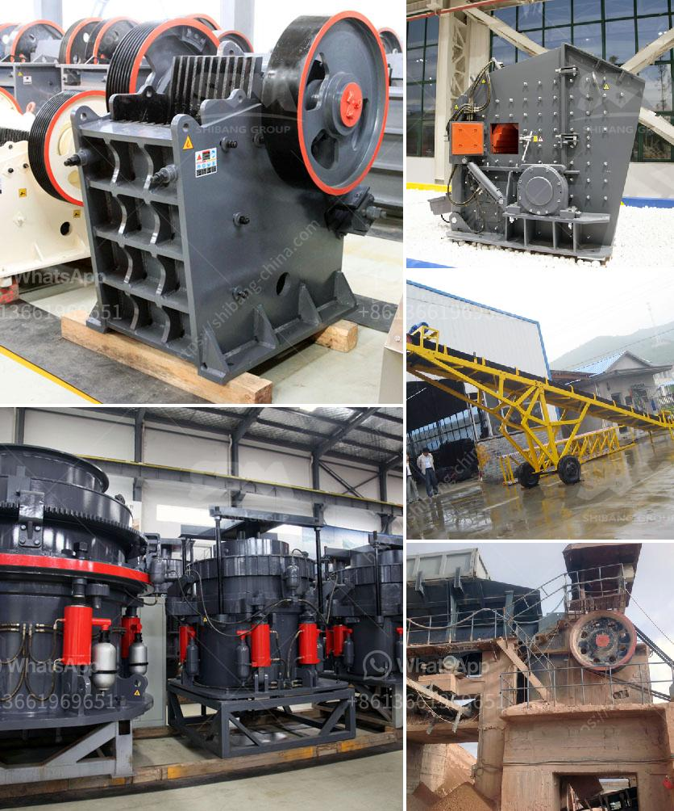

<h3>محطم الحجر الجيري روتور</h3>
يشكل الحجر الجيري مادة خام مهمة في الصناعات المختلفة، وخاصة في صناعة الأسمنت والفولاذ. ولتحويل الحجر الجيري من شكله الطبيعي إلى درجات مهمة من الدقة، يتم استخدام محطم الحجر الجيري روتور، الذي يعتبر جهازًا حيويًا في عمليات سحق وطحن الحجر الجيري.

يتميز محطم الحجر الجيري روتور بتقنية فريدة تساعد على سحق الحجر الجيري دون تلفه أو تغيير خصائصه الفيزيائية الهامة. يعمل المحطم بواسطة الضغط والتصادم بين المواد والروتور، حيث يتم تطبيق قوة ضغط على الحجر الجيري لسحقه وتخفيض حجمه بشكل فعال.

يحتوي محطم الحجر الجيري روتور على شفرات حادة ومتحركة تندفع بسرعة عالية دورانية، مما يؤدي إلى تفتيت الحجر والحصول على قطع صغيرة بحجم مناسب. بالإضافة إلى ذلك، يحتوي المحطم على لوحة تصادمية تعمل على تحويل القوة الحركية إلى طاقة تؤدي إلى ضرب مادة الحجر الجيري وتفتتها بشكل أكبر.

تتيح تقنية المحطم الروتور للصناعات العديد من المزايا. قد يغطي روتور الحجر الجيري مجموعة واسعة من القدرات، حيث يمكنه سحق الحجر الجيري بسرعة تصل إلى 500 طن في الساعة، مع وجود إمكانية تعديل سرعة العمل حسب الاحتياجات. كما أنه يتميز بكفاءة عالية ونسبة فعالة لتفتيت المواد.

بالإضافة إلى ذلك، فإن محطم الحجر الجيري روتور يتمتع بسهولة الصيانة والتشغيل. يتم تصميمه بطريقة تجعل عملية التبديل والإصلاح للشفرات والأجزاء الأخرى سهلة وسريعة. يعتبر المحطم أيضًا قويًا ومتينًا، مما يضمن عمرًا طويلًا واستخدام فعال في صناعة سحق الحجر الجيري.

في نهاية المطاف ، يعتبر محطم الحجر الجيري روتور أحد الأدوات الرئيسية في صناعة سحق الحجر الجيري. يعمل بكفاءة ويمكن الاعتماد عليه لتفتيت الحجر الجيري وتحويله إلى مواد صالحة للإستخدام في العديد من التطبيقات الصناعية المختلفة. بفضل تقنية الروتور ومزاياه العديدة، يعد محطم الحجر الجيري روتور اختيارًا مثاليًا للعمليات الصناعية التي تتطلب سحق الحجر الجيري بكفاءة وجودة عالية.
<h3>Contact us</h3><ul><li><strong>Whatsapp:&nbsp;<a href="https://wa.me/8613661969651">+8613661969651</a></strong></li><li><a href="https://swt.shibang-china.com/?git&amp;zhl&amp;محطم الحجر الجيري روتور"><strong>Online Service(chat now)</strong></a></li></ul><h3>Related</h3><ul><li><a href='مصنع كسارة مستعمل بسعر 100 طن في الساعة للبيع.md'>مصنع كسارة مستعمل بسعر 100 طن في الساعة للبيع</a></li><li><a href='عملية سحق الكسارة.md'>عملية سحق الكسارة</a></li><li><a href='طحن مطحنة الكرة والجسيمات.md'>طحن مطحنة الكرة والجسيمات</a></li><li><a href='مطحنة تعدين.md'>مطحنة تعدين</a></li><li><a href='آلة مطحنة الكرة في الصين.md'>آلة مطحنة الكرة في الصين</a></li></ul>