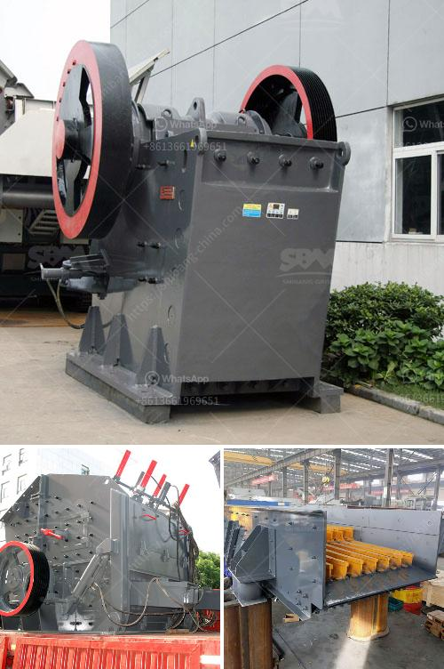

<h3>محطم متنقل لسحق الفحم</h3>
في عالم الصناعة والتعدين، تعتبر صناعة الفحم من أهم الصناعات التي تساهم في إنتاج الطاقة اللازمة. ومن أجل زيادة كفاءة استخراج الفحم وتحسين جودته، تم تطوير العديد من الأجهزة والمعدات الحديثة، منها المحطم المتنقل لسحق الفحم.

يُعتبر المحطم المتنقل للفحم جهازًا متطورًا تم تصميمه وتصنيعه للقضاء على عملية سحق الفحم بطريقة فعالة وسريعة. يستخدم هذا الجهاز في عمليات استخراج الفحم من المناجم وتجهيزه للاستخدام.

يتميّز المحطم المتنقل للفحم بعدة مزايا رئيسية. أولًا، يتم تجهيز هذا الجهاز بأنظمة متقدمة للتحكم والتشغيل، مما يساعد على زيادة كفاءة الإنتاجية وتقليل الوقت المطلوب لعملية سحق الفحم. كما يتميز هذا الجهاز بوزنه الخفيف، مما يجعله قابلًا للنقل بسهولة بين المواقع المختلفة.

ثانيًا، يتميز المحطم المتنقل بقدرته على سحق الفحم بطرق متعددة. يمكن ضبط الجهاز لسحق الفحم إلى أحجام مختلفة، بحيث يتلاءم مع متطلبات العمل المحددة. هذا يسمح للمشغلين بتحقيق نتائج مثالية ومرضية في عمليات سحق الفحم.

ثالثًا، يتمتع المحطم المتنقل بمستوى عالٍ من السلامة. يتم تجهيز هذا الجهاز بأنظمة حماية متقدمة لتجنب أي حوادث أو خلل في العمليات. كما يتم تزويده بأجزاء متينة وقوية توفر أقصى درجات الأمان وتتيح التركيز على عملية السحق دون أي تأثير سلبي.

وفي الختام، يُعتبر المحطم المتنقل لسحق الفحم أحدث التقنيات في صناعة الفحم. يتيح هذا الجهاز للشركات المعدنية والتعدينية الاستفادة من مزاياه العديدة في تحسين جودة الفحم المستخدم وزيادة الإنتاجية. يعد هذا الجهاز حلاً فعالًا لتحسين عمليات سحق الفحم وتعزيز الاستدامة البيئية في صناعة الطاقة.
<h3>Contact us</h3><ul><li><strong>Whatsapp:&nbsp;<a href="https://wa.me/8613661969651">+8613661969651</a></strong></li><li><a href="https://swt.shibang-china.com/?git&amp;zhl&amp;محطم متنقل لسحق الفحم"><strong>Online Service(chat now)</strong></a></li></ul><h3>Related</h3><ul><li><a href='مصنع معالجة البازلت.md'>مصنع معالجة البازلت</a></li><li><a href='أسعار كسارة رمل السيليكا.md'>أسعار كسارة رمل السيليكا</a></li><li><a href='عملية تلبيس خام المنغنيز.md'>عملية تلبيس خام المنغنيز</a></li><li><a href='كسارة تأثير من الصين.md'>كسارة تأثير من الصين</a></li><li><a href='خط سحق البازلت.md'>خط سحق البازلت</a></li></ul>