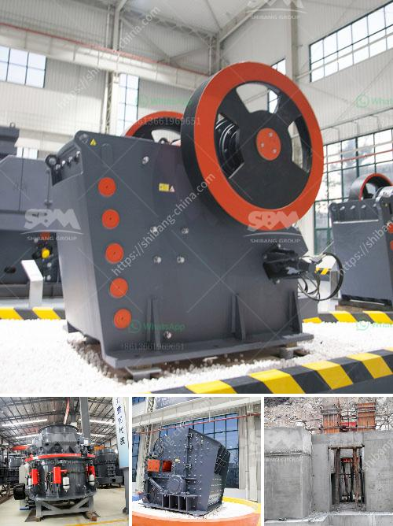

<h3>مختلف طرق سحق وطحن السيراميك</h3>
تعد السيراميك أحد المواد الهشة والصعبة التي تستخدم في مجموعة واسعة من التطبيقات والصناعات. قد تكون هناك حاجة لسحق وطحن السيراميك في عدة حالات مثل تحويلها إلى حجم جزيئات صغيرة للاستخدام في صناعة الطلاء أو صناعة الخزف أو التصنيع الإلكتروني. في هذه المقالة، سنتعرف على بعض الطرق المختلفة لسحق وطحن السيراميك.

أحد أشهر طرق سحق السيراميك هو استخدام الكسارة الفكية. تتميز هذه الكسارة بأسنان قوية تستخدم لتمزيق السيراميك إلى قطع صغيرة. بفضل الحجم الصغير لقطع السيراميك، يمكن تطبيق العديد من التقنيات الأخرى لطحنها إلى حجم أصغر. يمكن استخدام الكسارة الفكية لكسر السيراميك إلى قطع صغيرة بحجم تتراوح بين بضعة سنتيمترات وبضعة ميليمترات.

تعتبر طاحونة الكرات أيضًا طريقة شائعة لطحن السيراميك. تتكون هذه الطاحونة من أسطوانة تدور بسرعة، وتحتوي على كرات معدنية أو سيراميكية صغيرة داخلها. عندما يتم وضع قطع السيراميك داخل الطاحونة، تعمل الكرات على طحنها وسحقها تحت تأثير الاحتكاك والتصادم. النتيجة هي حجم الجسيمات الأصغر والأكثر تجانساً.

أما إذا كان هناك حاجة لطحن السيراميك إلى حجم أصغر بكثير، فيمكن استخدام طاحونة الطحن الكروية. تتميز هذه الطاحونة بوجود كرات صغيرة جداً، عادةً ما تكون من السيراميك، تدور داخل أسطوانة. يتم وضع قطع السيراميك داخل الطاحونة ومع تدور الأسطوانة، تعمل الكرات على سحقها وطحنها. هذه العملية تعطي حجم جسيمات أصغر وأكثر دقة.

طريقة أخرى شائعة لطحن السيراميك هي استخدام المجازفة الفائقة السرعة. تستخدم المجازفة دوران عالي السرعة لطحن السيراميك إلى جسيمات صغيرة. يتم وضع السيراميك داخل الجزء المخصص في المجازفة وبعد ذلك يتم تشغيلها بسرعة عالية. يتم جمع الجسيمات الناتجة بعد ذلك.

باختصار، هناك العديد من الطرق المختلفة لسحق وطحن السيراميك. أما إذا كان الهدف هو تصنيع جسيمات أصغر بكثير وأكثر دقة، فإن استخدام الطاحونة الكروية أو المجازفة الفائقة السرعة يعتبر الاختيار الأفضل.
<h3>Contact us</h3><ul><li><strong>Whatsapp:&nbsp;<a href="https://wa.me/8613661969651">+8613661969651</a></strong></li><li><a href="https://swt.shibang-china.com/?git&amp;zhl&amp;مختلف طرق سحق وطحن السيراميك"><strong>Online Service(chat now)</strong></a></li></ul><h3>Related</h3><ul><li><a href='مطحنة كرات للبيع في الهند.md'>مطحنة كرات للبيع في الهند</a></li><li><a href='سعر مصنع كسارة محمولة في الهند.md'>سعر مصنع كسارة محمولة في الهند</a></li><li><a href='تقرير المشروع على كسارة الخرسانة pdf.md'>تقرير المشروع على كسارة الخرسانة pdf</a></li><li><a href='آلة نقل حجر الكوارتز.md'>آلة نقل حجر الكوارتز</a></li><li><a href='آلة تكسير الصخور.md'>آلة تكسير الصخور</a></li></ul>