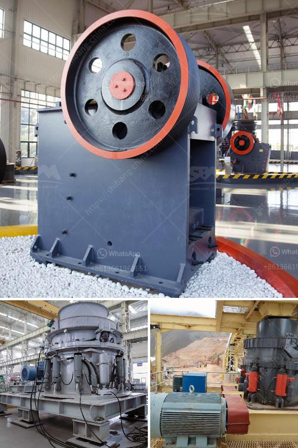

<h3>مخروط سحق 700 1000</h3>
تكسير الصخور هو عملية أساسية في صناعة التعدين والبناء، حيث يتم استخدامها لتحويل الصخور الكبيرة إلى حجم أصغر يمكن استخدامه في العديد من التطبيقات المختلفة. وشكلت مخروط سحق 700 1000 تطورًا هامًا في هذا المجال.

يستخدم مخروط سحق 700 1000 لتكسير الصخور بين الأحجام 200 و 400 ملم. وهو يتكون من غرفة سحق مخروطية تحتوي على مخروط يدور وأسطوانة خارجية ثابتة. وبفضل تصميمها الفريد وتقنيتها المتقدمة، يمكن لمخروط السحق المحمول 700 1000 تحقيق أداء استثنائي وكفاءة عالية في تكسير الصخور.

تتميز مخروط سحق 700 1000 بعدة مزايا رئيسية. أولاً وقبل كل شيء، فإنها توفر قوة سحق عالية مع تقليل الاهتزاز والضوضاء، مما يزيد من جودة الأداء ويقلل من تأثيرها على البيئة والعاملين. تم تصميم غرفة السحق المخروطية بطريقة تمكن من توزيع القوة المطلوبة بالتساوي على الصخور داخل الغرفة. يتم تحقيق ذلك بفضل شكل الغرفة المثلثية العلوية، حيث يتم توجيه الصخور إلى الأسفل ويتم تحويلها في نفس الوقت بسبب الضغط العالي الموجود في الجزء العلوي من المخروط. وهذا يؤدي إلى زيادة فعالية التكسير.

ثانيًا، تتميز مخروط سحق 700 1000 بتصميم مدمج وقابلية للتشغيل السهلة والتركيب المرن. يمكن استخدامها في العديد من المشاريع المختلفة، مثل تكسير الحجارة الكبيرة في مصانع الأسمنت أو التعدين، حيث يتم نقلها بسهولة وتركيبها في المواقع المطلوبة. بفضل حجمها المدمج ووزنها الخفيف، يمكن لمخروط سحق 700 1000 تقديم أداء عالي في أي مكان.

أخيراً، يتميز مخروط سحق 700 1000 بمرونة الإنتاج والتحكم الدقيق في حجم الإخراج. يمكن ضبط فجوة السحق وفقًا للمتطلبات المحددة، مما يسمح للمشغل بالتحكم في الحجم النهائي المطلوب للمنتج. هذا يعني أنه يمكن تحقيق تكسير دقيق للصخور مع حجم الحصى المنتج المطلوب.

باختصار، مخروط سحق 700 1000 هو تقنية تكسير الصخور الحديثة التي توفر أداءً ممتازًا وكفاءة عالية. بفضل تصميمها المتقدم ومزاياها المتعددة، فإنها تحظى بشعبية كبيرة في صناعة التعدين والبناء. إن استخدام هذه التقنية يعني زيادة الإنتاجية وتوفير الوقت والجهد، مما يساهم في تطور صناعة تكسير الصخور بشكل عام.
<h3>Contact us</h3><ul><li><strong>Whatsapp:&nbsp;<a href="https://wa.me/8613661969651">+8613661969651</a></strong></li><li><a href="https://swt.shibang-china.com/?git&amp;zhl&amp;مخروط سحق 700 1000"><strong>Online Service(chat now)</strong></a></li></ul><h3>Related</h3><ul><li><a href='سعر كسارة الفك 24x12.md'>سعر كسارة الفك 24x12</a></li><li><a href='شركات تصنيع مصانع المحاجر في المملكة المتحدة.md'>شركات تصنيع مصانع المحاجر في المملكة المتحدة</a></li><li><a href='معدات تعدين الرمال والحصى للبيع.md'>معدات تعدين الرمال والحصى للبيع</a></li><li><a href='أسعار كسارات الحجر الصغيرة.md'>أسعار كسارات الحجر الصغيرة</a></li><li><a href='مطحنة الأسطوانة للسائل.md'>مطحنة الأسطوانة للسائل</a></li></ul>