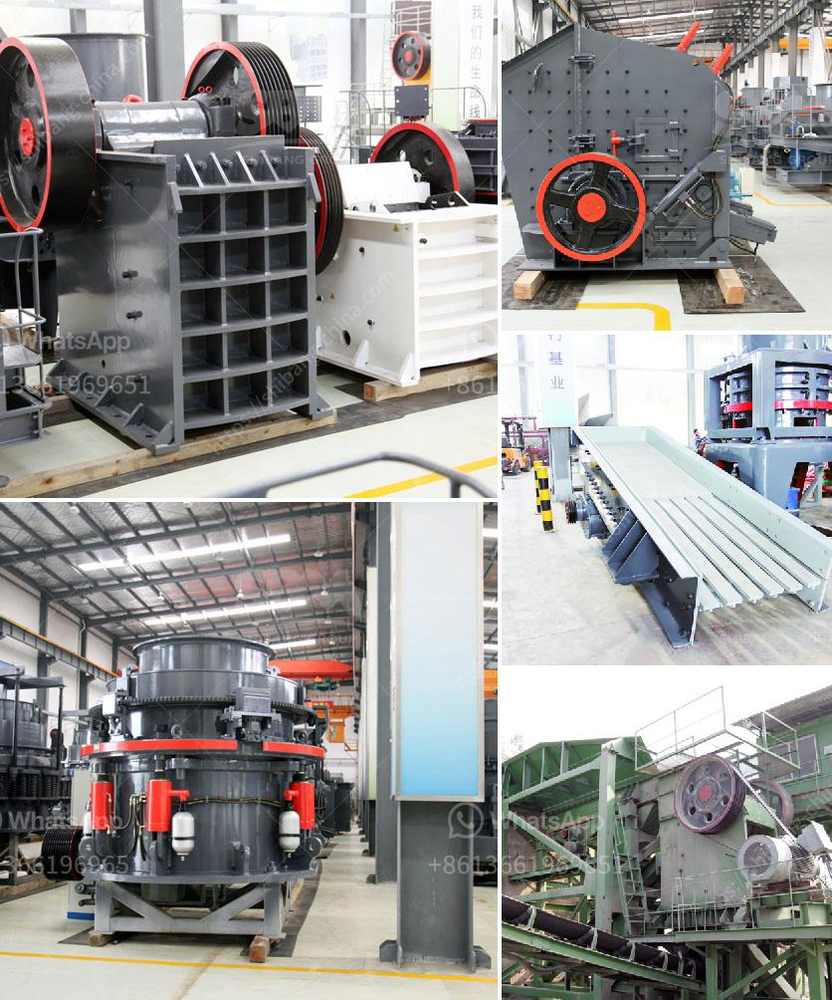

<h3>مخطط تخطيطي لمطحنة الأسطوانات</h3>
مطحنة الأسطوانات هي واحدة من الأدوات الرئيسية في صناعة الطحن. يتم استخدامها لطحن المادة الخام بشكل متساوٍ ودقيق للحصول على منتج نهائي متجانس مرغوب فيه. بناءً على هذا الغرض، سأقدم لكم مخططًا تخطيطيًا لمطحنة الأسطوانات.

أولاً وقبل كل شيء، تحتاج مطحنة الأسطوانات إلى هيكل قوي ومستقر. يتكون الهيكل العام للمطحنة من إطار قوي مصنوع من الصلب عالي الجودة. يتم تصميم قاعدة المطحنة بعرض واسع لتوفير الاستقرار وتقليل حدوث الاهتزازات التي يمكن أن تؤثر على جودة الطحن.

ثانيًا، تتكون مطحنة الأسطوانات من زوج من الأسطوانات. يتم تشكيل الأسطوانة العلوية والأسفل من المعدن المقاوم للتلف، مثل الصلب المقاوم للصدأ، لضمان مقاومتها للتأكل وتعزيز عمرها الافتراضي. توفر الأسطوانات القوة اللازمة لسحق المادة الخام وفرمها بينها.

ثالثًا، يوجد نظام التحكم في مطحنة الأسطوانات، والذي يعين على ضبط عملية الطحن وضمان تحقيق القدرة الإنتاجية والجودة المطلوبة. يتكون هذا النظام من وحدة تحكم تلقائية وحساسات تساعد في تتبع ومراقبة عملية الطحن.

رابعًا، هناك نظام لتبديد الحرارة في مطحنة الأسطوانات. فعملية الطحن قد تؤدي إلى ارتفاع درجة حرارة المادة الخام والأسطوانات. لمنع تراكم الحرارة وتلف المنتج، يجب تزويد المطحنة بنظام تبديد حرارة فعال، مثل مروحة تبريد أو أنابيب تساعد على تبديد الحرارة الزائدة.

أخيرًا، يتم تزويد مطحنة الأسطوانات بنظام للتحكم في الحجم. يسمح هذا النظام للمشغل بضبط حجم الطحين المنتج بحسب الاحتياجات المحددة. يعمل النظام عن طريق تغيير الفجوة بين الأسطوانات، مما يؤدي إلى تغيير الحجم النهائي للمنتج.

في النهاية، يجب أن يتم تصميم مطحنة الأسطوانات بعناية للحصول على أداء ممتاز ومنتج نهائي عالي الجودة. يجب الاهتمام بعاملي القوة والمتانة، وكذلك تحقيق القدرة الإنتاجية المطلوبة والتحكم في الجودة. تلبي هذه المعايير المذكورة سابقاً احتياجات الصناعة وتساهم في تحسين كفاءة وجودة الطحن.
<h3>Contact us</h3><ul><li><strong>Whatsapp:&nbsp;<a href="https://wa.me/8613661969651">+8613661969651</a></strong></li><li><a href="https://swt.shibang-china.com/?git&amp;zhl&amp;مخطط تخطيطي لمطحنة الأسطوانات"><strong>Online Service(chat now)</strong></a></li></ul><h3>Related</h3><ul><li><a href='قائمة الشركات المستخرجة في الفلبين.md'>قائمة الشركات المستخرجة في الفلبين</a></li><li><a href='إنتاج الإسمنت الأبيض من مسحوق الرخام.md'>إنتاج الإسمنت الأبيض من مسحوق الرخام</a></li><li><a href='مصنع معالجة الذهب آلة كسارة الحجر التركية.md'>مصنع معالجة الذهب آلة كسارة الحجر التركية</a></li><li><a href='سير ناقل في دبي.md'>سير ناقل في دبي</a></li><li><a href='مطحنة الضغط العالي.md'>مطحنة الضغط العالي</a></li></ul>