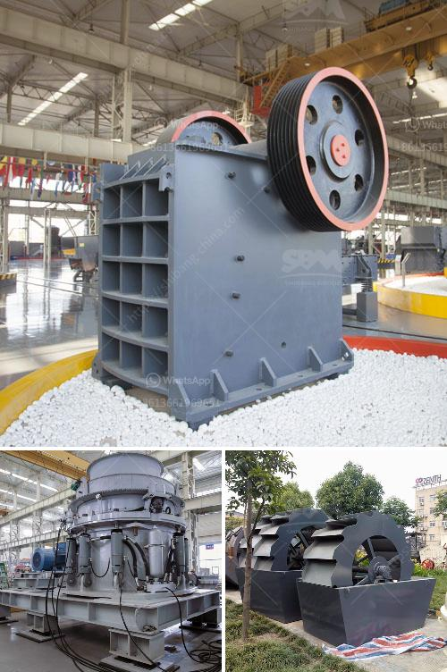

<h3>مخطط تدفق التعدين ومعالجة المعادن للنيكل</h3>
مخطط تدفق التعدين ومعالجة المعادن للنيكل هو سلسلة من العمليات المتسلسلة التي يتم اتباعها لاستخراج وتجهيز خام النيكل للحصول على منتج نهائي قابل للتسويق. يعد النيكل معدنًا استراتيجيًا مهمًا نظرًا لاستخداماته الواسعة في صناعات مختلفة مثل صناعة البطاريات والسيراميك والزجاج والفولاذ المقاوم للصدأ.

يتألف مخطط تدفق التعدين ومعالجة المعادن للنيكل من عدة مراحل رئيسية، وهي:

1. استخراج الخام: يتم استخراج خام النيكل من مواقع التعدين ، وقد تكون هذه المواقع في الأراضي أو في قاع البحر، ويتم استخدام آلات ثقيلة مثل الحفارات والجرافات لاستخراج الخام.

2. سحق وطحن: يتم نقل الخام إلى وحدة سحق وطحن حيث يتم سحقه إلى حجم أصغر ثم يطحن إلى مسحوق ناعم باستخدام مطاحن. الهدف من هذه العملية هو زيادة سطح الاتصال للخام ، والتي تسهل العمليات التالية.

3. التركيز الجاذبي والفصل المغناطيسي: يتم استخدام الجاذبية والفصل المغناطيسي لفصل النيكل عن الشوائب الأخرى مثل الكبريت والنحاس. يتم ذلك عن طريق تغذية محلول خام النيكل عبر منصة تكوينتنبيرج حيث تتفاعل جسيمات المعدن مع غاز طبيعي تلو أخرى تترسب داخل نماذج التركيز ويلتقط القرص المغناطيسي الذي يمر به المعدن تلو آخر.

4. الحمض: في بعض الحالات ، يتم استخدام الأحماض لإزالة الشوائب بعد عملية التركيز. يتم إضافة حمض إلى المحلول النقي للنيكل ، ويتفاعل الحمض مع الشوائب لتكوين رواسب قابلة للتصفية ، بينما يتم استخدام المحلول النقي للمراحل التالية.

5. تنقية: يتم تنقية المحلول النقي للنيكل باستخدام عمليات مختلفة مثل التبخر والتبلور. يتم زيادة تركيز النيكل في هذه العمليات بشكل مستدام حتى يصل إلى تركيز مرغوب لإنتاج منتج نهائي مرغوب.

6. الصهر والتطهير: يتم صهر النيكل المنقى في فرن حتى يتم تحويله إلى سبيكة قابلة للتشكيل. يتم معالجة السبيكة النهائية بعملية التطهير لإزالة أي شوائب بقية.

7. التكوين النهائي: يتم تشكيل السبيكة النهائية إلى منتجات نهائية مثل عصا النيكل أو الأسلاك أو القطع المصنوعة بعد تبريد وتصلب السبيكة.

يوضح مخطط تدفق التعدين ومعالجة المعادن للنيكل العمليات المختلفة المتبعة لاستخراج النيكل وتجهيزه وصنع منتج نهائي قابل للتسويق. تلعب كل مرحلة دورًا هامًا في استخلاص النيكل بكفاءة وتعزيز جودته ، مما يمكن أن يؤثر على تكلفة وفاعلية العملية بشكل كبير.
<h3>Contact us</h3><ul><li><strong>Whatsapp:&nbsp;<a href="https://wa.me/8613661969651">+8613661969651</a></strong></li><li><a href="https://swt.shibang-china.com/?git&amp;zhl&amp;مخطط تدفق التعدين ومعالجة المعادن للنيكل"><strong>Online Service(chat now)</strong></a></li></ul><h3>Related</h3><ul><li><a href='طاحونة مطرقية صغيرة بقطر 10 مم.md'>طاحونة مطرقية صغيرة بقطر 10 مم</a></li><li><a href='آلة تصنيع الكرة الجبسية.md'>آلة تصنيع الكرة الجبسية</a></li><li><a href='مطحنة صناعية.md'>مطحنة صناعية</a></li><li><a href='مصنع كسارة السخام في الهند.md'>مصنع كسارة السخام في الهند</a></li><li><a href='سعر طاحونة المطرقة.md'>سعر طاحونة المطرقة</a></li></ul>