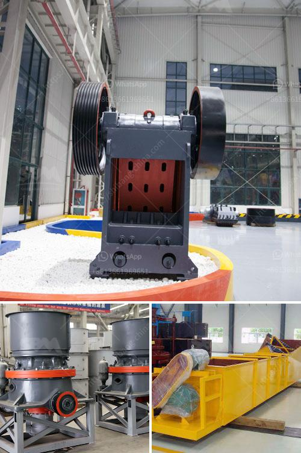

<h3>مخطط تدفق عملية استرداد الذهب بتنسيق PDF</h3>
مخطط تدفق العملية هو وثيقة توضح خطوات وتتبع العملية المحددة، وفي هذه المقالة سنستعرض مخطط تدفق عملية استرداد الذهب بتنسيق PDF.

تعتبر عملية استخراج الذهب من المناجم عملية شاملة ومعقدة، تشمل عدة خطوات يجب اتباعها بدقة للحصول على النتيجة المرجوة. وفيما يلي الخطوات الرئيسية لعملية استرداد الذهب والتي يمكن تضمينها في مخطط تدفق عملية استرداد الذهب بتنسيق PDF:

1. الاستكشاف والتقييم: تبدأ عملية استخراج الذهب بالاستكشاف والتقييم للمنظقة المحتملة لوجود الذهب. وتشمل هذه الخطوة إجراء دراسات جيولوجية وجيوفيزيائية دقيقة لتحديد المناطق المحتملة للعثور على مكامن الذهب.

2. الحفر والتنقيب: بعد تحديد المنطقة المحتملة، يتم إجراء عمليات حفر وتنقيب للكشف عن الشوائب الصخرية والمعادن الأخرى المتصاحبة مع الذهب. تستخدم في هذه العملية آلات حفر مختلفة مثل الحفارات الدوارة والحفارات الصغيرة.

3. تحطيم الصخور: بعد الحفر والتنقيب، يتم تحطيم الصخور الصلبة بواسطة المعدات الثقيلة، مثل الكسارات الفكية والكسارات المخروطية، لفصل الذهب عن الصخور.

4. عملية الفصل: تشمل هذه الخطوة استخدام مجموعة متنوعة من التقنيات لفصل الذهب عن الشوائب الأخرى. من بين هذه التقنيات، استخلاص الأملاح المتطايرة والقواقع الترشيحية والفصل الجاذبي.

5. التكرير: بعد عملية الفصل، يتم تكرير الذهب باستخدام عمليات كيميائية لإزالة أي شوائب متبقية وتنقية الذهب بشكل كامل.

6. التشكيل: في هذه الخطوة، يتم تشكيل الذهب طبقًا لاحتياجات السوق، حيث يتم صهره وصبه في قوالب معينة للحصول على سبائك ذهبية بمتطلبات محددة.

7. التعبئة والتغليف: في النهاية، يتم تعبئة وتغليف الذهب للتوزيع والتخزين. وقد يتم استخدام شهادات الجودة وأوزان موثقة لتوفير الأمان والموثوقية للعملاء.

هذه هي الخطوات الرئيسية التي يتم اتباعها في عملية استرداد الذهب. يجب إعداد مخطط تدفق عملية استرداد الذهب بتنسيق PDF بعناية لتوضيح سير العملية بشكل واضح ودقيق. ويتم تصميم المخطط بشكل يتناسب مع المتطلبات الخاصة للشركة أو المشروع المعني.
<h3>Contact us</h3><ul><li><strong>Whatsapp:&nbsp;<a href="https://wa.me/8613661969651">+8613661969651</a></strong></li><li><a href="https://swt.shibang-china.com/?git&amp;zhl&amp;مخطط تدفق عملية استرداد الذهب بتنسيق PDF"><strong>Online Service(chat now)</strong></a></li></ul><h3>Related</h3><ul><li><a href='مصنع غسل الرمل المستعمل للبيع.md'>مصنع غسل الرمل المستعمل للبيع</a></li><li><a href='تحجيم مطاحن الكرة.md'>تحجيم مطاحن الكرة</a></li><li><a href='مصانع غسيل الذهب للبيع في غانا.md'>مصانع غسيل الذهب للبيع في غانا</a></li><li><a href='محطة كسارة في الفلبين.md'>محطة كسارة في الفلبين</a></li><li><a href='خط إنتاج مسحوق الحجر الجيري في الهند.md'>خط إنتاج مسحوق الحجر الجيري في الهند</a></li></ul>