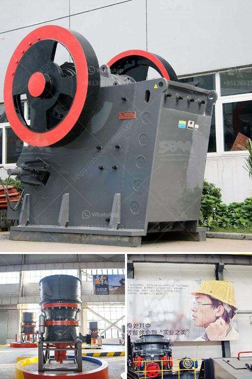

<h3>مخطط لمطحنة المطرقة العمودية</h3>
مخطط المطحنة العمودية هو نموذج هندسي مهم في صناعة الطحن ويستخدم بشكل واسع في عمليات التكسير والطحن للمواد الصلبة. تتكون المطاحن العمودية من جسم رئيسي عمودي ومشتملات أخرى مثل محركات ونواقل ومكابس وأجهزة تحكم.

يتم استخدام هذا النموذج بشكل أساسي لطحن المواد الخام في صناعة التعدين ومعالجة المعادن. هذا المخطط يقدم تصميماً فريداً وفعالاً لعملية الطحن. تلعب المطاحن العمودية دوراً هاماً في تحقيق أداء عالي لعملية الصناعة وتجهيز المواد.

تحتوي المطاحن العمودية على لوحة طحن رأسية تدور بسرعة عالية. تقوم الحبيبات بدخول المطحنة من الأعلى وتتعرض لعملية التكسير عندما يتفاعل المواد مع القوى الداخلية الموجودة في المطحنة. الجاذبية تقوم بسحق المواد على شكل دقيق.

يوفر تصميم المطحنة العمودية منطقة سطح أكبر للطحن مقارنة بالمطاحن التقليدية، وبالتالي يتيح إمكانية زيادة إنتاجية الطحن. يعتبر تصميمها المدمج عملياً في ظل توفير المساحة واستغلال الفراغات بشكل فعال.

إضافة إلى ذلك، تحتوي المطاحن العمودية على نظام تكسير ونقل وتصنيف فائق الدقة ويمكن التحكم فيه عن طريق أجهزة الكمبيوتر. يتيح هذا النظام الدقة والسرعة في عمليات الطحن ويحسن كفاءة الإنتاج.

باختصار، تعتبر المطاحن العمودية تكنولوجيا حديثة ومبتكرة في صناعة الطحن. توفر هذه المطاحن الأداء المتفوق والكفاءة العالية في تجهيز المواد الصلبة. بالإضافة إلى ذلك، تعد المطاحن العمودية أكثر راحة وسهولة في الصيانة مما يجعلها مناسبة للاستخدام في العديد من التطبيقات الصناعية.
<h3>Contact us</h3><ul><li><strong>Whatsapp:&nbsp;<a href="https://wa.me/8613661969651">+8613661969651</a></strong></li><li><a href="https://swt.shibang-china.com/?git&amp;zhl&amp;مخطط لمطحنة المطرقة العمودية"><strong>Online Service(chat now)</strong></a></li></ul><h3>Related</h3><ul><li><a href='مطحنة كرات صغيرة لهنان الصين.md'>مطحنة كرات صغيرة لهنان الصين</a></li><li><a href='خط إنتاج خاص لتعدين مسحوق الكوارتز.md'>خط إنتاج خاص لتعدين مسحوق الكوارتز</a></li><li><a href='تدفق عملية مصنع البنتونايت.md'>تدفق عملية مصنع البنتونايت</a></li><li><a href='معدات تعدين الذهب على نطاق صغير للبيع في مزاد.md'>معدات تعدين الذهب على نطاق صغير للبيع في مزاد</a></li><li><a href='معدات تعدين الصغيرة مصنعين في جنوب أفريقيا.md'>معدات تعدين الصغيرة مصنعين في جنوب أفريقيا</a></li></ul>