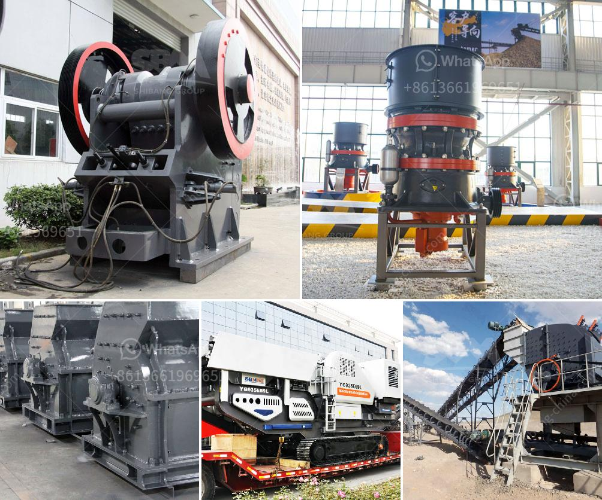

<h3>مخططات تدفق لتصنيع الحديد الزهر</h3>
منذ فترة طويلة، لعب الحديد الزهر دورًا هامًا في صناعة الهياكل المعدنية والقطع الصناعية المختلفة. يشير مصطلح "الحديد الزهر" إلى سبائك الحديد التي تحتوي على نسبة عالية من الكربون (ما بين 2.1٪ إلى 4٪) جنبًا إلى جنب مع نسب متغيرة من السيليكون والفوسفور والكبريت والمنغنيز. إن تصنيع الحديد الزهر يتطلب عمليات دقيقة وخطوات متعددة لضمان الجودة والمواصفات المطلوبة. في هذه المقالة، سنتطرق إلى بعض مخططات تدفق عملية تصنيع الحديد الزهر.

أولاً وقبل كل شيء، يتم الحصول على الحديد الزهر من خلال عملية تسمى "انتاج الصلب الأسفنجي". تبدأ هذه العملية بتحميل خام الحديد (مثل خام الحديد المغنتيت أو خام الحديد الهيماتيت) والفحم في فرن عالي الأفران سعة كبيرة. يتم تسخين الفرن إلى درجة حرارة عالية تتراوح بين 1350 درجة مئوية و1500 درجة مئوية. يتفاعل الحديد في خام الحديد مع الفحم لإنتاج الحديد السائل المعروف باسم "الصلب الساخن". هذا الصلب السائل يحتوي على نسبة عالية من الكربون.

بعد ذلك، يجب تخفيض نسبة الكربون في الحديد الساخن للحصول على الحديد الزهر. يتم ذلك بإضافة سبيكة من الحديد المنصهر والكربون العالي والسيليكون إلى الحديد الساخن. يتم تسخين الخليط الناتج إلى حوالي 1550 درجة مئوية وصبه في قوالب. ينتج عن ذلك الحديد الزهر الذي يحتوي على نسبة كربون تتراوح بين 2.1٪ إلى 4٪ إلى جانب نسب مناسبة من السيليكون والفوسفور والكبريت والمنغنيز.

لا تنتهي خطوات تصنيع الحديد الزهر هنا، بل يجب أيضًا أخذه إلى مراحل المعالجة الحرارية المناسبة. تعتبر عمليات التبريد والتفجير والتخمير جزءًا أساسيًا منها. تهدف هذه العمليات إلى تعزيز المقاومة والصلابة والخواص الميكانيكية للحديد الزهر.

باختصار، تتطلب عملية تصنيع الحديد الزهر العديد من الخطوات المتتابعة لضمان الجودة والمواصفات المطلوبة. يجب التحكم في درجات الحرارة والنسب الكيميائية والمعالجة الحرارية بعناية للحصول على منتج نهائي ذو جودة عالية. إن تطوير مخططات تدفق فعالة يسهم في تقليل التكاليف وتعظيم الإنتاجية وتحسين جودة المنتج النهائي.
<h3>Contact us</h3><ul><li><strong>Whatsapp:&nbsp;<a href="https://wa.me/8613661969651">+8613661969651</a></strong></li><li><a href="https://swt.shibang-china.com/?git&amp;zhl&amp;مخططات تدفق لتصنيع الحديد الزهر"><strong>Online Service(chat now)</strong></a></li></ul><h3>Related</h3><ul><li><a href='مصانع الكسارات للبيع.md'>مصانع الكسارات للبيع</a></li><li><a href='قائمة أسعار إعادة تدوير زجاج كونسول للطن.md'>قائمة أسعار إعادة تدوير زجاج كونسول للطن</a></li><li><a href='آلة معالجة البلانت.md'>آلة معالجة البلانت</a></li><li><a href='كسارات الحجر والرمل المحمولة على نطاق صغير.md'>كسارات الحجر والرمل المحمولة على نطاق صغير</a></li><li><a href='نظام مصنع البنتونيت.md'>نظام مصنع البنتونيت</a></li></ul>