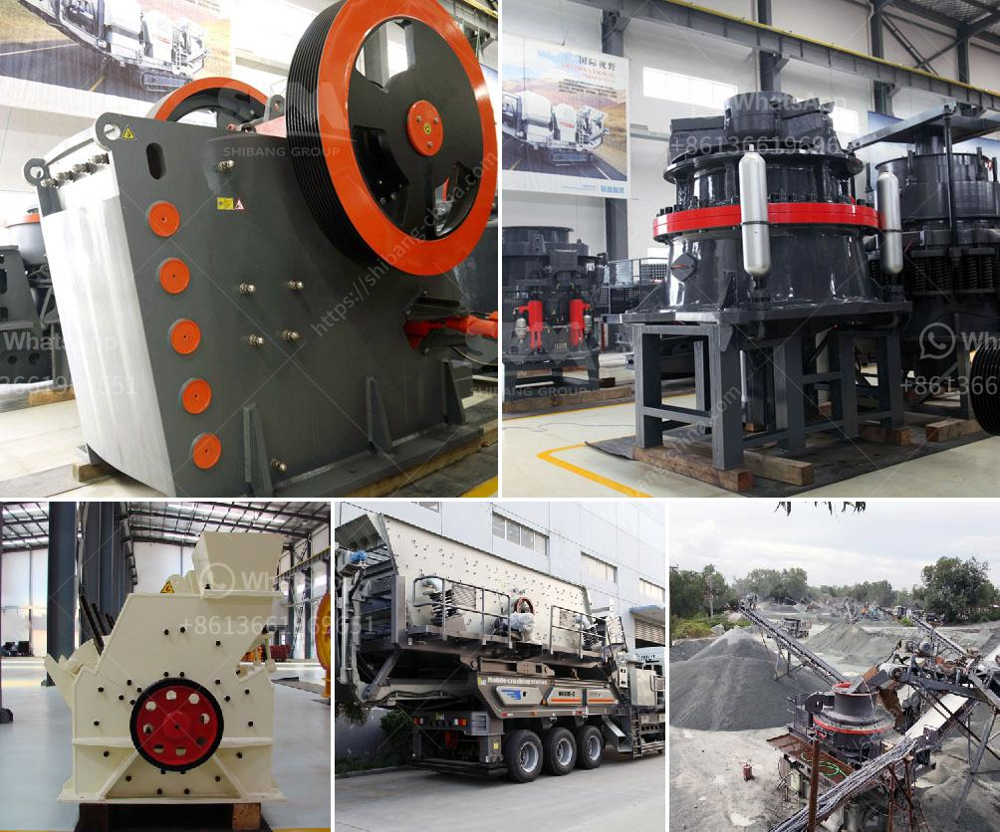

<h3>مزاد كسارة الفك</h3>
تعتبر كسارة الفك أحد الأدوات الرئيسية في صناعة التعدين والإنشاءات. وهي تستخدم لسحق الحجارة الكبيرة إلى حجم أصغر، مما يجعلها مفيدة جدا في عمليات البناء وإعادة تدوير المواد. تتوفر كسارات الفك في العديد من الأحجام والطاقات، وتختلف مزودة بتقنيات وميزات مختلفة.

سوق كسارات الفك يعد من أكثر الأسواق تنامياً في قطاع البناء والتعدين. وبفضل تطور التكنولوجيا وتطور الاقتصاد، فإن الطلب على كسارات الفك يزداد باستمرار. لذلك، قد يكون المشاركة في مزاد كسارة الفك فرصة رائعة لشراء كسارة ذات جودة عالية وبسعر مناسب.

يتم تنظيم مزاد كسارة الفك عادة من قبل شركات التعدين أو المقاولات الكبيرة التي تمتلك أكثر من جهاز وترغب في بيعه لفتح المجال أمام تحديث أو توسيع قدراتها. يتم الإعلان عن المزاد عادة مسبقاً لتتمكن الشركات المهتمة من الاطلاع على المعلومات المتاحة عن كل كسارة تعرض للبيع، بما في ذلك الحالة والتقنية والعمر التقديري. كما يتم تحديد سعر ابتدائي مقداره الحد الأدنى المقبول للمزايدة.

للمشاركة في المزاد، عادة ما يتعين على المشترين المحتملين تقديم ضمان مالي يؤكد قدرتهم على دفع الثمن الكامل في حال الفوز في المزاد. عادة ما يتم توفير فترة للمشترين المحتملين لفحص الكسارة المعروضة قبل المزايدة، حيث يمكنهم فحص حالة الجهاز وملاءمته لاحتياجاتهم المحددة.

عند مزاد كسارة الفك، يتم البدء بطرح السعر الابتدائي، ومن ثم تتم المزايدة من قبل الشركات المهتمة. يستمر عملية المزايدة حتى يتم تحديد أعلى سعر مقدم. يتم بعد ذلك إعلان الشركة الفائزة وتوقيع الاتفاقية بين البائع والمشتري.

تجلب مزادات كسارات الفك العديد من المزايا للكل الأطراف المعنية. من جهة، تسمح للشركات ببيع الكسارات الزائدة أو القديمة التي لم يعد لها حاجة، مما يساعدهم على تمويل عمليات تحديث وتطوير جديدة. من جهة أخرى، توفر هذه المزادات للمشترين فرصة للحصول على معدات عالية الجودة بأسعار منافسة.

باختصار، كسارة الفك هي أداة قيمة في صناعة التعدين والبناء. الاستفادة من مزاد كسارة الفك يمكن أن تكون فرصة مثالية لشراء كسارة ممتازة بسعر معقول.
<h3>Contact us</h3><ul><li><strong>Whatsapp:&nbsp;<a href="https://wa.me/8613661969651">+8613661969651</a></strong></li><li><a href="https://swt.shibang-china.com/?git&amp;zhl&amp;مزاد كسارة الفك"><strong>Online Service(chat now)</strong></a></li></ul><h3>Related</h3><ul><li><a href='مصانع الكرات الصناعية.md'>مصانع الكرات الصناعية</a></li><li><a href='تكلفة فتح مصنع للأسمنت الصغير.md'>تكلفة فتح مصنع للأسمنت الصغير</a></li><li><a href='إنتاج الركام.md'>إنتاج الركام</a></li><li><a href='إجراء إنتاج الأسمنت في المطحنة العمودية.md'>إجراء إنتاج الأسمنت في المطحنة العمودية</a></li><li><a href='كسارة الحجر ساياجي.md'>كسارة الحجر ساياجي</a></li></ul>