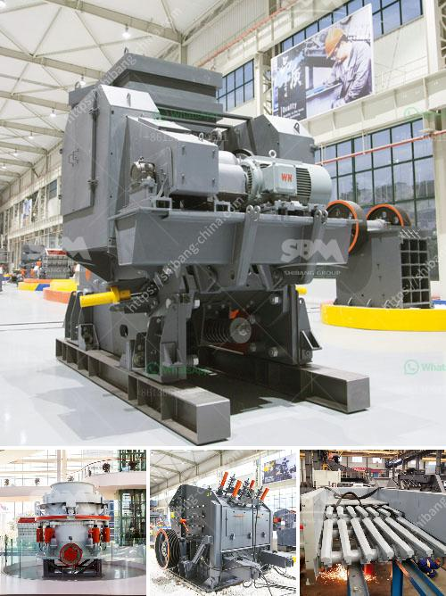

<h3>مزايا وعيوب مطحنة الطحن</h3>
مطحنة الطحن هي أداة أساسية في صناعة الغذاء والحبوب. تستخدم لطحن المواد الصلبة إلى مسحوق ناعم وقد تكون مفيدة في العديد من التطبيقات. ولكن مثل أي أداة أو تقنية أخرى، سوف تواجه مطحنة الطحن مجموعة من المزايا والعيوب. سأقدم لكم بعض هذه المزايا والعيوب في المقالة التالية:

1. تحسين العملية الإنتاجية: تعتبر مطحنة الطحن أكثر فاعلية في تجهيز المواد الصلبة وتحويلها إلى مسحوق ناعم بسرعة وكفاءة. تتيح للشركات زيادة الإنتاجية وتحقيق تقدم أسرع في عملية التصنيع.

2. تنوع التطبيقات: تتيح مطحنة الطحن للشركات إنتاج مجموعة واسعة من المنتجات المختلفة. يمكن استخدامها في طحن الحبوب، البهارات، المواد الكيميائية، وحتى الأعشاب العطرية. هذا يعني أنه يمكن استخدام مطحنة الطحن في العديد من الصناعات المختلفة.

3. جودة المنتج النهائي: تعتبر مساحية المطحنة قابلة للتعديل، مما يعني أنه يمكن للشركات ضبط درجة الطحن والتأكد من جودة المنتج النهائي. يمكن أن تؤثر درجة الطحن على توحيد الحجم والقوام والملمس والنكهة للمنتج النهائي.

1. التكاليف: تعتبر مطحنة الطحن من الأدوات المتطورة والمعقدة، مما يعني أنها عادة ما تكون مكلفة. قد يتطلب شراء مطحنة الطحن تخصيص ميزانية كبيرة، وهذا قد يكون تحديًا للشركات الصغيرة أو المبتدئة.

2. الصيانة: تحتاج مطحنة الطحن إلى صيانة دورية للحفاظ على أدائها المثلى. يجب تنظيفها وإزالة الرواسب والاتساخات بانتظام. هذا يستدعي العمل والجهد والتكلفة.

3. الضوضاء والاهتزاز: تعمل مطاحن الطحن على نحو فعال ولكن بشكل عام، يمكن أن تكون مزعجة بسبب الضجيج العالي والاهتزازات المترتبة على عمل الماكينة. قد يؤدي هذا إلى الإزعاج للعمال وقد يتطلب اتخاذ تدابير للتخفيف من هذه الضوضاء.

باختصار، مطحنة الطحن تعد أداة هامة وفعالة في صناعة الغذاء والحبوب. تحتوي على العديد من المزايا مثل تحسين العملية الإنتاجية وتنوع التطبيقات وجودة المنتج النهائي. ومع ذلك، يوجد أيضًا بعض العيوب مثل التكاليف العالية، والصيانة الدورية والضوضاء والاهتزازات. يجب على الشركات أن تقرر بناءً على احتياجاتها وميزانيتها ما إذا كانت مطحنة الطحن مناسبة لها أم لا.
<h3>Contact us</h3><ul><li><strong>Whatsapp:&nbsp;<a href="https://wa.me/8613661969651">+8613661969651</a></strong></li><li><a href="https://swt.shibang-china.com/?git&amp;zhl&amp;مزايا وعيوب مطحنة الطحن"><strong>Online Service(chat now)</strong></a></li></ul><h3>Related</h3><ul><li><a href='تكاليف مطاحن الكرة.md'>تكاليف مطاحن الكرة</a></li><li><a href='مصانع الكسارات الصينية.md'>مصانع الكسارات الصينية</a></li><li><a href='مصنعون لمطحنة الهامر في بيرو.md'>مصنعون لمطحنة الهامر في بيرو</a></li><li><a href='مصنع تكسير الحجر في كوريا.md'>مصنع تكسير الحجر في كوريا</a></li><li><a href='صناعة تكسير ومعالجة الرخام على نطاق صغير.md'>صناعة تكسير ومعالجة الرخام على نطاق صغير</a></li></ul>