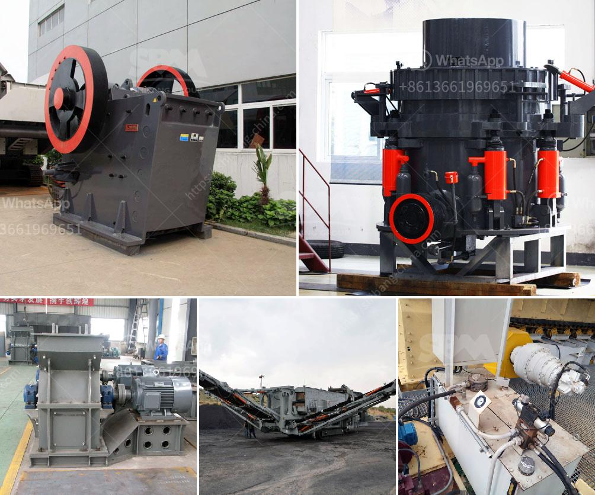

<h3>مستخدمة لمطاحن ريموند للبيع في الهند</h3>
تعتبر مطاحن ريموند واحدة من الشركات الرائدة في مجال تصنيع معدات الطحن والتجهيز في الهند. تأسست الشركة في عام 1925 ولديها أكثر من 100 عام من الخبرة في هذا المجال. تعتبر مطاحن ريموند معروفة بجودة منتجاتها وتقنياتها المتطورة.

تعمل مطاحن ريموند في الهند على تصنيع وبيع مجموعة واسعة من المنتجات المستخدمة في مجالات متنوعة مثل البناء والتعدين والتجهيز الكيميائي والصناعات الأخرى. تتضمن المنتجات الرئيسية للشركة مطاحن الكرة وطاحونات المطرقة ومطاحن الأسطوانة وغيرها من المعدات ذات الصلة.

تتميز مطاحن ريموند بتقديم منتجات ذات جودة عالية وفعالة من حيث التكلفة. إنها تعتمد على التكنولوجيا المتقدمة والمعدات المتطورة لضمان تلبية احتياجات العملاء بشكل فعال. كما تقدم الشركة أيضًا خدمات ما بعد البيع الممتازة والدعم الفني لضمان رضا العملاء.

تعتبر الهند بوابة كبيرة للصناعات المختلفة وتشهد نموًا اقتصاديًا سريعًا في السنوات الأخيرة. لذلك، فإن قطاع البناء والتعدين والتجهيز في الهند في حاجة ماسة إلى معدات عالية الجودة وموثوقة. هنا تأتي دور مطاحن ريموند ومساهمتها في تلبية احتياجات السوق الهندية. إن مطاحن ريموند للبيع في الهند تقدم معدات عالية الجودة وتكنولوجيا متقدمة لتحسين كفاءة وإنتاجية الصناعات المختلفة في الهند.

بالإضافة إلى ذلك، تعتبر مطاحن ريموند شركة عالمية تعمل في عدة دول على مستوى العالم. إن تواجدها العالمي يؤكد على جودة منتجاتها ورضا عملائها. حصول مطاحن ريموند على شهادات وتوصيات عالمية تعزز مكانتها في السوق وتحفز على استخدام منتجاتها.

في الختام، تعتبر مطاحن ريموند مستخدمة لمطاحن ريموند للبيع في الهند خيارًا جيدًا للعملاء المهتمين بشراء معدات الطحن والتجهيز عالية الجودة. إنها تقدم منتجات وخدمات متميزة وتعتمد على أحدث التكنولوجيا لضمان أداء موثوق وفعالية في استخدام المعدات.
<h3>Contact us</h3><ul><li><strong>Whatsapp:&nbsp;<a href="https://wa.me/8613661969651">+8613661969651</a></strong></li><li><a href="https://swt.shibang-china.com/?git&amp;zhl&amp;مستخدمة لمطاحن ريموند للبيع في الهند"><strong>Online Service(chat now)</strong></a></li></ul><h3>Related</h3><ul><li><a href='مطحنة الأسطوانة للطحن.md'>مطحنة الأسطوانة للطحن</a></li><li><a href='آلة كسارة في أوروبا.md'>آلة كسارة في أوروبا</a></li><li><a href='مصنع سيور الفحم في ألمانيا.md'>مصنع سيور الفحم في ألمانيا</a></li><li><a href='أسطوانات لكسارات في بوغوتا.md'>أسطوانات لكسارات في بوغوتا</a></li><li><a href='اختلافات بين مطحنة الهامر ومطحنة الكرة.md'>اختلافات بين مطحنة الهامر ومطحنة الكرة</a></li></ul>