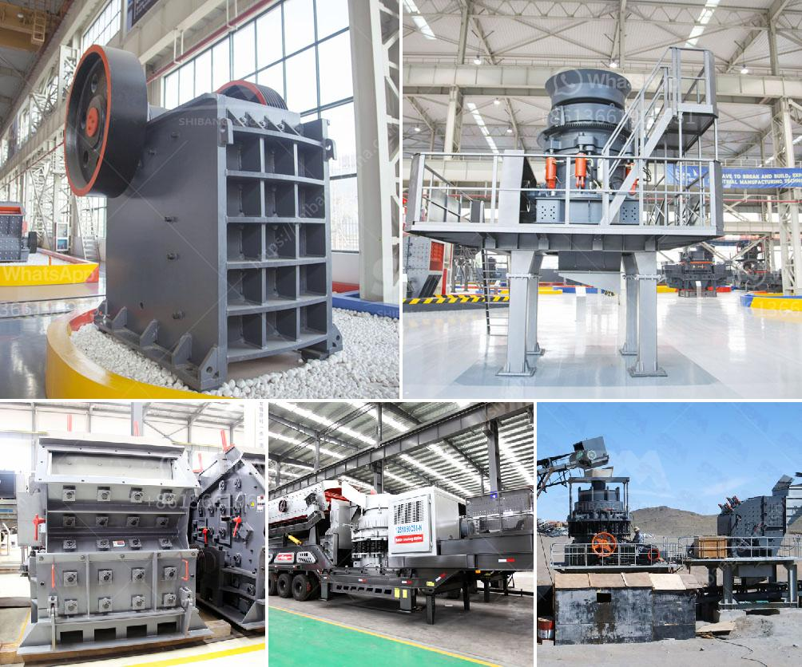

<h3>مستعملة vsi كسارة للبيع في الهند</h3>
تعتبر كسارة VSI المستعملة إحدى الخيارات المهمة عند البحث عن كسارة للبيع في الهند. تتيح للمشترين فرصة الحصول على كسارة بأسعار أقل مقارنة بالكسارات الجديدة. إلا أنه قبل القرار بشراء كسارة VSI المستعملة، يجب أن يتم تقييم مزايا وعيوب العمل بها.

أفضل جانب في شراء كسارة VSI المستعملة هو السعر المنخفض. فالكسارات المستعملة تكون عادة أقل تكلفةً مقارنةً بالكسارات الجديدة. هذا يعني أن العملاء يمكنهم الاستفادة من أسعار معقولة وفرصة لاقتناء كسارة بجودة جيدة دون الحاجة للدفع سعر الجديد. كما يمكن أن يعني السعر المنخفض فرصة لشراء كسارة أقدم سنًا ولا تزال قادرة على العمل بكفاءة.

ومع ذلك، يجب أن يتم التنبه لعدة عوامل عند اختيار كسارة VSI المستعملة. أولاً، يجب إجراء فحص وتقييم شامل للكسارة قبل الشراء. ينبغي التأكد من أن الكسارة تعمل بشكل صحيح وأنها لا تحتاج إلى إصلاحات كبيرة. كذلك، يجب التأكد من أن جميع القطع والأجزاء في حالة جيدة ومتوفرة للتبديل في حال الحاجة.

ثانياً، لا بد من دراسة تاريخ الکسارة واستخدامها السابق. يجب أن تكون الکسارة قد استخدمت بشكل صحيح والتأكد أنها لم تتعرض للإهمال أو التلف في الماضي. من الأفضل أن تأتي الكسارة من مصدر موثوق به، مثل شركة معروفة في صناعة الكسارات. هذا يساعد في ضمان جودة الكسارة والتحقق من تاريخها.

وأخيراً، يجب أن يتم النظر في الاحتياجات الخاصة بالعميل وتطابقها مع مواصفات الكسارة المستعملة. يجب البحث عن كسارة تلبي احتياجات الإنتاج المطلوبة وتكون في الحجم المناسب. كما يجب التأكد من أن الكسارة متوافقة مع الأجزاء والمعدات الأخرى المستخدمة في عملية الإنتاج.

باختصار، كسارة VSI المستعملة للبيع في الهند توفر للمشترين فرصة الحصول على كسارة بسعر منخفض. ومع ذلك، يجب أن يتم التأكد من جودة وحالة الكسارة قبل الشراء. من المهم أيضا أن يتم دراسة احتياجات العميل وتأكيدها مع المواصفات المتاحة. بعد التقييم الشامل، يمكن للمشتري أن يتخذ قرارًا منطقيًا بشأن شراء كسارة VSI المستعملة واستفادة من الفوائد المتاحة لهم.
<h3>Contact us</h3><ul><li><strong>Whatsapp:&nbsp;<a href="https://wa.me/8613661969651">+8613661969651</a></strong></li><li><a href="https://swt.shibang-china.com/?git&amp;zhl&amp;مستعملة vsi كسارة للبيع في الهند"><strong>Online Service(chat now)</strong></a></li></ul><h3>Related</h3><ul><li><a href='كيفية إنشاء شركة محجر.md'>كيفية إنشاء شركة محجر</a></li><li><a href='آلة صنع مسحوق الحجر الجيري في باكستان.md'>آلة صنع مسحوق الحجر الجيري في باكستان</a></li><li><a href='سعر معدات الطحن 250 طن.md'>سعر معدات الطحن 250 طن</a></li><li><a href='كسارات الفك بسعة 120 طن في الساعة.md'>كسارات الفك بسعة 120 طن في الساعة</a></li><li><a href='مصنعو آلات تكسير الحجر.md'>مصنعو آلات تكسير الحجر</a></li></ul>