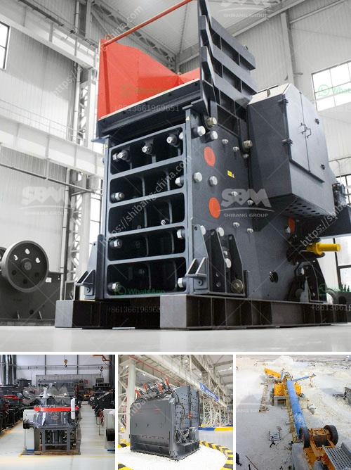

<h3>مسحوق الدولوميت 200 شبكة</h3>
يُعد مسحوق الدولوميت 200 شبكة من المواد المعدنية ذات الاستخدامات المتعددة والتي يتم استخدامها في مجموعة متنوعة من الصناعات. يتكون المسحوق من صخور الدولوميت المكسورة وتمت معالجتها وطحنها لتكوين حبيبات دقيقة قياسية بحوالي 200 شبكة من التجويف في كل بوصة مربعة.

تمتاز الدولوميت بخواصها الميكانيكية الفريدة، حيث تعتبر صخرة ناعمة وسهلة التجهيز، ما يجعلها مادة خام مثالية لصناعة المساحيق. تعتبر الدولوميت مادة مثالية للصناعات التي تستخدم مساحيق الرازبيري، حيث يعمل المسحوق المُحضر من الدولوميت 200 شبكة على تحسين خواصها التحميلية والجاذبية، مما يجعلها تستخدم بكفاءة في صناعة الإطارات والأحذية والمطاط الصناعي.

من الجوانب الأخرى التي يعتبر فيها مسحوق الدولوميت المكسور منتجًا مثاليًا، فهو مصدر طبيعي وآمن للكالسيوم والمغنيسيوم، مما يعزز استخدامه في صناعات الأغذية والأعلاف. يستخدم المسحوق في تصنيع المكملات الغذائية بشكل عام، وخاصة المكملات التي تحتوي على الكالسيوم والمغنيسيوم التي يعتبران مهمين لصحة العظام ونظام الأعصاب.

بالإضافة إلى ذلك، يُستخدم مسحوق الدولوميت 200 شبكة أيضًا في صناعة الدهانات والأصباغ. فهو يعمل على تحسين نوعية الدهان وكفاءته، مما يزيد من تصاقه بسطح الجدران ويمنحها مقاومة للماء والتآكل.

بصفة عامة، يُعتبر مسحوق الدولوميت 200 شبكة من المواد المهمة والعالية الجودة في صناعات متعددة. يتم استخدامه في عمليات التكرير والتكسير والتجميل والأدوية، ويتم الاعتماد عليه نظرًا لخصائصه الفريدة وأهميته التجارية.

لذا، يُمكن القول بأن مسحوق الدولوميت 200 شبكة يشكل مادة متعددة الاستخدامات ومفيدة في العديد من الصناعات. يتميز بخواصه الميكانيكية الفريدة وتركيبه الكيميائي، ما يجعله من أهم الخامات المستخدمة في العديد من الصناعات المختلفة.
<h3>Contact us</h3><ul><li><strong>Whatsapp:&nbsp;<a href="https://wa.me/8613661969651">+8613661969651</a></strong></li><li><a href="https://swt.shibang-china.com/?git&amp;zhl&amp;مسحوق الدولوميت 200 شبكة"><strong>Online Service(chat now)</strong></a></li></ul><h3>Related</h3><ul><li><a href='أنا أبحث عن كسارة في ماليزيا.md'>أنا أبحث عن كسارة في ماليزيا</a></li><li><a href='جهات اتصال ووكلاء شاشات الرمل والغرابيل.md'>جهات اتصال ووكلاء شاشات الرمل والغرابيل</a></li><li><a href='مطحنة طحن عمودية مستعملة بسعة 100 طن في الساعة.md'>مطحنة طحن عمودية مستعملة بسعة 100 طن في الساعة</a></li><li><a href='كسارة حجر في العمود الفقري.md'>كسارة حجر في العمود الفقري</a></li><li><a href='كتالوج sinex لمغذي الاهتزاز بان.md'>كتالوج sinex لمغذي الاهتزاز بان</a></li></ul>