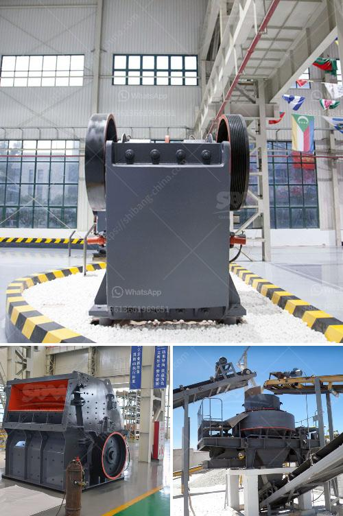

<h3>مسحوق الطين لصنع غانيشا</h3>
تعتبر صناعة الغانيشا من أعرق صناعات الفنون التقليدية في الهند. وتستخدم مساحيق الطين في تشكيلها وإضفاء الأشكال المختلفة عليها. يعتبر مسحوق الطين الخام الوسيلة الأساسية في صنع الغانيشا، فهو يستخدم للتشكيل وإضفاء الألوان والملمس على التماثيل.

يتم تحضير مسحوق الطين لصنع الغانيشا بطرق متنوعة، فمن الممكن أن يتم جمع الطين من أنهار أو بحيرات، ومن ثم تنقيته وغسله جيدًا للتخلص من الشوائب والأتربة. يتم تجفيف الطين على نار هادئة حتى يصبح نسيجه جافًا تمامًا. بعد ذلك، يتم طحن الطين الجاف بواسطة مطحنة أو طاحونة يدوية حتى يتحول إلى مسحوق ناعم.

عند صنع التماثيل، يتم خلط مسحوق الطين مع الماء للحصول على معجون لزج. يتم استخدام هذا المعجون الطيني لبناء هيكل الغانيشا طبقة بطبقة. يتم تشكيل الطين باليدين أو باستخدام القوالب الخاصة بالأشكال المختلفة لإضفاء التفاصيل على التماثيل.

بعد تشكيل التمثال، يتم تجفيفه بالهواء حتى يصبح صلبًا. من ثم يستخدم المنجل أو القطع الحادة لتنعيم الحواف وتصحيح الأخطاء البصرية. يتم إجراء أي تعديلات أخرى لتمثال الغانيشا في هذه المرحلة لتحقيق الشكل النهائي المطلوب.

بعد تجفيف تمثال الغانيشا وتماثيل أخرى، يتم تلوينها بواسطة ألوان الطين. يتم تحضير الألوان الطينية من مسحوق الطين بإضافة الماء إليه وخلطهما حتى الحصول على معجون طيني ملون. يتم استخدام فرش الطين أو الأصابع لتلوين التماثيل بشكل دقيق ودقيق. يمكن استخدام ألوان متنوعة لخلق تأثيرات مختلفة وإبراز التفاصيل.

بعد تلوين التمثيل، يتم تغطيتها بطبقة رقيقة من الورنيش لحمايتها من العوامل الجوية، مثل الرطوبة والحرارة. تساهم هذه الطبقة الواقية في إبقاء التمثيل في حالة جيدة والحفاظ على لونها لفترة أطول.

باختصار، يعد مسحوق الطين الخام أحد العناصر الأساسية في صنع التماثيل الطينية للغانيشا. يتم استخدامه في بناء الهيكل، وإضافة الألوان، وتلوين الأشكال وتشكيل مظهرها النهائي. يعتبر صناعة الغانيشا تدمج الفن والحرفية التقليدية مع تقنيات العصر الحديث لإنشاء أعمال فنية رائعة، تحمل في طياتها تراثاً ثقافياً غنياً وتعبيراً عن الإبداع والتفرد.
<h3>Contact us</h3><ul><li><strong>Whatsapp:&nbsp;<a href="https://wa.me/8613661969651">+8613661969651</a></strong></li><li><a href="https://swt.shibang-china.com/?git&amp;zhl&amp;مسحوق الطين لصنع غانيشا"><strong>Online Service(chat now)</strong></a></li></ul><h3>Related</h3><ul><li><a href='سحق الحجر الأسود تايلاند.md'>سحق الحجر الأسود تايلاند</a></li><li><a href='براميل أحزمة الناقلات في ماليزيا.md'>براميل أحزمة الناقلات في ماليزيا</a></li><li><a href='مطحنة الكرة الطين.md'>مطحنة الكرة الطين</a></li><li><a href='كسارة مخروطية قياسية دليل الإصلاح.md'>كسارة مخروطية قياسية دليل الإصلاح</a></li><li><a href='آلة تعبئة مسحوق التلك.md'>آلة تعبئة مسحوق التلك</a></li></ul>