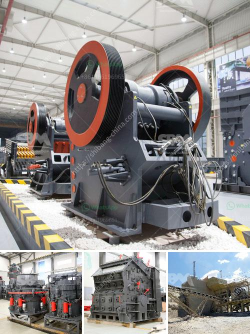

<h3>مشاريع المطاحن للسائل الزجاجي في الهند</h3>
تعد مشاريع المطاحن للسائل الزجاجي من أهم الصناعات في الهند. تعتبر الهند واحدة من أكبر منتجي الزجاج في العالم، حيث تستخدم الكميات الضخمة من الزجاج في مختلف الصناعات، مثل البناء والسيارات والتعبئة والتغليف.

تعتمد تلك المشاريع على استخدام تقنيات حديثة لصناعة الزجاج السائل. يتم تحويل الخامات الأولية للزجاج، مثل الرمل والصودا الكاوية والجير، إلى خليط سائل يسمى الزجاج السائل. يتم تحويل هذا الزجاج السائل إلى منتجات نهائية مثل الزجاج المسطح أو الزجاج المعشق أو الزجاج المستدير.

تعتبر المطاحن في الهند ركيزة أساسية في صناعة الزجاج، حيث تعتمد عليها بصورة كبيرة لتحويل الزجاج السائل إلى منتجات نهائية عالية الجودة. توفر هذه المطاحن نسبة عالية من الإنتاجية والكفاءة، مما يساعد على تلبية الطلب المتزايد على الزجاج في الهند.

بالإضافة إلى ذلك، تقوم مشاريع المطاحن بتوفير فرص عمل كبيرة للعديد من العمال في الهند. تعتبر هذه المشاريع من المصادر الرئيسية للعمالة في الصناعة، حيث يتم توظيف العديد من العمال ذوي المهارات المختلفة في عمليات الإنتاج والتصنيع.

وتلعب مشاريع المطاحن دورًا حيويًا في تعزيز الاقتصاد الهندي. تساهم تلك المشاريع في زيادة الناتج المحلي وتعزيز الصادرات، حيث تعتبر الهند واحدة من أكبر الدول المصدرة للزجاج في العالم. كما توفر تلك المشاريع فرص استثمارية للمستثمرين المحليين والأجانب.

ولا يسعنا أن نغفل أهمية الاهتمام بالبيئة والاستدامة في مشاريع المطاحن. يُعد الزجاج من المواد القابلة لإعادة التدوير، وتسعى تلك المشاريع إلى توفير وسائل مستدامة لإعادة استخدام الزجاج والحفاظ على البيئة.

في الختام، تعد مشاريع المطاحن للسائل الزجاجي في الهند من المشاريع الهامة والمثمرة. تساهم في تلبية الطلب المتزايد على الزجاج، وتوفر فرص عمل للعمال، وتعزز النمو الاقتصادي. كما تسهم في الحفاظ على البيئة وتعزيز استدامة الصناعة.
<h3>Contact us</h3><ul><li><strong>Whatsapp:&nbsp;<a href="https://wa.me/8613661969651">+8613661969651</a></strong></li><li><a href="https://swt.shibang-china.com/?git&amp;zhl&amp;مشاريع المطاحن للسائل الزجاجي في الهند"><strong>Online Service(chat now)</strong></a></li></ul><h3>Related</h3><ul><li><a href='استيراد كسارة الفك الصين في باكستان.md'>استيراد كسارة الفك الصين في باكستان</a></li><li><a href='كسارات محمولة مستعملة للبيع في جنوب أفريقيا.md'>كسارات محمولة مستعملة للبيع في جنوب أفريقيا</a></li><li><a href='معدات التعويم للتعدين للبيع في جنوب أفريقيا.md'>معدات التعويم للتعدين للبيع في جنوب أفريقيا</a></li><li><a href='مطحنة معدنية إلى 300 ميكرون.md'>مطحنة معدنية إلى 300 ميكرون</a></li><li><a href='كسارة مخروطية ثانوية.md'>كسارة مخروطية ثانوية</a></li></ul>