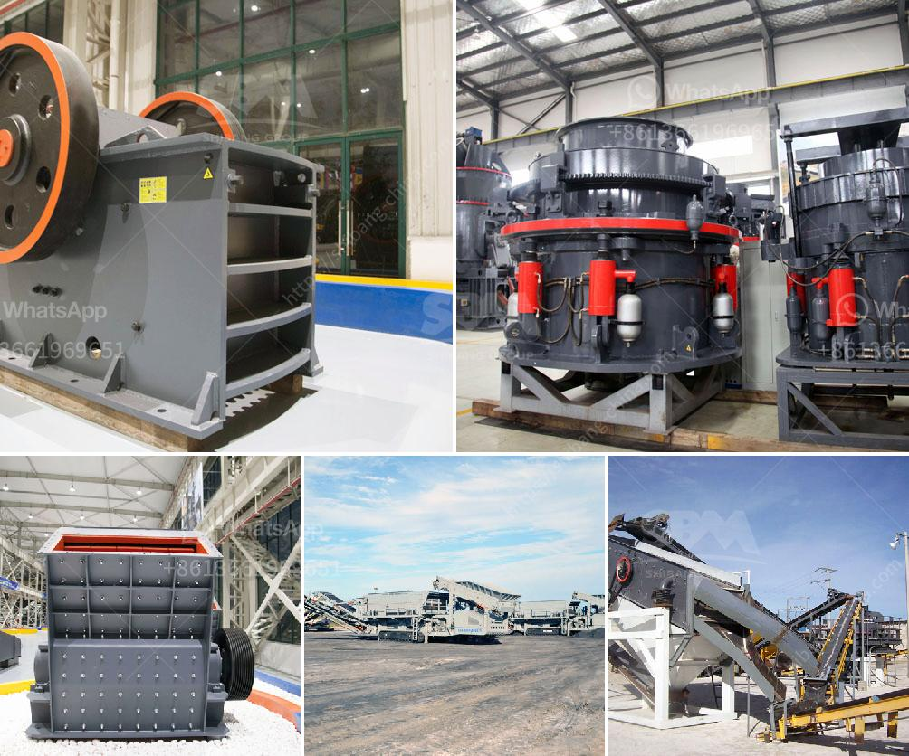

<h3>مشاكل طحن السخام</h3>
يعد طحن السخام أحد العمليات الهامة في صناعة الأسمنت، ولكنه يواجه العديد من المشاكل التي تؤثر على كفاءته وجودته. سنستعرض في هذه المقالة بعضًا من هذه المشاكل وأثرها على العملية.

أحد المشاكل المتكررة هي تكوين طبقة من السخام على سطح الكرات المستخدمة في عملية الطحن. تتسبب هذه الطبقة في زيادة احتكاك الكرات وبالتالي انخفاض كفاءة الطحن وزيادة في استهلاك الطاقة. لتجنب هذه المشكلة، يجب مراعاة خصائص المواد المطحونة والمضافات المستخدمة، وضبط عواكس الطحن بشكل صحيح.

علاوة على ذلك، تعتبر مشكلة تجمع السخام في الناقلات والفلاتر من أكثر المشاكل شيوعًا. يتسبب تجمع السخام في انسداد الأنابيب والفلاتر مما يؤثر على تدفق المواد وزيادة الضغط على المعدات. للحد من هذه المشكلة، يجب تنظيف الأنابيب والفلاتر بانتظام واستخدام أنواع معينة من الفلاتر المصممة لتصفية السخام.

بالإضافة إلى ذلك، قد يتسبب غبار السخام في مشاكل صحية وبيئية. يحتوي السخام على مواد ضارة يمكن أن تؤثر سلبًا على صحة العمال والبيئة المحيطة. للتقليل من هذه المشكلة، يجب اتخاذ تدابير وقائية مثل استخدام أقنعة الغبار ووضع أنظمة تهوية فعالة للحد من انبعاث غبار السخام.

وأخيرًا، تعتبر مشكلة التآكل والاستهلاك الزائد للأجزاء الميكانيكية أمرًا لا يمكن تجاهله. يتعرض الأجزاء المستخدمة في طحن السخام لاحتكاك مستمر وضغط عالٍ، مما يسبب تآكلًا سريعًا وتلفًا. يجب اختيار المواد المقاومة للتآكل والتصميم الجيد للمعدات للحد من هذه المشكلة.

باختصار، يواجه طحن السخام العديد من المشاكل التي تؤثر على كفاءته وجودته. لتحقيق طحن فعال وذو جودة عالية، يجب مراعاة عوامل عديدة مثل تكوين السخام، تجمعها في الأنابيب والفلاتر، وتأثيرها الصحي والبيئي، بالإضافة إلى مشكلة التآكل والاستهلاك الزائد للأجزاء الميكانيكية.
<h3>Contact us</h3><ul><li><strong>Whatsapp:&nbsp;<a href="https://wa.me/8613661969651">+8613661969651</a></strong></li><li><a href="https://swt.shibang-china.com/?git&amp;zhl&amp;مشاكل طحن السخام"><strong>Online Service(chat now)</strong></a></li></ul><h3>Related</h3><ul><li><a href='شراء محطة غسيل الفحم في ألمانيا.md'>شراء محطة غسيل الفحم في ألمانيا</a></li><li><a href='حجم كسارة الفك.md'>حجم كسارة الفك</a></li><li><a href='أكبر معدات تحسين خام الحديد في الصين.md'>أكبر معدات تحسين خام الحديد في الصين</a></li><li><a href='آلة كسارة للبيع.md'>آلة كسارة للبيع</a></li><li><a href='كسارة الحجر من النوع الصغير.md'>كسارة الحجر من النوع الصغير</a></li></ul>