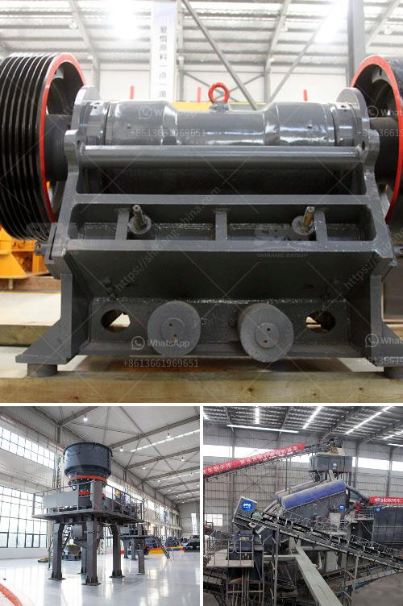

<h3>مشترين وبائعين لآلات مطحنة ريموند</h3>
تعد آلات مطحنة ريموند إحدى الآلات الهامة في صناعة الألغام والمعادن. وتستخدم هذه الآلة لطحن المواد الخام غير المتكتلة إلى حجم الجسيمات المطلوب، وتُستخدم أيضًا في صناعة الكيماويات والمواد الغذائية والبناء والصناعات الأخرى.

المشترين لآلات مطحنة ريموند يشملون مجموعة متنوعة من الشركات والمصانع التي تحتاج إلى آلات لطحن المواد الخام المستخدمة في إنتاج منتجاتها. يتطلب شراء آلة مطحنة ريموند اهتمامًا بالعديد من العوامل مثل الإنتاجية والجودة والتكلفة. ويتعاون المشتريين مع بائعين متخصصين في توفير هذه الآلات وفقًا لاحتياجاتهم الخاصة.

من جانبهم، يكون بائعو آلات مطحنة ريموند لديهم خبرة ومعرفة عميقة بتلك الآلات. يحاولون تلبية احتياجات المشترين عن طريق تقديم الآلات المناسبة. يعمل البائعون أيضًا على تقديم خدمات ما بعد البيع مثل توفير قطع الغيار والصيانة والتدريب على استخدام الآلات. يهدفون إلى تحقيق رضا المشتري من خلال تقديم خدمات عالية الجودة ومساعدتهم في تحقيق أهداف إنتاجهم بأقصى كفاءة.

تتعاون العلاقة بين المشترين والبائعين في هذه الصناعة على أساس الثقة والشراكة المستدامة. يهتم البائعون بفهم احتياجات المشترين وتوفير الحلول المناسبة لهم. وبصفة عامة، يتعاون البائعون والمشترين لضمان تنفيذ صفقات ناجحة ومربحة للطرفين.

باختصار، يلعب كل من المشترين والبائعين دورًا حيويًا في سوق آلات مطحنة ريموند. المشترين يبحثون عن آلات عالية الجودة لتلبية احتياجاتهم الصناعية، بينما يسعى البائعون لتقديم حلول تلبي تلك الاحتياجات وتحقيق رضا المشتري. هذا التعاون المثمر يتيح التطور والنمو في صناعة آلات مطحنة ريموند.
<h3>Contact us</h3><ul><li><strong>Whatsapp:&nbsp;<a href="https://wa.me/8613661969651">+8613661969651</a></strong></li><li><a href="https://swt.shibang-china.com/?git&amp;zhl&amp;مشترين وبائعين لآلات مطحنة ريموند"><strong>Online Service(chat now)</strong></a></li></ul><h3>Related</h3><ul><li><a href='مصنع آلات كسارة الحجر الماسي في الهند.md'>مصنع آلات كسارة الحجر الماسي في الهند</a></li><li><a href='أسعار معدات التكسير والفحص جنوب أفريقيا.md'>أسعار معدات التكسير والفحص جنوب أفريقيا</a></li><li><a href='آلات كسارة المحجر في إيطاليا.md'>آلات كسارة المحجر في إيطاليا</a></li><li><a href='اقتباسات مطحنة الكرة.md'>اقتباسات مطحنة الكرة</a></li><li><a href='البوكسيت من مصانع الأسمنت في الهند.md'>البوكسيت من مصانع الأسمنت في الهند</a></li></ul>