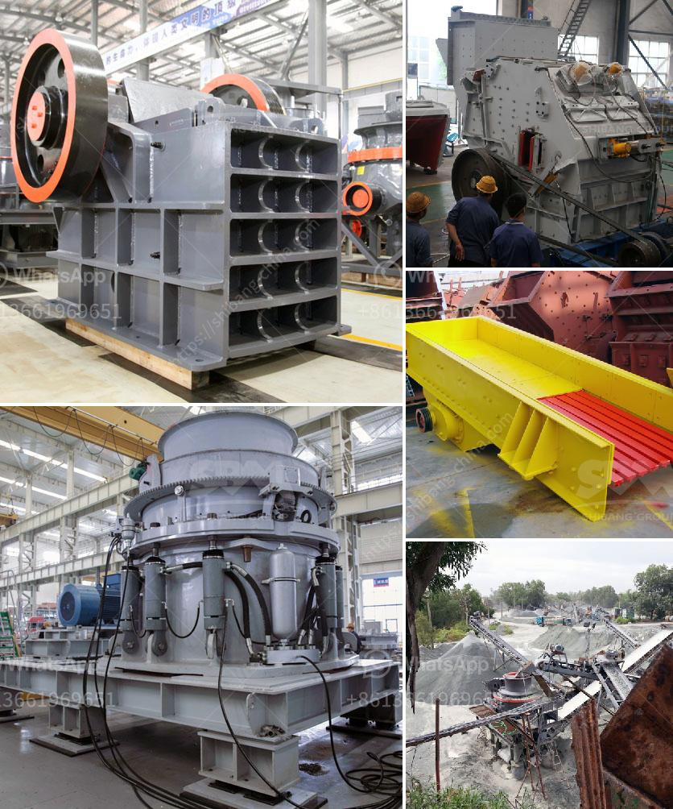

<h3>مشروع حجر الزلط في إثيوبيا</h3>
يعتبر مشروع حجر الزلط في إثيوبيا مشروعًا بارزًا في قطاع التعدين في البلاد. تعتبر إثيوبيا من أكثر الدول الأفريقية غنىً بالثروات المعدنية والموارد الطبيعية، وتحتل مكانة هامة في القارة الأفريقية بفضل وفرة الموارد التي تمتلكها. من بين هذه الموارد تأتي حجارة الزلط التي يتم استخدامها بشكل واسع في العديد من الصناعات.

يجري استخراج حجارة الزلط في مقاطعة تيغراي في إثيوبيا، وتوجد بهذه المنطقة موارد كبيرة من حجارة الزلط عالية الجودة. يتم تنقية الحجارة وتكسيرها وفرزها بدقة، قبل أن يتم تعبئتها وتوزيعها في الأسواق المحلية والعالمية. يستفيد المستهلكون من هذه الحجارة في مجموعة متنوعة من التطبيقات مثل البناء والطرق والأعمال البلدية، إضافةً إلى استخدامها في صناعة الخرسانة والرمل والزينة.

تعد حجارة الزلط في إثيوبيا منتجًا استراتيجيًا للبلاد، حيث يشكل قطاع التعدين واحدًا من أهم محركات النمو الاقتصادي. يعود ذلك إلى الطلب المتزايد على مواد البناء في البلاد نظرًا للتطور السكاني المستمر والعمل على تطوير البنية التحتية. تعمل حكومة إثيوبيا جنبًا إلى جنب مع الشركات والمستثمرين الأجانب في تعظيم استغلال هذه الموارد المعدنية وتعزيز صادرات الزلط إلى الأسواق العالمية.

تشكل حجارة الزلط في إثيوبيا فرصة كبيرة لتحقيق الاكتفاء الذاتي للمواد البنائية وتخفيف الاعتماد على الواردات الخارجية. بفضل العمل على تحسين عمليات التعدين وتعزيز القدرات التكنولوجية وتوفير البنية التحتية الملاحية المناسبة، يمكن لإثيوبيا أن تصبح مركزًا إقليميًا لصناعة حجارة الزلط وتصديرها إلى الأسواق المجاورة.

ومن المهم أن نذكر أيضًا أن استخراج حجارة الزلط يعزز التنمية المحلية ويساهم في توفير فرص العمل للسكان المحليين. يعد قطاع التعدين مصدرًا رئيسيًا للعمل في المنطقة، ويوفر فرص عمل ذات دخل جيد وفرص للتدريب والتطوير المهني.

في النهاية، يمثل مشروع حجر الزلط في إثيوبيا فرصة كبيرة لتعزيز الاقتصاد المحلي وتنمية البنية التحتية في البلاد. يتطلب العمل المستمر على تطوير هذا القطاع الاهتمام والدعم من قبل الحكومة والمستثمرين، وكذلك تشجيع الابتكار وتحسين التكنولوجيا لتحقيق أقصى استفادة من هذه الموارد المعدنية الهامة.
<h3>Contact us</h3><ul><li><strong>Whatsapp:&nbsp;<a href="https://wa.me/8613661969651">+8613661969651</a></strong></li><li><a href="https://swt.shibang-china.com/?git&amp;zhl&amp;مشروع حجر الزلط في إثيوبيا"><strong>Online Service(chat now)</strong></a></li></ul><h3>Related</h3><ul><li><a href='عملية مصنع الأحجار الكوارتز 3080.md'>عملية مصنع الأحجار الكوارتز 30-80</a></li><li><a href='مطحنة الكرة لتعدين الذهب على نطاق صغير.md'>مطحنة الكرة لتعدين الذهب على نطاق صغير</a></li><li><a href='كيفية اختيار كسارة مخروطية.md'>كيفية اختيار كسارة مخروطية</a></li><li><a href='مصنع تحسين الكروم في الصين.md'>مصنع تحسين الكروم في الصين</a></li><li><a href='التكسير الصخور للبيع.md'>التكسير الصخور للبيع</a></li></ul>