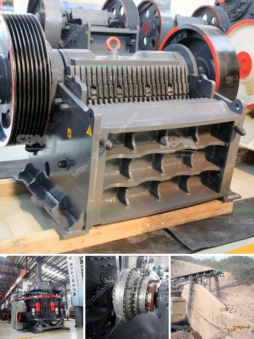

<h3>مشروع كسارة الحجر في الولايات المتحدة</h3>
تعتبر صناعة البناء والتشييد من الصناعات الأساسية التي تسهم في تطور الشركات والاقتصاد على المستوى العالمي. ومن أهم المكونات التي تدعم هذه الصناعة هي الحجر الطبيعي، الذي يستخدم في بناء المباني والطرق والجسور وغيرها من البنية التحتية.

وفي ظل هذا الطلب المتزايد على الحجر الطبيعي، تم تطوير مشروع كسارة الحجر في الولايات المتحدة. يتمثل هدف هذا المشروع في استخراج الحجر الطبيعي من المحاجر ومعالجته ليتم استخدامه في مجموعة متنوعة من التطبيقات البنائية.

يعتمد مشروع كسارة الحجر على تكنولوجيا حديثة لتحقيق أقصى قدر من الكفاءة والجودة في عمليات استخراج الحجر. يتم استخدام الآلات والمعدات المتطورة لتفجير الصخور ونقلها وكسرها إلى قطع صغيرة يسهل تجهيزها.

وبعد استخراج الحجر من المحجر، يتم نقله إلى منشأة المعالجة حيث يتم فحصه بدقة وتصنيفه وتكسيره وغسله. تستخدم الآلات المتقدمة في هذه المرحلة لتحسين الجودة والمواصفات الفنية للحجارة بحيث تتوافق مع متطلبات البناء.

تعتبر مشاريع كسارات الحجر في الولايات المتحدة فرصة اقتصادية كبيرة، حيث توفر فرص عمل للعديد من العاملين المحليين. وبالإضافة إلى ذلك، تعمل هذه المشاريع على تحسين الاقتصاد المحلي من خلال زيادة الاستثمارات وتعزيز الصادرات وتحسين الرفاهية العامة.

ولكن مشروع كسارة الحجر يقابل أيضًا بعض التحديات والمخاطر البيئية، فعملية استخراج الحجر قد تتسبب في تلوث الهواء والمياه وتخريب المناظر الطبيعية. لذا، يجب أن تلتزم هذه المشاريع بتطبيق أعلى معايير الحماية البيئية واتخاذ إجراءات للتقليل من أثرها البيئي.

لتجاوز هذه التحديات، يجب التعاون بين القطاع الخاص والحكومة لتنظيم ومتابعة وتنفيذ هذه المشاريع بما يضمن الاستدامة البيئية والاقتصادية في الوقت نفسه.

في الختام، يعد مشروع كسارة الحجر في الولايات المتحدة استثمارًا استراتيجيًا يدعم صناعة البناء ويساهم في تحقيق التنمية الاقتصادية. ومع اتباع الإجراءات البيئية اللازمة، سيكون له تأثير ايجابي على المجتمع المحلي والبيئة بشكل عام.
<h3>Contact us</h3><ul><li><strong>Whatsapp:&nbsp;<a href="https://wa.me/8613661969651">+8613661969651</a></strong></li><li><a href="https://swt.shibang-china.com/?git&amp;zhl&amp;مشروع كسارة الحجر في الولايات المتحدة"><strong>Online Service(chat now)</strong></a></li></ul><h3>Related</h3><ul><li><a href='حجم منتج التغذية لكسارات المخروط.md'>حجم منتج التغذية لكسارات المخروط</a></li><li><a href='كسارة مخروطية hp300.md'>كسارة مخروطية hp300</a></li><li><a href='مصنع تكسير صغير من الصين.md'>مصنع تكسير صغير من الصين</a></li><li><a href='مطحنة عمودية معلومات أيرلندا.md'>مطحنة عمودية معلومات أيرلندا</a></li><li><a href='معدات التعدين لإنتاج الحجر الجيري للبيع.md'>معدات التعدين لإنتاج الحجر الجيري للبيع</a></li></ul>