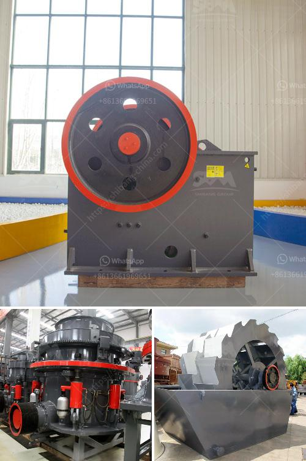

<h3>مشروع كلنكر الإسمنت في الهند</h3>
تعتبر صناعة الإسمنت من أهم الصناعات في الهند، حيث تشهد البلاد ارتفاعًا كبيرًا في الطلب على الإسمنت نتيجة للنمو السريع في قطاعات البناء والبنية التحتية. ومن بين مشاريع الإسمنت الهائلة في الهند، يتميز مشروع كلنكر الإسمنت بأهميته وحجمه الكبير.

مشروع كلنكر الإسمنت يقع في ولاية أندرا براديش في جنوب الهند، وهو من المشاريع الضخمة التي يجري تنفيذها من قبل شركة تصنيع الإسمنت "شركة جايبي إسمنت"، وهي واحدة من أكبر الشركات في مجال الإسمنت في الهند.

يعد مشروع كلنكر الإسمنت في الهند هو المرحلة الثانية من مشروع الشركة الذي بدأ في العام 2017. حيث تمتلك الشركة مصنعًا للإسمنت بطاقة إنتاجية تبلغ 2.2 مليون طن سنويًا، وتهدف الشركة من مشروع كلنكر الإسمنت إلى زيادة استيعابية المصنع بمقدار 1.2 مليون طن لتصل إلى 3.4 مليون طن سنويًا.

تم تخصيص استثمارات ضخمة في مشروع كلنكر الإسمنت، حيث تبلغ التكلفة الكلية للمشروع حوالي 750 مليون دولار أمريكي. وقد أسهم هذا المشروع في توفير فرص عمل هامة للعديد من العمال المحليين بالمنطقة، وتزويد سوق العمل بتوظيفات جديدة.

وتهدف الشركة من مشروع كلنكر الإسمنت إلى تلبية الاحتياجات المحلية للإسمنت وتحسين القدرة التنافسية للشركة في هذا القطاع المهم. كما أنها تهدف أيضًا إلى زيادة إنتاجية الشركة وتعزيز قدرتها على تلبية الطلب المتزايد على الإسمنت في الهند وخارجها.

تعتبر الهند واحدة من أكبر منتجي ومستهلكي الإسمنت في العالم، وتواصل صناعة الإسمنت في البلاد تطورها ونموّها المستدام. وبفضل مشاريع كبيرة مثل مشروع كلنكر الإسمنت، يتم تعزيز البنية التحتية للبلاد وتلبية احتياجات النمو الاقتصادي المستدام.

بهذا المشروع الضخم، ستكون الهند على مقدمة الدول المنتجة والمصدرة للإسمنت، وستحافظ على موقعها المرموق في سوق البناء والبنية التحتية العالمية. كما سيساهم المشروع في توفير فرص عمل وتحسين دخل المجتمع المحلي، وسيعزز تعاون الهند مع الدول الأخرى في قطاع الإسمنت.

باختصار، مشروع كلنكر الإسمنت في الهند هو مشروع ضخم يساهم في تطوير صناعة الإسمنت وتلبية الطلب المتزايد على الإسمنت في الهند وخارجها. كما يعزز الاقتصاد المحلي ويعزز دور الهند كمنتج رائد ومصدر للإسمنت عالميًا.
<h3>Contact us</h3><ul><li><strong>Whatsapp:&nbsp;<a href="https://wa.me/8613661969651">+8613661969651</a></strong></li><li><a href="https://swt.shibang-china.com/?git&amp;zhl&amp;مشروع كلنكر الإسمنت في الهند"><strong>Online Service(chat now)</strong></a></li></ul><h3>Related</h3><ul><li><a href='مطحنة طحن فائقة الدقة.md'>مطحنة طحن فائقة الدقة</a></li><li><a href='كيماويات تعويم تحسين الفحم في الهند.md'>كيماويات تعويم تحسين الفحم في الهند</a></li><li><a href='معدات كسارة الذهب.md'>معدات كسارة الذهب</a></li><li><a href='مصنع كسارة خام الحديد.md'>مصنع كسارة خام الحديد</a></li><li><a href='مصنع تكسير متنقل في الصين.md'>مصنع تكسير متنقل في الصين</a></li></ul>