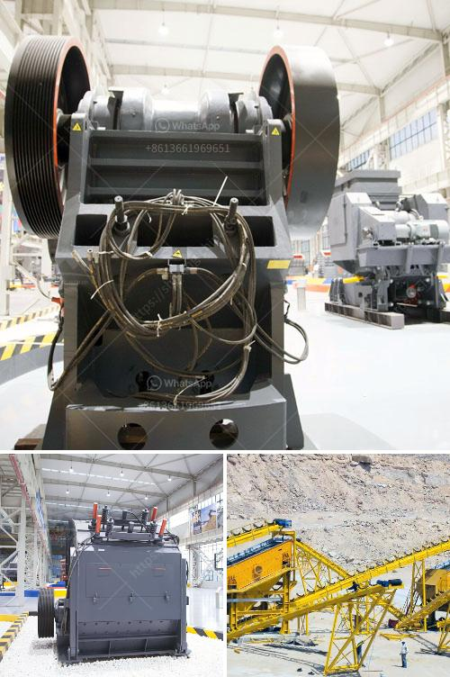

<h3>مشروع محجر للبيع في نيجيريا</h3>
لا شك في أن قطاع التعدين يعتبر من أهم قطاعات الاقتصاد في نيجيريا. وفي إطار التطور الاقتصادي الذي تشهده البلاد، تزداد الحاجة إلى المزيد من المشاريع الاستثمارية في هذا القطاع. ومن ضمن هذه المشاريع المحجر، الذي يعتبر مصدرًا هامًا للحصول على المواد الخام لمختلف الصناعات.

يقدم مشروع محجر للبيع في نيجيريا فرصة استثمارية مثيرة للاهتمام لرجال الأعمال والمستثمرين الذين يبحثون عن فرصة ناجحة في قطاع التعدين. حجر البناء والجرانيت هما المواد الخام الرئيسية التي تستخرج من المحاجر، والتي يتم استخدامها في العديد من الصناعات مثل البناء والتشييد والطرق وصناعة الأثاث وغيرها.

لماذا يعتبر مشروع المحجر فرصة جيدة للاستثمار في نيجيريا؟ أولاً، لأن نيجيريا تمتلك واحدة من أكبر الاحتياطيات الطبيعية للجرانيت في العالم، مما يجعلها وجهة مثالية لتأسيس مشروع محجر. ثانياً، الطلب المتزايد على مواد البناء في البلاد والمنطقة يعني أن هناك طلبًا مستمرًا على منتجات محجر الجرانيت. وبالتالي، توجد فرصة كبيرة للربح وتحقيق عائد استثمار جيد من مشروع المحجر.

بالإضافة إلى ذلك، يعتبر قطاع المحاجر من القطاعات ذات القدرة العالية على توفير فرص العمل. ففي مزارع الجرانيت، يتطلب استخراج المواد وتجهيزها فريقًا كبيرًا من العمالة. وبالتالي، ستكون المشاريع المحجر فرصة لتوفير وظائف جديدة للسكان المحليين والمساهمة في النمو الاقتصادي للمجتمع المحلي.

لكن بالطبع، هناك عدة عوامل يجب النظر فيها عند النظر في استثمار مشروع محجر في نيجيريا. على سبيل المثال، يجب الحصول على التراخيص اللازمة والالتزام بالتشريعات واللوائح المحلية للتعدين. كما يجب أيضًا تقييم الجدوى الاقتصادية للمشروع وتوقع الطلب والمنافسة في السوق.

في النهاية، يمكن القول إن مشروع محجر للبيع في نيجيريا هو فرصة استثمارية واعدة في قطاع التعدين. بفضل الاحتياطيات الطبيعية الهائلة التي تمتلكها البلاد والطلب المستمر على مواد البناء، فإنه يمكن تحقيق ربح جيد من هذا النوع من المشروعات. ومن المهم العمل بجد والاستعانة بالخبراء المحليين للمساعدة في توجيه المشروع وتحقيق النجاح المثمر في هذا القطاع الحيوي.
<h3>Contact us</h3><ul><li><strong>Whatsapp:&nbsp;<a href="https://wa.me/8613661969651">+8613661969651</a></strong></li><li><a href="https://swt.shibang-china.com/?git&amp;zhl&amp;مشروع محجر للبيع في نيجيريا"><strong>Online Service(chat now)</strong></a></li></ul><h3>Related</h3><ul><li><a href='تقرير مشروع مصنع الأسمنت الصغير.md'>تقرير مشروع مصنع الأسمنت الصغير</a></li><li><a href='كسارات الحجر للبيع في المملكة المتحدة.md'>كسارات الحجر للبيع في المملكة المتحدة</a></li><li><a href='معدات تعدين الفحم في جنوب أفريقيا.md'>معدات تعدين الفحم في جنوب أفريقيا</a></li><li><a href='مطحنة كرات عمودية في كينيا.md'>مطحنة كرات عمودية في كينيا</a></li><li><a href='مشترين وبائعين لآلات مطحنة ريموند.md'>مشترين وبائعين لآلات مطحنة ريموند</a></li></ul>