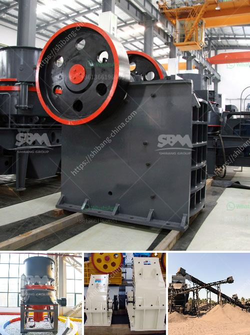

<h3>مشغل مصنع كسارة في كسارة</h3>
تعتبر مهنة مشغل مصنع كسارة في كسارة واحدة من أهم المهن في صناعة البناء والتشييد. يعمل هؤلاء المشغلين على تشغيل وصيانة الكسارات التي تقوم بتفتيت الصخور وتحويلها إلى حصى أو ركام يستخدم في إنشاء الطرق والمباني.

عمل مشغل المصنع يتطلب مهارات فنية عالية ومعرفة بالآلات الثقيلة والتحكم فيها، حيث يتعين عليه فهم عملية التشغيل ومعرفة كيفية تشغيل المعدات بطرق صحيحة وآمنة. يجب على المشغل أن يكون على دراية تامة بقراءة الرسومات الفنية والتعليمات الفنية للمعدات والآلات التي يعمل عليها.

بصفة عامة، يقوم مشغل المصنع بتوليد قائمة بالمهام المطلوبة لتشغيل المصنع بطريقة صحيحة وفقًا للمعايير الفنية المحددة. قد تتضمن هذه المهام تشغيل الكسارات، ورصد تدفق المواد وأحجامها وانتاج الحصى أو الركام، وأيضًا تنظيف وصيانة المعدات للحفاظ على أدائها الأمثل.

بالإضافة إلى ذلك، يلتزم مشغل المصنع باتباع إجراءات السلامة والوقاية من الحوادث لضمان سلامته الشخصية وسلامة الآخرين. يجب عليه اتباع اللوائح والقوانين الصادرة عن الجهات المختصة واحترام إرشادات السلامة المطبقة في المصنع.

قد يواجه مشغل مصنع كسارة تحديات في عمله، مثل تقلبات في طبيعة الصخور المراد تفتيتها أو مشاكل تقنية في المعدات. يجب على المشغل أن يكون قادرًا على التعامل مع هذه التحديات وحلها بذكاء وسرعة.

من الجدير بالذكر أن البناء والتشييد هما قطاعان حيويان في أي اقتصاد، ولذا فإن الاعتماد على المشغلين الماهرين في صناعة الكسارات يعد أمرًا أساسيًا لضمان استدامة هذه الصناعة وتقدمها. يجب أن يكون لدى المشغلين دراية بأحدث التكنولوجيا والأدوات المستخدمة في تشغيل الكسارات لتحسين كفاءة العمل وزيادة الإنتاجية.

في الختام، يعد مشغل مصنع كسارة في كسارة الشخص الذي يراقب ويقود عملية تشغيل الكسارات ويضمن أن الإنتاج يتم وفقًا للمعايير الفنية وبأعلى مستوى من الجودة. يتطلب العمل في هذا المجال الدقة والتفاني والمعرفة التقنية، ويعد هؤلاء المشغلين حجر الزاوية في تلبية احتياجات صناعة البناء والتشييد.
<h3>Contact us</h3><ul><li><strong>Whatsapp:&nbsp;<a href="https://wa.me/8613661969651">+8613661969651</a></strong></li><li><a href="https://swt.shibang-china.com/?git&amp;zhl&amp;مشغل مصنع كسارة في كسارة"><strong>Online Service(chat now)</strong></a></li></ul><h3>Related</h3><ul><li><a href='آلة تعدين الذهب في الصين.md'>آلة تعدين الذهب في الصين</a></li><li><a href='كسارة الخرسانة المدمجة.md'>كسارة الخرسانة المدمجة</a></li><li><a href='هل هناك طاحونة فائقة الدقة عمودية للأسطوانة.md'>هل هناك طاحونة فائقة الدقة عمودية للأسطوانة</a></li><li><a href='كسارة متنقلة قابلة للنقل بسعة 200 طن.md'>كسارة متنقلة قابلة للنقل بسعة 200 طن</a></li><li><a href='مطاحن الحجر للبيع في كينيا.md'>مطاحن الحجر للبيع في كينيا</a></li></ul>