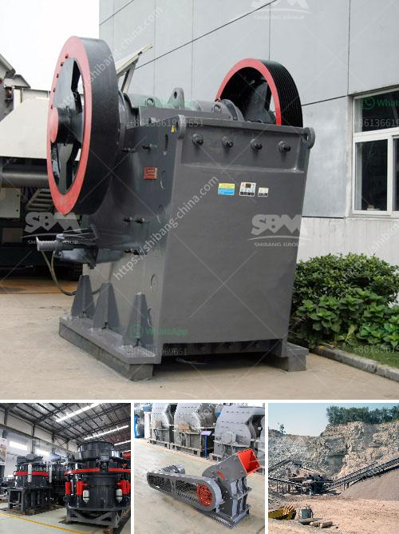

<h3>مشكلة الناقل الفحم</h3>
تُعتبر صناعة الفحم من أهم الصناعات التي تلعب دورًا حاسمًا في توفير الطاقة اللازمة لمختلف القطاعات الاقتصادية. تشغل محطات توليد الكهرباء والمصانع العديد من معاملات الفحم لضمان سلاسة تدفق المواد الخام وتأمين احتياجاتها. ومع ذلك، تواجه صناعة الفحم تحديًا كبيرًا يتمثل في نقل الفحم من المناجم إلى وجهات الاستهلاك النهائي.

تعد مشكلة الناقل الفحم من أبرز التحديات التي تواجهها صناعة الفحم. يتطلب نقل الفحم بعد استخراجه من المناجم استخدام وسائل نقل مؤهلة تتناسب مع كمية الفحم ومساقط الأرض المختلفة. ومع ذلك، فإن هذه الوسائل تعاني من العديد من المشاكل، ما يؤثر على فعالية العمليات والتكلفة النهائية.

أحد المشاكل المستعصية في مشكلة الناقل الفحم هو ضرورة تغطية المسافات البعيدة بين المناجم ووجهات الاستهلاك النهائي. تستلزم هذه المسافات استخدام وسائل نقل ضخمة مثل السفن والقطارات، والتي قد تعاني من مشكلات الازدحام وتأخر الوقت. بالإضافة إلى ذلك، يمكن أن تواجه هذه الوسائل المتاحة مشاكل في الصيانة والكفاءة التشغيلية، خاصة في ظل البيئة القاسية لوجود الفحم.

يصاحب مشكلة الناقل الفحم أيضًا قضية الحماية البيئية. فعلى الرغم من أن الفحم يعتبر مصدرًا رخيصًا وفعالًا للطاقة، إلا أنه يترتب عليه انبعاث العديد من الملوثات البيئية، بما في ذلك غازات الدفيئة. قد تؤثر عمليات النقل على جودة الهواء والمياه، مما يتطلب تبني إجراءات للحد من تلك الآثار السلبية.

لحل مشكلة الناقل الفحم، يجب أن تتعاون الجهات المعنية معًا للبحث عن حلول مبتكرة. يجب الاستثمار في تكنولوجيا النقل الأكثر كفاءة وصديقة للبيئة، مثل استخدام المزيد من الناقلات البحرية ذات السعة الكبيرة والمحطات الأكثر تجهيزًا للعمليات السريعة. علاوة على ذلك، يجب العمل على تحسين استخراج الفحم في المناجم وتدابير الحماية البيئية للحد من التلوث.

باختصار، تتطلب مشكلة الناقل الفحم جهودًا مشتركة لحلها. من المهم الاستثمار في التكنولوجيا المتقدمة وتبني الإجراءات البيئية لتحسين عمليات النقل وحماية البيئة. بتنفيذ تلك الحلول، يمكن أن نساهم جميعًا في تعزيز صناعة الفحم وجعلها أكثر استدامة في المستقبل.
<h3>Contact us</h3><ul><li><strong>Whatsapp:&nbsp;<a href="https://wa.me/8613661969651">+8613661969651</a></strong></li><li><a href="https://swt.shibang-china.com/?git&amp;zhl&amp;مشكلة الناقل الفحم"><strong>Online Service(chat now)</strong></a></li></ul><h3>Related</h3><ul><li><a href='كسارات مستعملة للبيع في الولايات المتحدة.md'>كسارات مستعملة للبيع في الولايات المتحدة</a></li><li><a href='تصميم كسارة الحجر.md'>تصميم كسارة الحجر</a></li><li><a href='مطحنة حجر للبيع.md'>مطحنة حجر للبيع</a></li><li><a href='معدات ترقية خام الحديد.md'>معدات ترقية خام الحديد</a></li><li><a href='مطحنة طحن السخام في الهند.md'>مطحنة طحن السخام في الهند</a></li></ul>