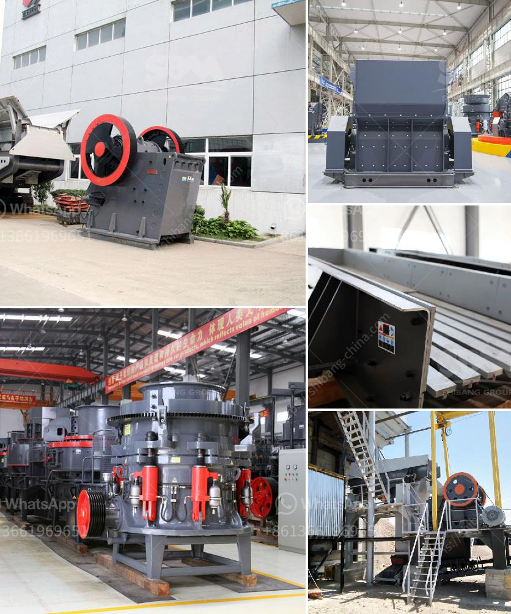

<h3>مصانع VSI في الإمارات</h3>
مع تطور صناعة البناء والتشييد في الإمارات العربية المتحدة، أصبحت واحدة من أهم النقاط التي يتم الاهتمام بها هي جودة المواد الخام المستخدمة وتأثيرها على المشاريع الكبيرة في البلاد. وتلعب مصانع VSI دورًا حاسمًا في تلبية هذه الاحتياجات وتوفير مواد بناء عالية الجودة.

تأسست مصانع VSI بالإمارات بهدف توفير منتجات بناء عالية الجودة، وتلبية المعايير الدولية في صناعة البناء. وتعمل هذه المصانع على تصنيع مواد البناء المتنوعة، مثل الرمل المسحوق، والحصى المسحوق، والخرسانة الخفيفة، والخرسانة الباطونية وغيرها. وتتميز منتجات VSI بأنها تلبي معايير الجودة العالمية، وتتمتع بمقاومة عالية للتآكل والتلف، مما يجعلها الخيار المثالي للمشاريع ذات الأحمال الثقيلة.

تستخدم مصانع VSI أحدث التقنيات والمعدات لتصنيع منتجاتها. وتعتمد على تقنية VSI (Vertical Shaft Impactor) المبتكرة في إنتاج الرمل المسحوق والحصى المسحوق. تتميز تقنية VSI بقدرتها على توليد تأثير ديناميكي عالي السرعة، والتي تؤدي إلى تكسير المواد الخام بطريقة فعالة ودقيقة. وهذا يسمح بإنتاج مواد بناء ذات شكل نهائي مثالي، وتقديمها باستخدام عمليات التصنيع المناسبة وفقًا لاحتياجات العميل.

استخدام مواد البناء المصنوعة من مصانع VSI يوفر العديد من الفوائد للعملاء. فهي تتمتع بقوة عالية ومتانة، وتتحمل الضغوط العالية من التحميل والتفكيك المتكرر، مما يحسن من عمر المنشأة ويقلل من التكاليف اللاحقة للصيانة والتجديد. كما أنها تساهم في تحسين جودة المشاريع البنائية وتكفل متانتها في ظل الظروف المناخية القاسية في الإمارات، مثل الحرارة العالية والرطوبة.

باختصار، تلعب مصانع VSI دورًا حاسمًا في استدامة صناعة البناء في الإمارات العربية المتحدة، من خلال توفير منتجات عالية الجودة ومتينة، تلبي احتياجات مشاريع البناء الضخمة في البلاد. وبفضل استخدام التكنولوجيا الحديثة والعمل المتخصص، يمكن توفير منتجات فعالة واقتصادية للمشاريع المختلفة، مما يعزز التنمية المستدامة ويعزز الازدهار الاقتصادي في الدولة.
<h3>Contact us</h3><ul><li><strong>Whatsapp:&nbsp;<a href="https://wa.me/8613661969651">+8613661969651</a></strong></li><li><a href="https://swt.shibang-china.com/?git&amp;zhl&amp;مصانع VSI في الإمارات"><strong>Online Service(chat now)</strong></a></li></ul><h3>Related</h3><ul><li><a href='مصنع غسيل الرمل المستخدم للبيع في تكساس.md'>مصنع غسيل الرمل المستخدم للبيع في تكساس</a></li><li><a href='آلة تعبئة مسحوق التلك.md'>آلة تعبئة مسحوق التلك</a></li><li><a href='آلة تعدين الرمال التقليدية في ماليزيا.md'>آلة تعدين الرمال التقليدية في ماليزيا</a></li><li><a href='سعر آلة غسيل الرمل الكوارتز.md'>سعر آلة غسيل الرمل الكوارتز</a></li><li><a href='اقتباسات مطحنة الكرة.md'>اقتباسات مطحنة الكرة</a></li></ul>