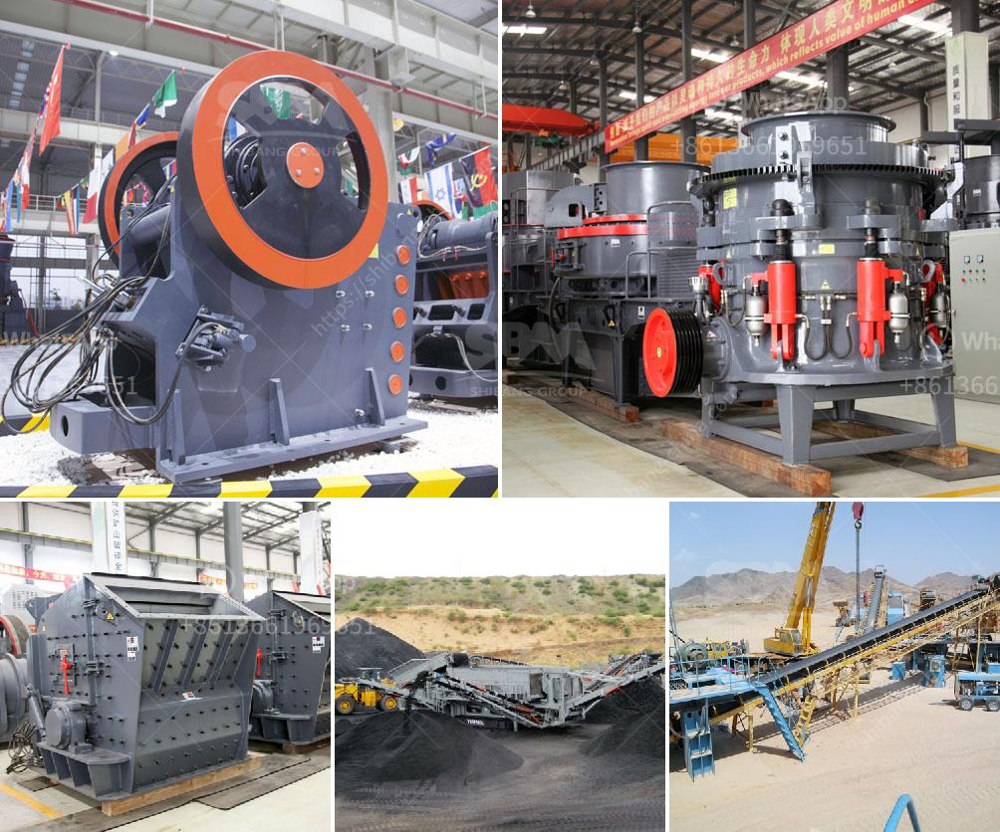

<h3>مصانع إعادة تدوير النحاس في الصين</h3>
تعتبر الصين واحدة من أكبر الدول المنتجة للمعادن في العالم، وتلعب دوراً رئيسياً في صناعة إعادة التدوير. ومن بين المعادن التي تعتبر أهمية كبيرة في عملية إعادة التدوير هو النحاس.

تشتهر الصين بمصانع إعادة تدوير النحاس الكبيرة والتي تتيح لها استخراجه من المنتجات المستعملة أو المعدنية المهملة بطريقة فعالة ومستدامة. توجد العديد من هذه المصانع في مناطق صناعية كبرى مثل مقاطعة قوانغدونغ ومقاطعة تشجيانغ ومقاطعة جيانغسو.

يتم جمع النحاس من منتجات متنوعة مثل الأسلاك الكهربائية والأنابيب والكابلات والمكونات الإلكترونية والمراوح والأدوات الكهربائية القديمة. يتم فحص هذه المنتجات وتفكيكها وفصل النحاس عن البلاستيك الذي قد يكون موجوداً فيها.

تُقدر كمية النحاس التي تنتجها مصانع إعادة التدوير في الصين بالملايين من الأطنان سنويًا. تستخدم هذه المصانع تكنولوجيا حديثة مثل الفرز الميكانيكي والفصل المغناطيسي والتخصيب الكهروستاتيكي لاستخراج النحاس بنسبة عالية من الخامات المعاد تدويرها.

إعادة تدوير النحاس لها فوائد اقتصادية وبيئية كبيرة. ففي الجانب الاقتصادي، تساهم في توفير الموارد الطبيعية والحفاظ على النفقات التشغيلية، بالإضافة إلى توفير فرص عمل جديدة ودعم النمو الاقتصادي.

ومن الناحية البيئية، يقلل إعادة تدوير النحاس من استخراج المزيد من المعدن من المناجم، ويقلل من تكاليف معالجة النفايات والتأثيرات البيئية السلبية للتعدين النحاس. كما أنه يقلل من تلوث التربة والمياه والهواء عن طريق تقليل الانبعاثات الضارة.

ومع ازدياد الطلب على النحاس في قطاعات مثل البناء والنقل والإلكترونيات، يصبح الاستثمار في مصانع إعادة تدوير النحاس في الصين أمرًا جيدًا من النواحي الاقتصادية والبيئية. فهذه المصانع تلعب دوراً هاماً في تحقيق تنمية مستدامة وتوفير مصادر المعادن الحيوية.

باختصار، تعتبر مصانع إعادة تدوير النحاس في الصين من أهم القطاعات الصناعية التي تدعم التنمية المستدامة. وتُعتبر هذه الصناعة مشروعًا استثماريًا مشجعًا في الصين، حيث تحقق الاقتصاد الأخضر والحد من التلوث البيئي.
<h3>Contact us</h3><ul><li><strong>Whatsapp:&nbsp;<a href="https://wa.me/8613661969651">+8613661969651</a></strong></li><li><a href="https://swt.shibang-china.com/?git&amp;zhl&amp;مصانع إعادة تدوير النحاس في الصين"><strong>Online Service(chat now)</strong></a></li></ul><h3>Related</h3><ul><li><a href='مصنعو كسارات الجيري.md'>مصنعو كسارات الجيري</a></li><li><a href='موردين لمعدات التعدين في جنوب أفريقيا.md'>موردين لمعدات التعدين في جنوب أفريقيا</a></li><li><a href='مطاحن الهامش في جنوب أفريقيا.md'>مطاحن الهامش في جنوب أفريقيا</a></li><li><a href='مختلف طرق سحق وطحن السيراميك.md'>مختلف طرق سحق وطحن السيراميك</a></li><li><a href='بيانات مصنع تحضير خام الكروم.md'>بيانات مصنع تحضير خام الكروم</a></li></ul>